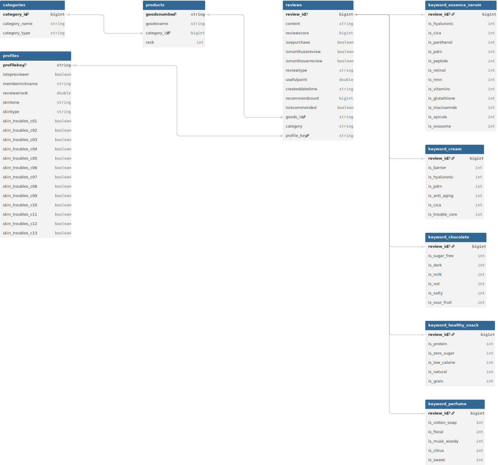

# 프로젝트 목표

최근 3개월간 급상승한 리뷰 키워드 분석을 통해 **차세대 주력 성분(ingredient) 및 신규 상품군을 제안**하는 것을 목표로 하는 '화장품 성분 분석 프로젝트'의 첫 번째 포스트입니다.

이번 포스트에서는 분석의 기반이 될 데이터를 수집하고, 분석에 용이하도록 데이터베이스를 설계하는 과정을 다룹니다.

## 1. 올리브영 카테고리 데이터 수집

올리브영에서 상품 리뷰를 가져오려면 먼저 상품 ID를 알아야 합니다. 상품 ID는 각 카테고리별 랭킹 페이지에서 수집할 수 있으므로, 우선 올리브영의 전체 상품 카테고리 구조를 파악하는 것부터 시작했습니다.

올리브영의 카테고리는 3개의 계층적 구조를 가지고 있습니다. 저는 이를 각각 large, mid, small로 명명했습니다. 아래 표와 같이 **대 → 중 → 소** 순서로 ID가 확장되는 규칙을 가지고 있습니다.

| **카테고리 레벨** | **카테고리 ID**     | **카테고리 명칭** | **비고**                   |
| ----------------- | ------------------- | ----------------- | -------------------------- |
| large             | 10000010001         | 스킨케어          | 최상위 분류                |
| mid               | 100000100010010     | 미스트/오일       | 스킨케어 내 세부분류       |
| small             | 1000001000100100001 | 미스트/픽서       | 최종 상품 리스트 추출 지점 |

각 카테고리 정보를 가져오는 스크래핑 코드는 `category_scraping.ipynb`에 구현되어 있습니다.

## 2. 데이터베이스 설계 (ERD)

수집한 데이터를 효율적으로 관리하고 분석하기 위해 데이터베이스 스키마를 설계했습니다. 데이터는 S3에 저장하고 AWS Athena를 사용해 쿼리할 예정입니다.

전체 데이터베이스의 구조는 다음과 같습니다.



### 테이블 구조 요약

| 구분 | 테이블명 | 주요 역할 |
|------|---------|----------|
| **기본** | `categories` | 제품 카테고리 분류 |
| **기본** | `products` | 올리브영 제품 정보 |
| **기본** | `profiles` | 리뷰어 프로필 (피부타입/고민) |
| **기본** | `reviews` | 리뷰 본문 + 메타데이터 |
| **분석** | `keyword_*` | 카테고리별 트렌드 키워드 분석 결과 |

## 3. 초기 데이터 탐색 (EDA) 및 테이블 생성

본격적인 분석에 앞서, 수집한 카테고리 데이터에 대한 간단한 탐색을 진행했습니다. 어떤 카테고리에 상품이 많이 분포해 있는지 확인하기 위해 Athena에서 다음 쿼리를 실행했습니다.

```sql
SELECT c.category_name, COUNT(DISTINCT p.goods_id) AS product_count
FROM categories AS c
JOIN products AS p ON c.category_id = p.category_id
WHERE c.category_type = 'small'
GROUP BY c.category_name
ORDER BY product_count DESC;
```

분석 결과, '에센스/세럼/앰플' 카테고리에 가장 많은 상품이 등록되어 있었습니다. 모든 카테고리에 대해 프로젝트를 진행하기에는 규모가 너무 크다고 판단하여, 등록 상품 수가 가장 많은 상위 5개 카테고리에 대해서만 분석을 진행하기로 결정했습니다.

이 데이터를 바탕으로 Athena에 테이블을 생성했습니다. `products`와 `profiles` 테이블의 생성 쿼리는 다음과 같습니다.

```sql title="products 테이블 생성"
CREATE EXTERNAL TABLE IF NOT EXISTS oliveyoung_db.products (
    goodsNumber STRING,
    goodsName STRING,
    category_id BIGINT,
    rank int
)
STORED AS PARQUET
LOCATION 's3://oliveyoung-reviews-yn/products/'
TBLPROPERTIES ('parquet.compress'='SNAPPY');
```

```sql title="profiles 테이블 생성"
CREATE EXTERNAL TABLE IF NOT EXISTS oliveyoung_db.profiles (
  profileKey STRING,
  isTopReviewer BOOLEAN,
  memberNickname STRING,
  reviewerRank DOUBLE,
  skinTone STRING,
  skinType STRING,
  skin_troubles_C01 BOOLEAN,
  skin_troubles_C02 BOOLEAN,
  skin_troubles_C03 BOOLEAN,
  skin_troubles_C04 BOOLEAN,
  skin_troubles_C05 BOOLEAN,
  skin_troubles_C06 BOOLEAN,
  skin_troubles_C07 BOOLEAN,
  skin_troubles_C08 BOOLEAN,
  skin_troubles_C09 BOOLEAN,
  skin_troubles_C10 BOOLEAN,
  skin_troubles_C11 BOOLEAN,
  skin_troubles_C12 BOOLEAN,
  skin_troubles_C13 BOOLEAN
)
STORED AS PARQUET
LOCATION 's3://oliveyoung-reviews-yn/profile/'
TBLPROPERTIES ("parquet.compress"="SNAPPY");
```

또한, 각 카테고리별 트렌드 키워드를 정규표현식으로 추출하여 별도의 `keyword` 테이블에 저장했습니다. 예를 들어 `cream` 카테고리의 키워드 테이블은 다음과 같이 생성됩니다.

```sql title="cream_keyword 테이블 생성"
CREATE EXTERNAL TABLE IF NOT EXISTS oliveyoung_db.cream_keyword (
    review_id BIGINT,
    is_Barrier INT,
    is_Hyaluronic INT,
    is_PDRN INT,
    is_Anti_Aging INT,
    is_Cica INT,
    is_Trouble_Care INT
)
STORED AS PARQUET
LOCATION 's3://oliveyoung-reviews-yn/reviews/keyword/cream/'
TBLPROPERTIES ('parquet.compression'='SNAPPY');
```

## 4. 핵심 지표 산출 로직

구체적인 분석 계획이 세워지지 않았기에 성분에 따른 다양한 지표를 추출해보고 그 중에서 궁금한 것을 알아보고자 합니다. 먼저 가장 관심이 많은 에센스/세럼 카테고리에 해당하는 화장품부터 살펴봅니다. 가지고 있는 정보중에 profiles, 즉 고객 피부속성같은 정보들도 있기 때문에 이를 활용하면 좋을 거 같아 추출하여 정리하고 가겠습니다.

```sql
SELECT DISTINCT skintype, COUNT(*) AS cnt
FROM profiles
GROUP BY skintype
ORDER BY skintype ASC;
```

| 순번 | skintype | 피부 타입 명칭 | 데이터 수 (cnt) |
|:---:|:---:|:---|:---:|
| 1 | **A01** | 건성 | 5,819 |
| 2 | **A02** | 지성 | 9,165 |
| 3 | **A03** | 복합성 | 15,735 |
| 4 | **A04** | 민감성 | 3,360 |
| 5 | **A05** | 약건성 | 523 |
| 6 | **A06** | 트러블성 | 2,232 |
| 7 | **A07** | 기타 | 643 |
| 8 | **-** | 정보 미기입(Null) | 113,426 |

전체 약 15만건의 리뷰 데이터 중 정보 제공자는 약 24.8%에 불과합니다. 그리고 그 중 42%가 복합성 피부라고 표시했는데 여기서 복합성 피부란 T존 유분과 U존 건조함

<iframe 
  src="/charts/beauty/skintype_chart.html" 
  width="100%" 
  height="500px" 
  frameborder="0" 
  scrolling="no">
</iframe>

:::note
피부 타입 명칭은 gemini 결과를 추가한 것입니다. 원본은 A01이 건성을 의미하는 지 알려주지 않습니다.
:::

skintone도 같은 방식으로 살펴봅니다.

<iframe 
  src="/charts/beauty/skintone_chart.html" 
  width="100%" 
  height="500px" 
  frameborder="0" 
  scrolling="no">
</iframe>


```sql
SELECT DISTINCT skintone, COUNT(*) AS cnt
FROM profiles
GROUP BY skintone
ORDER BY skintone ASC;
```

| 순번 | skintone | 피부 톤 명칭 | 데이터 수 (cnt) | 비고 |
|:---:|:---:|:---|:---:|:---|
| 1 | **B01** | 매우 밝은 톤 | 8,041 | 13호~17호 수준 |
| 2 | **B02** | 밝은 보통 톤 | 9,636 | 21호 |
| 3 | **B03** | 보통 톤 | 5,063 | 22호~23호 수준 |
| 4 | **B04** | 차분한 톤 | 6,301 | 23호 이상 건강한 피부 |
| 5 | **B05** | 어두운/태닝 톤 | 3,501 | 구릿빛 혹은 어두운 피부 |
| 6 | **B06** | 기타/특수 톤 | 2,460 | 붉은기/노란기 강한 피부 |
| 7 | **-** | 정보 미기입(Null) | 115,901 | |


분석을 위해 다음과 같은 핵심 지표를 정의했습니다.

- **SOV (Share of Voice)**: 전체 리뷰 중 해당 키워드가 차지하는 비중
- **NSS (Net Sentiment Score)**: (긍정 리뷰 비율 - 부정 리뷰 비율)
- **MoM (Month-on-Month)**: 키워드 언급량의 월별 성장률

이 지표들을 계산하기 위한 SQL 쿼리의 예시는 다음과 같습니다. 아래는 '에센스/세럼' 카테고리의 월별 키워드 지표를 산출하는 쿼리입니다.

```sql title="에센스/세럼 카테고리 월별 키워드 지표 산출"
/*
=================================================================
Essence/Serum Keyword Analysis - Monthly Metrics
- 기간: 2024-08-01 ~ 2025-01-31
- 목적: 트렌드 키워드별 SOV, NSS, MoM 계산
=================================================================
*/

-- Step 1: 기간 내 에센스/세럼 리뷰 추출
WITH base_reviews AS (
  SELECT 
    r.review_id,
    date_parse(r.createddatetime, '%Y.%m.%d') as review_date,
    date_trunc('month', date_parse(r.createddatetime, '%Y.%m.%d')) as month,
    r.reviewscore,
    k.is_hyaluronic,
    k.is_cica,
    k.is_panthenol,
    k.is_pdrn,
    k.is_peptide,
    k.is_retinol,
    k.is_nmn,
    k.is_vitaminc,
    k.is_glutathione,
    k.is_niacinamide,
    k.is_spicule,
    k.is_exosome
  FROM reviews r
  INNER JOIN keyword_essence_serum k ON r.review_id = k.review_id
  WHERE date_parse(r.createddatetime, '%Y.%m.%d') BETWEEN DATE '2024-08-01' AND DATE '2025-01-31'
    AND r.category = 'essence_serum'
),

-- Step 2: 키워드별 unpivot (12개 키워드를 행으로)
keyword_unpivot AS (
  SELECT month, review_id, reviewscore, 'Hyaluronic' as keyword_name, is_hyaluronic as is_keyword FROM base_reviews
  UNION ALL
  SELECT month, review_id, reviewscore, 'Cica', is_cica FROM base_reviews
  UNION ALL
  SELECT month, review_id, reviewscore, 'Panthenol', is_panthenol FROM base_reviews
  UNION ALL
  SELECT month, review_id, reviewscore, 'PDRN', is_pdrn FROM base_reviews
  UNION ALL
  SELECT month, review_id, reviewscore, 'Peptide', is_peptide FROM base_reviews
  UNION ALL
  SELECT month, review_id, reviewscore, 'Retinol', is_retinol FROM base_reviews
  UNION ALL
  SELECT month, review_id, reviewscore, 'NMN', is_nmn FROM base_reviews
  UNION ALL
  SELECT month, review_id, reviewscore, 'VitaminC', is_vitaminc FROM base_reviews
  UNION ALL
  SELECT month, review_id, reviewscore, 'Glutathione', is_glutathione FROM base_reviews
  UNION ALL
  SELECT month, review_id, reviewscore, 'Niacinamide', is_niacinamide FROM base_reviews
  UNION ALL
  SELECT month, review_id, reviewscore, 'Spicule', is_spicule FROM base_reviews
  UNION ALL
  SELECT month, review_id, reviewscore, 'Exosome', is_exosome FROM base_reviews
),

-- Step 3: 월별 전체 리뷰 수 계산
monthly_total AS (
  SELECT 
    month,
    COUNT(DISTINCT review_id) as total_reviews_in_month
  FROM base_reviews
  GROUP BY month
),

-- Step 4: 월별 키워드별 집계
monthly_keyword_stats AS (
  SELECT 
    month,
    keyword_name,
    -- 키워드 언급 리뷰 수
    SUM(is_keyword) as keyword_reviews,
    -- 긍정 리뷰 (4~5점)
    SUM(CASE WHEN is_keyword = 1 AND reviewscore >= 4 THEN 1 ELSE 0 END) as positive_reviews,
    -- 부정 리뷰 (1~2점)
    SUM(CASE WHEN is_keyword = 1 AND reviewscore <= 2 THEN 1 ELSE 0 END) as negative_reviews
  FROM keyword_unpivot
  WHERE is_keyword = 1  -- 키워드가 있는 리뷰만
  GROUP BY month, keyword_name
),

-- Step 5: SOV, NSS 계산
with_basic_metrics AS (
  SELECT 
    k.month,
    k.keyword_name,
    t.total_reviews_in_month as total_reviews,
    k.keyword_reviews,
    k.positive_reviews,
    k.negative_reviews,
    -- SOV
    ROUND(CAST(k.keyword_reviews AS DOUBLE) / NULLIF(t.total_reviews_in_month, 0) * 100, 2) as SOV,
    -- NSS
    ROUND(CAST(k.positive_reviews - k.negative_reviews AS DOUBLE) / NULLIF(k.keyword_reviews, 0) * 100, 2) as NSS
  FROM monthly_keyword_stats k
  INNER JOIN monthly_total t ON k.month = t.month
),

-- Step 6: MoM 계산 (윈도우 함수)
final_metrics AS (
  SELECT 
    month,
    keyword_name,
    total_reviews,
    keyword_reviews,
    positive_reviews,
    negative_reviews,
    SOV,
    NSS,
    -- 전월 키워드 리뷰 수
    LAG(keyword_reviews) OVER (PARTITION BY keyword_name ORDER BY month) as prev_month_reviews,
    -- MoM 성장률
    ROUND(
      (CAST(keyword_reviews AS DOUBLE) - LAG(keyword_reviews) OVER (PARTITION BY keyword_name ORDER BY month)) 
      / NULLIF(LAG(keyword_reviews) OVER (PARTITION BY keyword_name ORDER BY month), 0) 
      * 100, 
      2
    ) as MoM_growth
  FROM with_basic_metrics
)

SELECT 
  date_format(month, '%Y-%m') as month,
  keyword_name,
  total_reviews,
  keyword_reviews,
  positive_reviews,
  negative_reviews,
  SOV,
  NSS,
  prev_month_reviews,
  MoM_growth
FROM final_metrics
ORDER BY keyword_name, month;
```

## 5. 결론 및 다음 단계

이번 포스트에서는 화장품 트렌드 분석 프로젝트의 첫 단계로, 올리브영의 카테고리 데이터를 수집하고 분석을 위한 데이터베이스 스키마를 설계하는 과정을 살펴보았습니다.

다음 포스트에서는 실제 상품 리뷰 데이터를 수집하고, 오늘 설계한 지표들을 활용하여 유의미한 트렌드를 발견하는 과정을 보여드리겠습니다.


