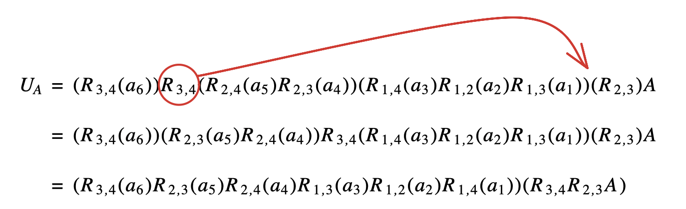
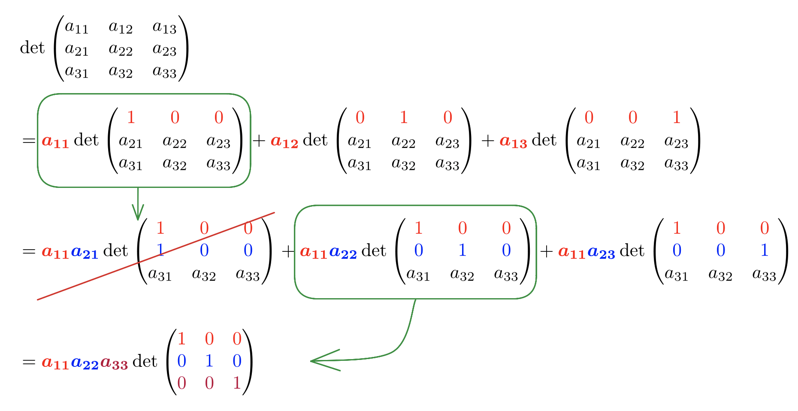
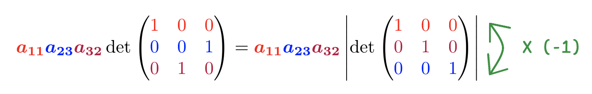
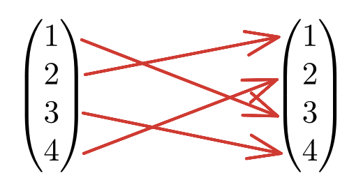
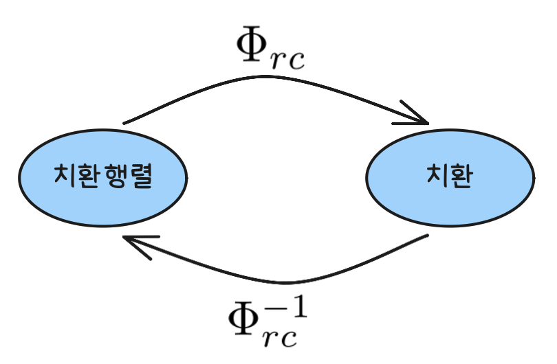
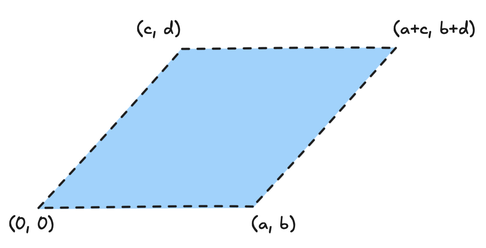
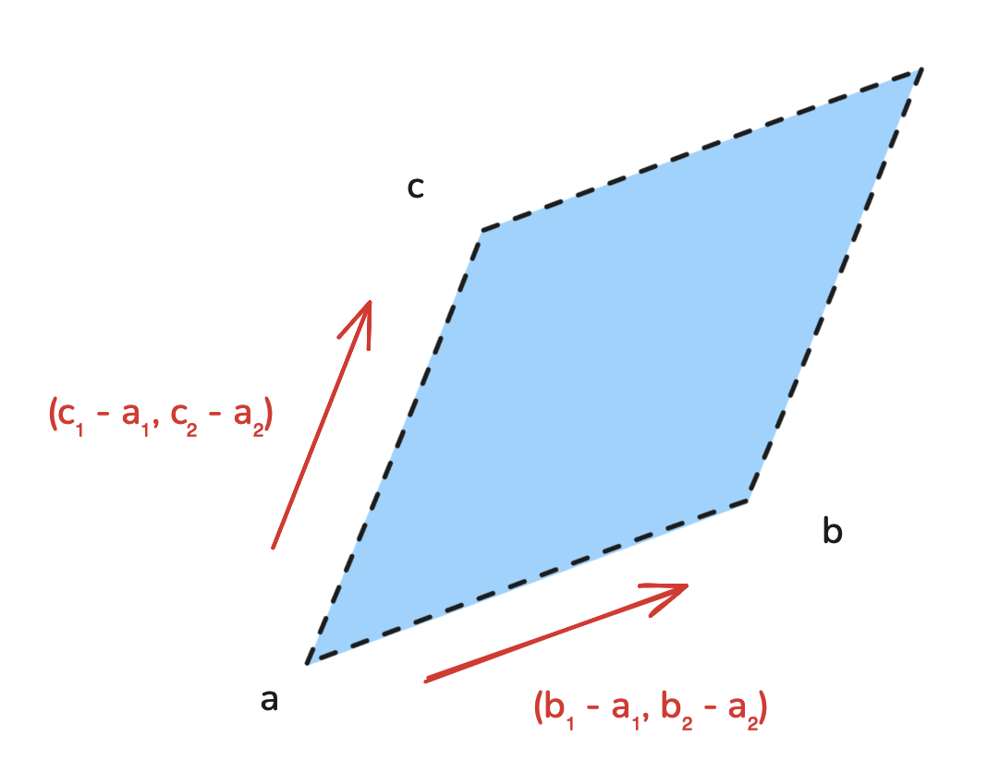

## 벡터의 선형결합

> **주어진 벡터로부터 새로운 벡터를 만드는 방법** 
> a) 한 벡터에 상수를 곱한다. 
> b) 두 벡터를 더하여 벡터합을 구한다.

 

즉, 세 벡터 a, b, c가 주어질 때, 이 벡터를 이용하여 만들 수 있는 새로운 벡터의 일반적인 형태는 다음과 같다.

 

$$v = \alpha a + \beta b +  \gamma c,\\ (\alpha, \beta, \gamma \in \mathbb{R})$$

 

이 때 식의 우변에서 상수배와 벡터의 합으로 표시된 형태를 벡터 a, b, c의 `선형결합(linear combination)` 또는 일차결합이라고 부르고, 벡터 v는 벡터 a, b, c로부터 생성된다고 한다. 
그리고 이 때의 a, b, c를 우리는 v의 `기저(basis)`라고 볼 수 있다. 참고로 기저는 어떤 벡터를 생성하는데 필요한 최소한의 벡터 집합을 나타내며, 이 벡터들의 일차결합으로 벡터공간을 만들어 낼 수 있다.

 

## 벡터의 곱

벡터의 곱에는 두 가지 표현 방식이 있다. 
하나는 `내적(inner product)` 또 하나는 `외적(outer product)`이다. 
내적의 경우 계산 결과가 `스칼라(scalar)`가 나오고, 
외적의 경우 `벡터(vector)`로 나오게 된다는 것이 차이다.

 

### 벡터의 내적

> **내적의 성질** 
> a) $a \cdot a \ge 0 $ 
> b) $a \cdot b = b \cdot a$ 
> c) $(a + b) \cdot c = a \cdot c + b \cdot c$ 
> d) $(ka) \cdot b = k(a \cdot b) = a \cdot (k b)$

 

**벡터의 내적 정의**

case 1)

 

$$a \cdot b ~ = ~ \parallel a \parallel \parallel b \parallel cos  \theta $$

 

case 2)

$a = (a_1, a_2), b = (b_1, b_2)$ 형태의 성분일 때 다음과 같다. 

 

$$a \cdot b ~ = a_1 b_1 + a_2 b_2$$ 

 

### 벡터의 외적
 

**벡터의 외적 정의**

case 1)

 

$$a \times b ~ = ~ \parallel a \parallel \parallel b \parallel sin \theta $$

 

case 2)

$a = (a_1, a_2, a_3), b = (b_1, b_2, b_3)$ 형태의 성분일 때 다음과 같다.

 

$$a \times b ~ = ~ (a_2 b_3 - a_3 b_2, a_3 b_1 - a_1 b_3, a_1 b_2 - a_2 b_1)$$

 

굳이 손으로 계산할 일이 없는 거 같아서 이 식이 왜 이렇게 생겼는지에 대한 이유는 적지 않아요.

 

외적의 정의에 의해 벡터 $a \times b$는 a와 수직이며 동시에 b와도 수직인 벡터이다. 
또한, $a \times b$와 방향이 반대인 벡터는 다음과 같은데

 

$$b \times a = - a \times b$$

 

이는 교환법칙이 성립하지 않음을 의미한다. 이는 행렬 연산에서 교환법칙이 성립하지 않는 이유이다. 
행렬이란 외적연산으로 표현할 수 있는 밀접한 관련이 있기 때문인데 예를 들어보자면 다음과 같다.

 

$$
\begin{vmatrix}
\vec{i} & \vec{j} & \vec{k} \\
a_x & a_y & a_z \\
b_x & b_y & b_z \\
c_x & c_y & c_z \\
\end{vmatrix}
= (\vec{a} \times \vec{b}) \cdot \vec{c}
$$

 

**두 벡터의 크기**

 

$$\parallel a \times b \parallel  =  \parallel b \times a \parallel  =  \parallel a  \parallel \parallel b \parallel sin \theta$$

 

이는 곧 a와 b로 만들어지는 평행사변형의 넓이를 의미한다. 또한, 실수 k에 대해 벡터의 상수배는 두 벡터의 사잇각을 변화시키지 않으므로 교환법칙은 성립하지 않았지만 다음과 같이 결합법칙은 성립한다.

 

$$ (k a) \times b = k(a \times b) = a \times (k b)$$

## 2파트 역행렬, 블록행렬, 행렬곱의 이해, LU 분해

- intro 
식의 계수만을 이용하여 연립일차방정식을 간단하게 표현할 때 `행렬`이라는 것을 사용하게 된다. 이처럼 행렬을 이용하여 연립일차방정식을 나타내고, 더 나아가 미지수의 개수를 줄여가며 연립일차방정식의 해를 구하는 방법을 `가우스(가우스-조르당) 소거법`이라고 한다. 
또, 평면에서 각 점을 회전시키거나 대칭이동 시키는 함수는 특별한 성질을 갖는다. 이런 종류의 함수들을 `선형사상`이라고 부르는데 이는 항상 행렬을 사용하여 나타낼 수 있다. 
또한 행렬의 연산을 사용하면 두 선형사상에 대응되는 행렬과 선형사상의 연산에 대응되는 행렬 사이의 관계를 설명할 수 있다.

## 행렬과 그 연산

$m \times n$ 행렬 중 모든 성분이 0인 행렬을 `영행렬`이라 하고, $O_{m \times n}$ 또는 간단히 $O$로 나타낸다. 예를 들어, $O_{2 \times 2}$와 $O_{2 \times 3}$은 다음과 같다.

$$ O_{2 \times 2} = \begin{pmatrix}
0 & 0 \\
0 & 0
\end{pmatrix},~ O_{2 \times 3} = \begin{pmatrix}
0 & 0 & 0\\
0 & 0 & 0
\end{pmatrix}
$$

n차 정사각행렬 A의 성분 $a_{11}, a_{22}, \cdots, a_{nn}$을 A의 `주대각 성분`이라 하고, 이들 성분을 연결하는 가상의 대각선을 `주대각선`이라 한다. 특히 **정사각행렬 A의 주대각 성분을 제외한 모든 성분이 0일 때**, A를 `대각행렬`이라 하고, 

$$ A = Diag(a_{11}, a_{22}, \cdots, a_{nn})$$

과 같이 나타낸다. 
또, 주 대각선 성분이 모두 같은 대각행렬을 `상수행렬`이라 하는데, 특히 모든 주대각 성분이 1인 n차 상수행렬을 n차 `단위행렬`이라 하고 $I_n$으로 나타낸다. 예를들어, 다음은 $I_2, I_3$이다.

$$I_2 = \begin{pmatrix}
1 & 0 \\
0 & 1
\end{pmatrix},~ I_3 = \begin{pmatrix}
1 & 0 & 0\\
0 & 1 & 0\\
0 & 0 & 1
\end{pmatrix}
$$

행렬의 성분이 모두 실수인 $m \times n$ 행렬들의 집합을 

$$ M_{m, n} $$

으로 나타낸다. 
특히 행렬이 $M_{1, n}$에 속할 때 `행벡터`, $M_{m, 1}$ 에 속할 때 `열벡터`라 부른다. 
$\mathbb{R}^2$에서 두 벡터 a와 b가 같은 벡터라는 것은 두 벡터의 같은 위치에 있는 각 성분이 같은 것을 의미하는 것처럼, $M_{m,n}$의 두 행렬 A, B가 다음 조건을 만족할 때, 서로 `같다`고 하고 A = B로 나타낸다.

$$A = B ~ \Leftrightarrow ~ A_{ij} = B_{ij}
$$

 

**행렬의 연산에 대한 성질**

> a) A + B = B + A 
> b) A + (B + C) = (A + B) + C 
> c) A(BC) = (AB)C 
> d) A(B + C) = AB + AC 
> e) (A + B)C = AC + BC 
> f) k(A + B) = kA + kB 
> g) (k + l)A = kA + lA 
> h) (kl)A = k(lA) = l(kA) 
> i) k(AB) = (kA)B = A(kB)

 

### 역행렬

 

$$AX = I_n = XA$$

를 만족하는 n차 정사각행렬 X가 존재하면 X는 곱셈에 대한 A의 역원이 되는데, 이 X를 A의 `역행렬`이라 한다. 또 행렬 A가 역행렬을 가질 때, `가역`이라 한다.

**역행렬의 성질**

n차 정사각행렬 $A, B$가 가역행렬이고, $k$가 0아닌 실수일 때, 다음이 성립한다.

> a) $A$의 역행렬은 유일하다.(따라서, 역행렬이 같다면 둘은 같은 행렬) 
> b) $A^{-1}$는 가역이고 $(A^{-1})^{-1} = A$이다. 
> c) $AB$는 가역이고, $(AB)^{-1} = B^{-1}A^{-1}$이다. 
> d) $kA$는 가역이고, $(kA)^{-1} = \frac{1}{k} A^{-1}$이다.

 

### 전치행렬

행렬 A가 $m \times n$ 행렬일 때, 행렬 A의 1행부터 m행을 차례로 1열부터 m열로 갖는 행렬을 A의 `전치행렬`이라하고, $A^T$로 나타낸다. 즉, $n \times m$ 행렬 $A^T$의 성분은 다음과 같다. 

$$ (A^T)_{ij} = A_{ji} (1 \le i, j \le n)$$

**전치행렬의 성질**
> a) $(A^T)^T = A$ 
> b) $(kA)^T = kA^T$ 
> c) $(A + B)^T = A^T + B^T$ 
> d) 행렬곱이 정의될 때, $(AB)^T = B^TA^T$ 
> e) A가 가역행렬이면 $A^T$도 가역이고, $(A^T)^{-1} = (A^{-1})^T$

 

### 대각합

A가 n차 정사각행렬일 때, **A의 주대각선성분을 모두 더한 것**을 A의 `대각합`이라고 하고 `Tr(A)`로 나타낸다. 즉, A의 대각합은 다음과 같다.

$$Tr(A) = A_{11} + A_{22} + \cdots + A_{nn} = \sum_{k=1}^{n} A_{kk}$$

**대각합 성질**
> a) $Tr(A^T) = Tr(A)$ 
> b) $Tr(kA) = kTr(A)$ 
> c) $Tr(A + B) = Tr(A) + Tr(B)$ 
> d) $Tr(AB) = Tr(BA)$ 
> e) $Tr(ABC) = Tr(CAB) = Tr(BCA) \ne Tr(ACB)$

 

## 블록행렬의 곱셈

주어진 행렬을 부분행렬들로 이루어진 블록행렬로 생각하여 연산하는 것이 편리한 경우가 있다. 예를 들어, 5 $\times$ 5 행렬 $A_1$는 다음과 같다.

$$
A = \begin{bmatrix}
    2 & 4 & 1 & 8 & 0 \\
    3 & 5 & 7 & 2 & 9 \\
    6 & 4 & 0 & 1 & 2 \\
    1 & 2 & 4 & 6 & 8 \\
    9 & 7 & 5 & 3 & 1
\end{bmatrix}
$$

그리고, 이는 네 개의 부분행렬로 나누어 보일 수 있다.

$$A_1 = \begin{pmatrix}
X_1 & Y_1 \\
Z_1 & W_1
\end{pmatrix} 
$$

이 때, 또 다른 5 $\times$ 5 행렬 $A_2$도 같은 방법으로 부분행렬 $X_2, Y_2, Z_2, W_2$로 이루어진 블록행렬로 생각하면 두 행렬의 곱 $A_1 A_2$ 는 성분을 이용한 행렬의 곱셈과 유사하게 아래와 같은 꼴로 표현 가능하다.

$$
A_1 A_2 = \begin{pmatrix}
X_1 & Y_1 \\
Z_1 & W_1
\end{pmatrix} 
\begin{pmatrix}
X_2 & Y_2 \\
Z_2 & W_2
\end{pmatrix} = 
\begin{pmatrix}
X_1X_2 + Y_1Z_2 & X_1Y_2 + Y_1W_2 \\
Z_1X_2 + W_1Z_2 & Z_1Y_2 + W_1W_2
\end{pmatrix}
$$

위의 식에서처럼 부분행렬들 사이의 곱이 잘 정의되도록 나누기만 하면 유사하게 블록행렬의 곱셈을 할 수 있다.

 

**가우스-조르당 소거법**

가우스-조르당 소거법이란 가우스 소거법으로 구한 행사다리꼴에서 각 선행성분을 포함하는 열에 `선행성분을 제외한 모든 성분이 0`이 되도록 계산하는 방법이다.

 

## 행렬의 곱셈을 이해하는 4가지 방법

### A의 행벡터와 B의 열벡터의 곱 : 벡터의 내적으로 이해

 

행렬의 각 행을 행벡터로, 각 열을 열벡터로 이해할 때, 두 행렬 A와 B의 곱 AB의 (i, j)성분은 각 A의 i번째 행벡터와 B의 j번째 열벡터의 `내적`으로 이해할 수 있다. 
아래는 벡터의 내적으로 표현하는 모습

 

$$
\begin{pmatrix}
1 & 2 \\
3 & 4
\end{pmatrix} 
\begin{pmatrix}
a & b \\
c & d
\end{pmatrix} = 

\begin{pmatrix}

\begin{pmatrix}
1 & 2 
\end{pmatrix}
\begin{pmatrix}
a \\
c 
\end{pmatrix}
&
\begin{pmatrix}
1 & 2 
\end{pmatrix}
\begin{pmatrix}
b \\
d 
\end{pmatrix} \\
\begin{pmatrix}
3 & 4 
\end{pmatrix}
\begin{pmatrix}
a \\
c 
\end{pmatrix} &
\begin{pmatrix}
3 & 4 
\end{pmatrix}
\begin{pmatrix}
b \\
d 
\end{pmatrix}

\end{pmatrix}

=
\begin{pmatrix}
1a+2c & 1b+2d \\
3a+4c & 3b+4d
\end{pmatrix}
$$

 

### A의 열벡터와 B의 행벡터의 곱: 계수(rank)가 1인 행렬의 덧셈으로 이해

 

$$
\begin{pmatrix}
1 & 2 \\
3 & 4
\end{pmatrix} 
\begin{pmatrix}
a & b \\
c & d
\end{pmatrix} = 

\begin{pmatrix}
1 \\
3
\end{pmatrix}
\begin{pmatrix}
a & b
\end{pmatrix}
+
\begin{pmatrix}
2 \\
4
\end{pmatrix}
\begin{pmatrix}
c & d
\end{pmatrix}

\\

=
\begin{pmatrix}
1a & 1b \\
3a & 3b
\end{pmatrix}
+
\begin{pmatrix}
2c & 2d \\
4c & 4d
\end{pmatrix}
=
\begin{pmatrix}
1a+2c & 1b+2d \\
3a+4c & 3b+4d
\end{pmatrix}
$$

주어진 형태를 두 개씩 묶어 치환하여  $(A_1 A_2)$ $B_1 \choose B_2$ 와 같다고 생각해보자. 
즉, $ 1 \choose 3$, $2 \choose 4 $ 로 묶고 $(a b)$, $(c d)$로 묶는다고 생각! 
그렇다면 결과물은 1 $\times$ 1 형태로 나온다.(but, 이는 실제로 벡터로 이루어진 $A_1 B_1 + A_2 B_2$)

 

### 행렬의 곱셈 AB: B의 행벡터들의 일차결합으로 이해

 

일반적으로 n개의 벡터 $v_1, v_2, \cdots, v_n$와 상수 $c_i(1 \le i \le n)$가 주어질 때,

$$c_1v_1 + c_2v_2 + \cdots + c_nv_n$$

을 주어진 벡터들의 `선형결합` 또는 `일차결합`이라고 한다. 이때, 두 행렬의 곱 AB의 i행은 A의 i행의 성분들과 B의 행벡터들의 일차결합으로 이해할 수 있다.

> 선형결합(일차결합): 앞의 vector에 숫자 곱하고 뒤의 vector에 숫자 곱해서 그들의 합으로 표현되는 형태 
> 그리고 이를 통해 새로운 vector의 꼴을 만드는 것을 `생성한다` 라고 한다.

 

아래 예시에서 (a, b, c, d)로 이루어진 행렬을 하나의 묶음으로 생각해보자. 그리고 앞의 행렬 역시 두 개의 행으로 이루어진 2 $\times$ 1 행렬이라 생각한다면 결과는 다음과 같이 나온다. 그리고 다음 줄의 과정은 (1 2)를 1 $\times$ 2로 보고 (a, b, c, d)를 (a b), (c d) 로 묶는 2 $\times$ 1이라고 생각하자. 
그렇게 구한 결과는 최종적으로 다른 방식으로 구한 결과와 동일하다. 
즉, 행렬을 바라보는 다양한 관점이 중요하다!

$$
\begin{pmatrix}
1 & 2 \\
3 & 4
\end{pmatrix} 
\begin{pmatrix}
a & b \\
c & d
\end{pmatrix} = 

\begin{pmatrix}

\begin{pmatrix}
1 & 2 
\end{pmatrix}
\begin{pmatrix}
a & b\\
c & d
\end{pmatrix}
\\
\begin{pmatrix}
3 & 4 
\end{pmatrix}
\begin{pmatrix}
a & b\\
c & d
\end{pmatrix}

\end{pmatrix}

\\

=
\begin{pmatrix}

1  
\begin{pmatrix}
a & b
\end{pmatrix}
+
2
\begin{pmatrix}
c & d 
\end{pmatrix} \\
3 
\begin{pmatrix}
a & b
\end{pmatrix} +
4 
\begin{pmatrix}
c & d 
\end{pmatrix}

\end{pmatrix}
=\begin{pmatrix}
1a & 1b \\
3a & 3b
\end{pmatrix}
+
\begin{pmatrix}
2c & 2d \\
4c & 4d
\end{pmatrix}
=
\begin{pmatrix}
1a+2c & 1b+2d \\
3a+4c & 3b+4d
\end{pmatrix}

$$

 

행렬의 곱을 행벡터들의 일차결합으로 이해하는 방식을 응용해보면 연립방정식을 풀때나, 역행렬을 구할 때 유용하게 사용하는 가우스 소거법은 아래의 세 가지 종류의 행 기본연산을 반복하여 적용하는 방법이다.

> **행 기본연산** 
> a) 두 행의 위치를 바꾼다. 
> b) 한 행에 상수배를 한다. 
> c) 한 행에 상수배한 것을 다른 행에 더한다.

 

이 때 예를 들어, 행렬 A가 아래와 같고 이를 기본 행 연산을 하여 얻어지는 행렬 $\hat{A}$가 아래와 같다고 하자.

 

$$
A = \begin{pmatrix}
1 & 2 & 1\\
0 & 1 & 1\\
1 & 1 & 2
\end{pmatrix},
\hat{A} = \begin{pmatrix}
1 & 2 & 1\\
0 & 1 & 1\\
0 & -1 & 1
\end{pmatrix}
$$

 

이를 우리는 단순히 A라는 것을 "1행에 -1을 곱한 것을 3행에 더한다"라는 연산을 통해 $\hat{A}$가 되었다고 생각하지말고 A라는 행렬 앞에 X라는 계수(?)행렬을 곱해서 계산된 형태라고 받아들일 수 있어야한다! 
변화 과정을 유추해보면, 1행, 2행은 변화가 없다. 그리고 3행은 1행 * -1 +3행으로 보이기에 이를 행렬로 표현하면 다음과 같다.

 

$$
X = \begin{pmatrix}
1 & 0 & 0\\
0 & 1 & 0\\
-1 & 0 & 1
\end{pmatrix}
$$

 

이는 1행은 그대로 가져오고 2행은 그대로 가져오고 3행칸에는 1행 (-1)곱 + 3행이라는 뜻이 내포해 있다는 것을 알아야한다.

**추가** 기본행 연산에 대한 표현을 다음과 같이 나타낼 수 있다.

$R_{1, 3}(-1)$ = 1행에 -1을 곱해서 3행에 더하라.

 

### 행렬의 곱셈 AB: A의 열벡터들의 일차결합으로 이해

 

$$
\begin{pmatrix}
1 & 2 \\
3 & 4
\end{pmatrix}
\begin{pmatrix}
a & b \\
c & d
\end{pmatrix}
=
\begin{pmatrix}
a
\begin{pmatrix}
1 \\
3
\end{pmatrix}
+
c
\begin{pmatrix}
2 \\
4
\end{pmatrix}
&
b
\begin{pmatrix}
1 \\
3
\end{pmatrix}
+
d
\begin{pmatrix}
2 \\
4
\end{pmatrix}
\end{pmatrix}
$$

 

위의 식의 경우 $(1, 3)^T, (2, 4)^T$을 각각 $\alpha, \beta$라고 보면 뒤의 행렬의 원소들이 계수처럼 곱의 형태가 된다. 엄밀히 말하면 a, b, c, d는 행렬곱에서 순서상 뒤에 위치하나 숫자로 생각하고 계수 자리에 위치시킨겁니다. 당연히 결과는 다른 연산들과 동일하게 나옵니다.

 

 

## 가우스-조르당 소거법과 역행렬 관계

$A X_{3 \times 3} = I$를 만족하는 $A$를 찾는 거라고 생각한다.

 

## LU 분해(factorization)

먼저 LU는 각각 lower, upper를 의미한다. 즉, 하삼각행렬 $\times$ 상삼각행렬꼴을 의미하는데 하삼각행렬은 주 대각선 위가 모두 0인 행렬이고 상삼각행렬은 반대를 의미한다. 
`하삼각행렬`은 주어진 행렬을 행사다리꼴로 만드는 연산에 대한 정보를 담고 있고, `상삼각행렬`은 행사다리꼴을 `기약행사다리꼴`로 만들어지는 정보를 담고 있다.

 

> **하삼각행렬 성질** 
a) 하삼각행렬끼리의 곱도 하삼각행렬 
b) 모든 대각성분의 곱이 0이 아닌 하삼각행렬의 역행렬도 하삼각행렬

> **상삼각행렬 성질** 
a) 상삼각행렬끼리의 곱도 상삼각행렬 
b) 모든 대각성분의 곱이 0이 아닌 상삼각행렬의 역행렬도 상삼각행렬

 

LU분해 예시

$$
A = \begin{pmatrix}
1 & 2 & 4\\
3 & 8 & 14\\
2 & 6 & 13
\end{pmatrix}
\to R_{2,3}(-2) R_2( \frac{1}{2}) R_{1,3}(-2) R_{1,2}(-3) A 
= \begin{pmatrix}
1 & 2 & 4\\
0 & 1 & 1\\
0 & 0 & 3
\end{pmatrix}
$$

 

가우스 소거법으로 A를 다음과 같은 형태의 행사다리꼴로 변환시키면 $L_A = R_{2,3}(-2) R_2( \frac{1}{2}) R_{1,3}(-2) R_{1,2}(-3)$이 되고 이때의 상황을 $L_A A = U_A$라고 표현할 수 있다.  
결과적으로 $A = L_A^{-1}U_A$라고 표현할 수 있다. 
그리고 $L_A$의 역행렬 $L_A^{-1}$ = $R_{1,2}(3) R_{1,3}(2) R_2(2) R_{2,3}(2)$이다.

 

정리하면 다음처럼 A = LU형태로 분해된다.

 
$$
A = R_{1,2}(3) R_{1,3}(2) R_2(2) R_{2,3}(2) \begin{pmatrix}
1 & 2 & 4\\
0 & 2 & 2\\
0 & 0 & 3
\end{pmatrix}
=
\begin{pmatrix}
1 & 0 & 0\\
3 & 1 & 0\\
2 & 2 & 1
\end{pmatrix}
\begin{pmatrix}
1 & 2 & 4\\
0 & 2 & 2\\
0 & 0 & 3
\end{pmatrix}
$$

 

### LU분해가 안되는 경우

일반적으로 LU분해가 가능하지만 안되는 경우도 존재하는데 이는 순서를 바꿔야 하는 행렬에 해당한다. 
하지만 해결방법은 존재하는데 처음에 순서를 바꾸고 연산작업을 시작하면 이 역시 LU분해가 가능하기에 순서 바꾸는 작업과 다른 계산 작업간의 교환법칙이 성립하는지를 확인해야 한다. 
결론부터 말하면 성립하지만 규칙이 들어간다. 아래는 예시이다.

 

 

결과적으로 $R_{3,4}$같은 것을 맨 오른쪽으로 옮기는 것이 목표인데 이 때의 규칙은 옮겨지면서 한 블럭내의 연산에서 문자로 표현한 부분은 그대로 가고 아래 숫자가 맨 왼쪽과 맨 오른쪽이 뒤바뀌게 된다. 
그리고 이 때 $R_{3,4} R_{2,3}$과 같이 $R_{k, l}$들의 곱으로 이루어진 행렬은 치환행렬의 특징을 보인다. 
`치환행렬`이란 각 행 각 열에 1이 한 개씩만 존재하고 나머지가 모두 0인 정사각행렬을 말한다.

 

고로 적당한 행교환 이후 가우스 소거법을 사용하면 `가역`이라는 조건하에 무엇이든 LU분해를 구할 수 있다.

## 파트3 행렬식, 치환, 여인자 전개, adj, 보간다항식, 반데르몽드 행렬

$n \times n$ 행렬 A의 행렬식은 다음과 같이 정의된다.

 

$$
|A| = \sum_{\sigma \in S_n} sgn(\sigma) a_{1 \sigma (1)} a_{2 \sigma (2)} \cdots a_{n \sigma (n)}
$$

 

> **det의 두 가지 큰 기능** 
> a) 숫자 여러개를 하나로 만들어준다. 
> b) 역행렬의 존재 유무를 밝힌다.

 

## 행렬식의 성질

 

**성질 1**

합을 다음과 같이 쪼갤 수 있다.

$$
det
\begin{pmatrix}
a + a^{'} & b + b^{'} & c + c^{'}\\
e & f & g\\
h & i & j
\end{pmatrix} =
det
\begin{pmatrix}
a & b & c \\
e & f & g\\
h & i & j
\end{pmatrix} +
det
\begin{pmatrix}
a^{'} & b^{'} & c^{'}\\
e & f & g\\
h & i & j
\end{pmatrix} 
$$

 

**성질 2**

같은 행에 곱해진 상수는 계수로 뺄 수 있다.

$$
det
\begin{pmatrix}
3a & 3b & 3c \\
e & f & g\\
h & i & j
\end{pmatrix}
=
3 det
\begin{pmatrix}
a & b & c \\
e & f & g\\
h & i & j
\end{pmatrix}
$$

 

**성질 3**

두 행의 위치를 바꾸면 -가 붙는다.(위치 변환시마다 붙음)

 

**성질 4**

단위행렬 I에 대해, det(I) = 1이다.

 

**성질 5**

행렬 A에 완전히 똑같은 행이 존재한다면 det(A) = 0이다. 

 

**성질 6**

한 행에 상수배한 것을 다른 행에 더해도 행렬식은 변하지 않는다.

 

**성질 7**

행렬 A의 어느 한 행의 성분이 모두 0이면 det(A) = 0이다.

 

### 행렬식 수식의 이해

 

위에 소개된 행렬식의 성질만으로 행렬식의 계산을 이해할 수 있다. 위의 과정을 보자. 
먼저 1행을 `성질1`로 분해한다. 그렇게 하면 3개로 분해가 되는데,  
여기서 $a_{11}$를 예로 들면 또 3개로 분해가 된다. 이 중 $a_{11}a_{21}$는 같은 행이 두 개 나오기에 `성질 5`에 의해 삭제된다. 고로 2개만 남는다. 그리고 3번째 행도 같은 과정을 거치면 $a_{11}$에 대해 2개가 나온 꼴이 된다. $a_{12}, a_{13}$도 같은 과정이기에 총 6개가 나온다. 
이 때 $a_{11}a_{22}$같은 경우 단위행렬로 표현되기에 결과가 $a_{11} a_{22} a_{33} \times I$이지만 
 $a_{11} a_{23}$의 경우 그렇지 못하다. 아래를 보자.

 

 

이러한 경우 필연적으로 행의 위치를 바꿔야하는 작업이 필요하고 이 경우 `성질 3`에 의해 $\times$ -1이 추가된다.  
이 모든 과정을 하나의 수식으로 표현하면 다음과 같다.

 

$$
det(A) = \sum_{\sigma \in S_n} sgn(\sigma) a_{1 \sigma (1)} a_{2 \sigma (2)} a_{3 \sigma (3)}
$$

 

여기에서 $\sigma(1)$은 1 뒤에 오는 수라는 의미이다. 즉 $a_{11}, a_{12}, a_{13}$의 함축 표현. 
그리고 $sgn(\sigma)$는 다음의 함축 표현인데, 이는 같은 행과 열에 1이 겹치지 않고 배치되는 형태를 의미한다. 
(삼각배열이 필수가 아닌 기약행사다리꼴) 
따라서 $sgn(\sigma)$는 1 또는 -1의 값을 갖는다.

 

$$
sgn(\sigma) = 
det
\begin{pmatrix}
I^R_{\sigma(1)}\\
I^R_{\sigma(2)}\\
I^R_{\sigma(3)}
\end{pmatrix} 
$$

 

결과적으로 행렬식은 n칸에 중복을 하지않고 차례로 배열하는 경우의 수이기에 n!개의 행렬식으로 분해된다.

 

#### 하삼각행렬의 행렬식

> 하삼각행렬과 상삼각행렬, 대각행렬의 행렬식은 대각 성분의 곱이다.

 

$$
A = \begin{pmatrix}
A_{11} & 0 & 0 & \cdots & 0 \\
A_{21} & A_{22} & 0 & \cdots & 0 \\
\substack{\vdots \\ A_{n1}} & \substack{\vdots \\ \vdots \\ A_{n2}} & \ddots & \ddots & \vdots \\
\vdots & \vdots & \ddots & \ddots & 0 \\
A_{n1} & A_{n2} & \cdots & \cdots & A_{nn}
\end{pmatrix}
$$

 

위의 행렬에서 보이듯이 배치자체가 한정되므로 결과적으로 대각선의 곱이라는 결과가 나온다.

 

$$det(A) = A_{11} A_{22} \cdots A_{nn} =  \prod^n_{k=1} A_{kk}$$

 

**성질 9**

행렬 A의 역행렬이 존재할 필요충분조건은 $det(A) \ne 0$이다.

한 줄이 0으로 되어있는 행렬로 해를 구해본다고 생각하면 이해가 쉽다.(부정이 존재)

 

**성질 10**

행렬 A, B에 대해 $det(AB) = det(A)det(B)$이다.

 

**역행렬의 행렬식**

행렬 A가 역행렬을 가질 때, $det(A^{-1}) = \frac{1}{det(A)}$이다.

 

**성질 11**

$n \times n$ 행렬 $A$에 대해 $det(A^T) = det(A)$이다.

## 치환

`치환` : 집합 {$1, 2, \cdots, n$} $\to$ {$1, 2, \cdots, n$}인 `bijective function` $\sigma$를 뜻한다. 
이 때 모든 치환들의 집합을 $S_n$라고 표시한다. 각 치환 $\sigma$는 $(\sigma(1), \sigma(2), \cdots, \sigma(n))$과 같이 1부터 n에 대응되는 $\sigma$의 함수값을 차례로 나열한 순서쌍으로 나타낼 수 있다.

 

 

예를들어, 위의 함수그림에서 보면 $\sigma(1) = 3, \sigma(3) = 4$를 의미한다.
 
당연히 bijective이기에 역함수가 존재하고, 이 역함수도 치환이 된다. 예를들어, 치환 $\sigma = (3, 1, 4, 2)$에 대한 역치환 $\sigma^{-1} = (2, 4, 1, 3)$이 성립한다. 
`호환` : 항등함수에서 i, j에 대한 함숫값만 서로 맞바꾼 `bijective function`, $\tau_{i, j}$라고 표현한다.

 

- 가능한 치환의 개수

$$|S_n| = n \times (n-1) \times \cdots \times 2 \times 1 = n!$$

 

$S_n$의 치환 $\sigma = (i_1, i_2, \cdots, i_n)$의 각 수 $i_k$에 대해 $i_k$보다 큰 수가 $i_k$보다 앞에 있을 때 `반전`이 있다고 한다. 예를들어 $\sigma = (3, 2, 4, 1)$이라하면 1앞에 (3, 2, 4), 2앞에 3이 앞서므로 "이 치환에는 반전은 4개 있다" 라고한다.

 

예제) 치환 $\sigma = (3, 2, 4, 1)$을 호환의 합성으로 나타내라

먼저 반전이 없어지도록 1부터 호환을 합성시켜 보면 다음과 같다.

 

$$
(3, 2, 4, 1) \overset{ \tau_{1, 4} }{\to} (3, 2, 1, 4) \overset{ \tau_{1, 2} }{\to} (3, 1, 2, 4) \overset{ \tau_{1, 3}}{\to} (1, 3, 2, 4) \overset{ \tau_{2, 3} }{\to} (1, 2, 3, 4)
$$

 

이를 합성함수로 표현하면 다음과 같다.

 

$$
\tau_{2, 3} \circ \tau_{1, 3} \circ \tau_{1, 2} \circ \tau_{1, 4} \circ \sigma = id(항등함수)
$$

 

### 짝치환 & 홀치환

일반적으로 $\sigma$에 총 n개의 반전이 있으면, $\sigma$는 n개의 호환의 합성으로 나타낼 수 있다. 실제로는 더 적은 개수의 호환의 합성으로 나타내어질 수도 있지만, n이 짝수라면 항상 짝수 개의 호환의 합성으로 표현되고, n이 홀수라면 항상 홀수개의 호환의 합성으로 표현된다.

 

> `짝치환(even permutation)` : 치환에 있는 반전의 개수가 짝수 
> `홀치환(odd permutation)` : 치환에 있는 반전의 개수가 홀수

 

$$
sgn(\sigma) = \left\{
\begin{array}{c}
+1,~ \sigma = 짝 \\
-1,~ \sigma = 홀
\end{array}
\right.
$$

$\sigma$가 짝치환이면 1, 홀치환이면 -1 의미

 

위의 예제 sgn((3, 2, 4, 1))의 경우 반전의 개수가 4개로 짝수이기에 1이 된다.

 

치환 $\sigma$에 대해 $sgn(\sigma) = sgn(\sigma^{-1})$인데  이는 치환의 역함수는 순서만 바뀔뿐 개수가 바뀌지는 않기에 그렇다. 
호환 $\tau_{i, j}$에 대해 $sgn(\tau_{i, j} \circ \sigma) = -sgn(\sigma) = sgn(\sigma \circ \tau{i, j})$인데 
이는 개수가 1개 늘어나니 짝 $\to$ 홀 or 홀 $\to$ 짝으로 바뀌어 $\times (-1)$하는 것이다. 
종합적으로 $S_n$에서 짝치환의 개수와 홀치환의 개수는 각각 $\frac{n!}{2}$이다.

 

## 치환행렬

치환행렬 : 각 행과 열에 오직 하나의 1만 가지고 나머지 성분은 모두 0인 행렬

 이를 다음과 같이 표현할 수 있다.

  

$$
\begin{pmatrix}
0 & 1 & 0 \\
1 & 0 & 0 \\
0 & 0 & 1 \\
\end{pmatrix}
\to

 \left\{
\begin{array}{c}
\sigma_{rc} = (2, 1, 3) \\
\sigma_{cr} = (2, 1, 3)
\end{array}
\right.
$$

 

또 다른 표현으로 다음과 같이 나타낼 수 있다. 이 경우 P는 치환행렬을 의미한다.

 

$$
\begin{pmatrix}
0 & 0 & 1 & 0\\
1 & 0 & 0 & 0\\
0 & 0 & 0 & 1\\
0 & 1 & 0 & 0\\
\end{pmatrix} \to
 \left\{
\begin{array}{c}
\Phi_{rc}(P) = \sigma_{rc} = (3, 1, 4, 2) \\
\Phi_{cr}(P) = \sigma_{cr} = (2, 4, 1, 3)
\end{array}
\right.
$$

 

즉, 용어의 의미는 아래와 같다.

 

$$
\Phi_{rc}(P) = \sigma_{rc}\\
\Phi_{cr}(P) = \sigma_{cr}
$$

 

결과적으로 치환행렬 P에 대해 두 치환 $\Phi_{rc}(P)$와 $\Phi_{cr}(P)$는 역함수(역치환)관계에 있고, 
치환 $\sigma$에 대해 두 치환행렬 $\Phi_{rc}^{-1}(\sigma)$와 $\Phi_{cr}^{-1}(\sigma)$는 서로 전치행렬의 관계에 있다. 
수식으로 정리하면 아래와 같다.

 

$$
\Phi_{rc}^{-1}(P) = \Phi_{cr}(P)\\
\sigma^{-1}_{rc} = \sigma_{cr}\\
(\Phi_{rc}^{-1}(\sigma))^T = \Phi_{cr}^{-1}(\sigma)
$$

 

이 식들을 연결해보면 임의의 치환행렬 $P$가 가역이면, $P^{-1} = P^T$이 성립한다.

 

### 치환행렬의 곱

두 치환행렬 $P, Q \in PM_n$에 대해, 치환행렬의 곱 $PQ$도 다시 치환행렬이 된다. 따라서 다음이 성립한다.

 

$$
\Phi_{rc}(PQ) = \Phi_{rc}(Q) \circ \Phi_{rc}(P)\\
\Phi_{cr}(PQ) = \Phi_{cr}(P) \circ \Phi_{cr}(Q)
$$

 

임의의 두 치환 $\sigma, \tau \in S_n$ 에 대해 다음이 성립한다.

 

$$
\Phi_{rc}^{-1}(\tau \circ \sigma) = \Phi_{rc}^{-1}(\sigma) \circ \Phi_{rc}^{-1}(\tau)\\
\Phi_{cr}^{-1}(\tau \circ \sigma) = \Phi_{cr}^{-1}(\tau) \circ \Phi_{cr}^{-1}(\sigma)
$$

 

치환행렬 $P$에 대응되는 치환 $\Phi_{rc}(P)$가 k개의 호환들의 합성으로 표현되면, 치환행렬 P는 k개의 치환행렬들의 곱으로 표현된다. 
호환 $\tau_{ij}$에 대해 다음이 성립한다.

 

$$
\Phi_{rc}^{-1}(\tau_{ij}) = R_{i,j} = \Phi_{cr}^{-1}(\tau_{ij})
$$

 

이로인해 단위행렬에서 두 행을 맞바꾼 행렬 $R_{i, j}$를 `호환행렬`이라  부른다.  

 

$R_{i, j}$ = 가역행렬 
$R_{i, j}^{-1} = R_{i, j} = R_{i, j}^T$

 

위의 결과들로 인해 다음이 성립한다.

 

> $P =$ 가역 
> 호환행렬 유한 개의 곱으로 표현가능 
> $P^{-1} = P^T$

 

이러한 관계를 도식화하면

 

 

결과적으로 치환행렬은 호환행렬들의 곱으로 나타낼 수 있다.
우선 치환행렬 $P$는 다음과 같다고 하자.

 

$$
P = 
\begin{pmatrix}
0 & 0 & 0 & 1\\
0 & 1 & 0 & 0\\
1 & 0 & 0 & 0\\
0 & 0 & 1 & 0\\
\end{pmatrix}
$$

 

이는 치환으로 표현하면 다음과 같은데,

 

$$
\Phi_{rc}(P) = (4, 2, 1, 3) = \tau_{1,2} \circ \tau_{1,4} \circ \tau_{2,4} \circ \tau_{3,4}
$$

 

그렇기에 치환행렬 $P$는 다음과 같은 호환행렬들의 곱으로 표현가능하다.

 

$$
P = \Phi^{-1}_{rc}((4, 2, 1, 3)) = \Phi^{-1}_{rc}(\tau_{3,4}) \Phi^{-1}_{rc}(\tau_{2,4}) \Phi^{-1}_{rc}(\tau_{1,4}) 
\Phi^{-1}_{rc}(\tau_{1,2}) = R_{3,4} R_{2,4} R_{1,4} R_{1,2}
$$

위의 치환행렬 $P$에 det()를 씌우면 다음의 결론이 도출 가능하다.

 

$$
det(P) = det(R_{3,4} R_{2,4} R_{1,4} R_{1,2}) = (-1)det(R_{2,4} R_{1,4} R_{1,2}) = (-1)^4 det(I_n) = (-1)^4
$$

 

결과적으로 $P$를 만들기 위해 필요한 호환행렬의 개수 
= 치환 $\Phi_{rc}(P)$를 호환의 합성으로 만들 때 사용된 호환의 개수

이 때 방법에 따라 개수는 달라질 수 있지만, 결과의 (홀, 짝) 여부는 변하지 X 
고로 치환행렬의 행렬식은 일정

이 개념은 위에서 나왔던 $sgn(\sigma)$가 왜 나왔는지에 대한 이유가 된다.

따라서, 이 모든 것을 정리하자면 아래가 된다.

 

$$
det(P) = sgn(\sigma) = 
det
\begin{pmatrix}
I^R_{\sigma(1)}\\
I^R_{\sigma(2)}\\
\vdots\\
I^R_{\sigma(n)}
\end{pmatrix} =\left\{
\begin{array}{c}
+1,~ \sigma = 짝 \\
-1,~ \sigma = 홀
\end{array}
\right.
$$

 

## 행렬식의 여인자 전개

`소행렬식` : A에서 i행과 j열을 제거한 후 det 씌운 것, $M_{i,j}(A)$이라 쓴다.

`여인자` : $a_{i,j}$의 여인자라고도 하고, $A^{i,j}$라 쓴다. 
$(-1)^{i+j}M_{i,j}(A)$를 의미한다.(소행렬식과 유사한데 -1만 붙음)

 

$$
A = 
\begin{pmatrix}
a_{11} & a_{12} & a_{13} \\
a_{21} & a_{22} & a_{23} \\
a_{31} & a_{32} & a_{33} \\
\end{pmatrix}
$$

이라면

 

$$
M_{3,1}(A) = det
\begin{pmatrix}
a_{12} & a_{13} \\
a_{22} & a_{23} \\
\end{pmatrix}\\
A^{2,3} = (-1)^5
det
\begin{pmatrix}
a_{12} & a_{13} \\
a_{22} & a_{23} \\
\end{pmatrix}
$$

 

det를 위의 내용으로 표현하면 아래와 같이 나타낼 수 있다.(유도과정 생략)

 

$$
det(A) = a_{i1}A^{i,1} + a_{i2}A^{i,2} + \cdots + a_{in}A^{i,n} = \sum^n_{k=1}a_{ik}A^{i,k}
$$

 

이를 행렬 A의 행에 대한 `여인자 전개`라고 한다. 
열도 똑같은 과정(행 $\to$ 열로만 바꾸면)

 

## 수반행렬

행렬 adj(A)를 `수반행렬`이라 하고 다음과 같이 정의한다.

 

$$
adj(A) = \begin{pmatrix}
A^{1,1} & A^{2,1} & \cdots & A^{n,1} \\
A^{1,2} & A^{2,2} & \cdots & A^{n,2} \\
\vdots & \vdots & \ddots & \vdots \\
A^{1,n} & A^{2,n} & \cdots & A^{n,n}
\end{pmatrix}
=\begin{pmatrix}
A^{1,1} & A^{1,2} & \cdots & A^{1,n} \\
A^{2,1} & A^{2,2} & \cdots & A^{2,n} \\
\vdots & \vdots & \ddots & \vdots \\
A^{n,1} & A^{n,2} & \cdots & A^{n,n}
\end{pmatrix}^T
$$

 

여기서 A와 adj(A)의 곱의 형태를 살펴본다. 
$a_{11}A^{1,1} + a_{12}A^{1,2} + \cdots + a_{1n}A^{1,n} = det(A)$이므로 
행렬의 내적 곱으로 이해한다면 대각선이 det(A)가 됨을 알 수 있다. 
나머지도 계산해보면 0이 나옴(설명 생략)

 

$$
A ~ adj(A) = 
\begin{pmatrix}
a_{11} & a_{12} & \cdots & a_{1n} \\
a_{21} & a_{22} & \cdots & a_{2n} \\
\vdots & \vdots & \ddots & \vdots \\
a_{n1} & a_{n2} & \cdots & a_{nn} \\
\end{pmatrix}

\begin{pmatrix}
A^{1,1} & A^{2,1} & \cdots & A^{n,1} \\
A^{1,2} & A^{2,2} & \cdots & A^{n,2} \\
\vdots & \vdots & \ddots & \vdots \\
A^{1,n} & A^{2,n} & \cdots & A^{n,n}
\end{pmatrix}
\\
=\begin{pmatrix}
det(A) & 0 & \cdots & 0 \\
0 & det(A) & \cdots & 0 \\
\vdots & \vdots & \ddots & \vdots \\
0 & 0 & \cdots & det(A)
\end{pmatrix}
$$

 

요약하면 $A ~ adj(A) = det(A) I$이 성립함에 따라 다음이 성립한다.

 

$$
A^{-1} = \frac{1}{det(A)}adj(A)
$$

 

## 행렬식의 기하학적 의미

case 1)

 

 

주어진 평행사변형의 넓이는 크래머 공식을 활용하면 다음과 같다.

 

$$
\begin{vmatrix} det (\frac{ab}{cd})\end{vmatrix}
$$

 

case 2)

 

 

위와 같이 세 점이 주어졌을 경우 벡터로 이해하고 구하는 방법은 다음과 같다.

 

$$
\begin{vmatrix} det 
\begin{pmatrix}
b_1 - a_1 & b_2 - a_2 \\
c_1 - a_1 & c_2 - a_2 \\
\end{pmatrix}
\end{vmatrix}
=
\begin{vmatrix} det 
\begin{pmatrix}
1 & a_1 & a_2 \\
1 & b_1 & b_2 \\
1 & c_1 & c_2 \\
\end{pmatrix}
\end{vmatrix}
$$

 

case 3-1)

 

{: width="50%" height="50%"}

 

위와 같이 $R^3$에서 세 벡터로 결정되는 평행육면체의 부피는 아래와 같다.

 

$$
\begin{vmatrix}
det\begin{pmatrix}
a_1 & a_2 & a_3\\
b_1 & b_2 & b_3\\
c_1 & c_2 & c_3\\
\end{pmatrix}
\end{vmatrix}
$$

 

case 3-2)

 

위의 평행육면체는 다음과 같이 외적의 곱으로도 부피를 구할 수 있다.

 

$$
V = (a \times b) \circ c = det
\begin{pmatrix}
c_1 & c_2 & c_3\\
a_1 & a_2 & a_3\\
b_1 & b_2 & b_3\\
\end{pmatrix} = 
det \begin{pmatrix}
a_1 & a_2 & a_3\\
b_1 & b_2 & b_3\\
c_1 & c_2 & c_3\\
\end{pmatrix}
$$

 

위의 식에서 세 벡터 $a, b, c$에 대해 스칼라 $(a \times b) \circ c$를 `스칼라 삼중적`이라 부른다.

 

## 보간다항식 

### 반데르몽드 행렬

`보간다항식` : 좌표평면에서 n + 1의 점 $(x_i, y_i)(i = 0, 1, \cdots, n
)$이 주어졌을 때, 이 점들을 지나는 n차 이하의 다항함수가 유일하게 결정되는 다항함수 
우선 n차 이하의 다항함수를 $f(x) = a_0 + a_1 x + \cdots + a_n x^n$이라 하면, 여기서 $(a_0, a_1, \cdots, a_n)$를 유일하게 결정하면 보간다항식의 해를 구했다고 할 수 있을 것이다. 이 때 반데르몽드 행렬을 사용하는데 이는 다음과 같이 생겼다.

 

$$
\begin{pmatrix}
1 & x_0 & x_0^2 & \cdots & x_0^n \\
1 & x_1 & x_1^2 & \cdots & x_1^n \\
\vdots & \vdots & \vdots & \ddots & \vdots \\
1 & x_n & x_n^2 & \cdots & x_n^n \\
\end{pmatrix}
$$

 

고로 보간다항식은 다음과 같은 꼴로 표현이 될 것이다.

 

$$
V = \begin{pmatrix}
1 & x_0 & x_0^2 & \cdots & x_0^n \\
1 & x_1 & x_1^2 & \cdots & x_1^n \\
\vdots & \vdots & \vdots & \ddots & \vdots \\
1 & x_n & x_n^2 & \cdots & x_n^n \\
\end{pmatrix}

\begin{pmatrix}
a_0 \\
a_1 \\
\vdots \\
a_n \\
\end{pmatrix}
=
\begin{pmatrix}
y_0 \\
y_1 \\
\vdots \\
y_n \\
\end{pmatrix}
$$

여기서 지나는 점 4개를 알고 있다면 V에 그 점을 넣어 식이 4개가 나오고 결과적으로 4 by 4행렬이 나오게 된다. 따라서 $a_0, a_1, \cdots, n$는 행렬 V의 역행렬을 y 행렬에 곱하면 나오게 된다.

 

### 라그랑주 보간다항식

이 때 보간 다항식은 점 $(x_0, y_0), (x_1, y_1), \cdots, (x_n, y_n)$을 지난 다는 점을 이용하여 다음과 같이 표현할 수도 있고 이를 `라그랑주 보간다항식`이라고 한다.

 

$$
L(x) = y_0 \frac{(x-x_1)(x-x_2)\cdots(x-x_n)}{(x_0-x_1)(x_0-x_2)\cdots(x_0-x_n)}
+ y_1 \frac{(x-x_0)(x-x_2)\cdots(x-x_n)}{(x_1-x_0)(x_1-x_2)\cdots(x_1-x_n)}
+ \\
\cdots
+ y_n \frac{(x-x_0)(x-x_1)\cdots(x-x_{n-1})}{(x_n-x_0)(x_n-x_1)\cdots(x_n-x_{n-1})}
$$

 

요약하면, 반데르몽드 행렬을 계산해 나온 결과는 다항식의 계수값이 나오게 되고, 라그랑주의 결과는 테일러 급수처럼 "이러한 형태로도 표현이 가능하다"라는 결론을 보인다.