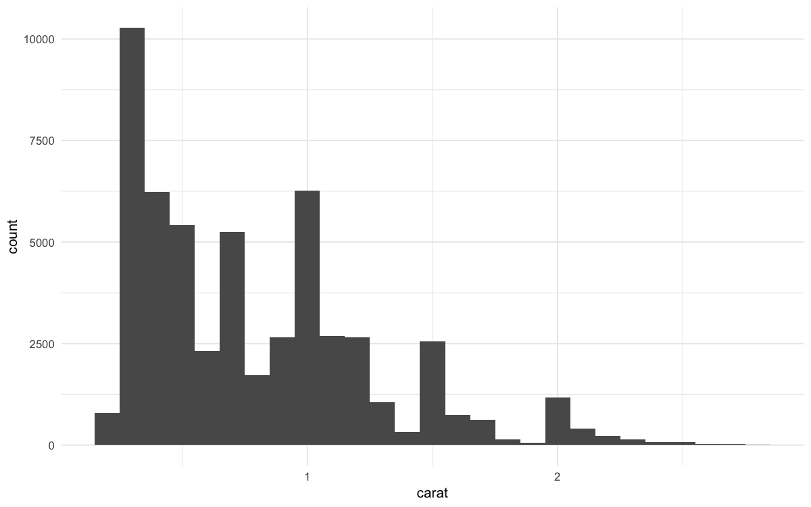
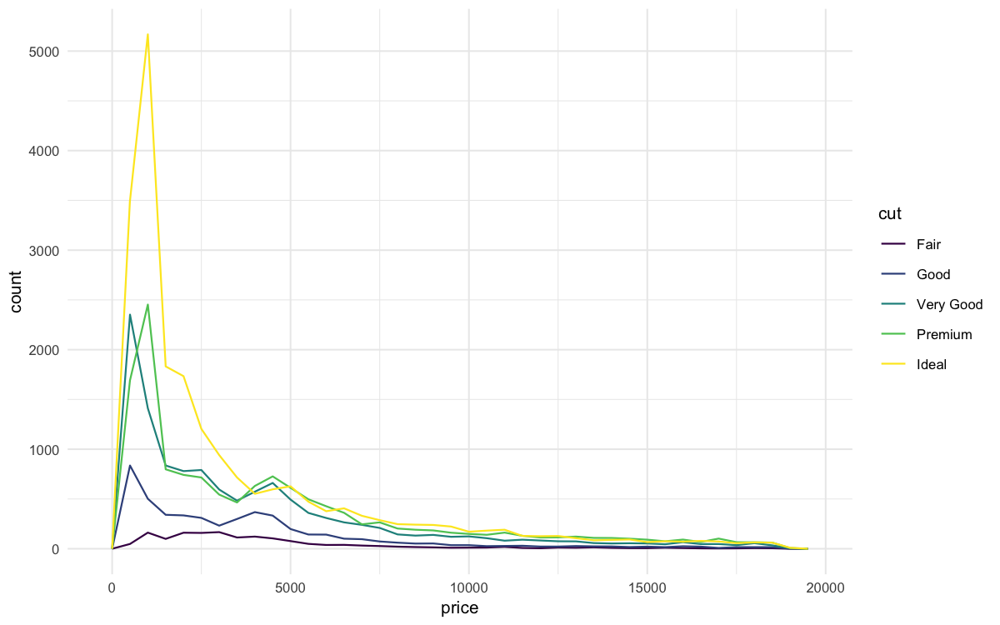
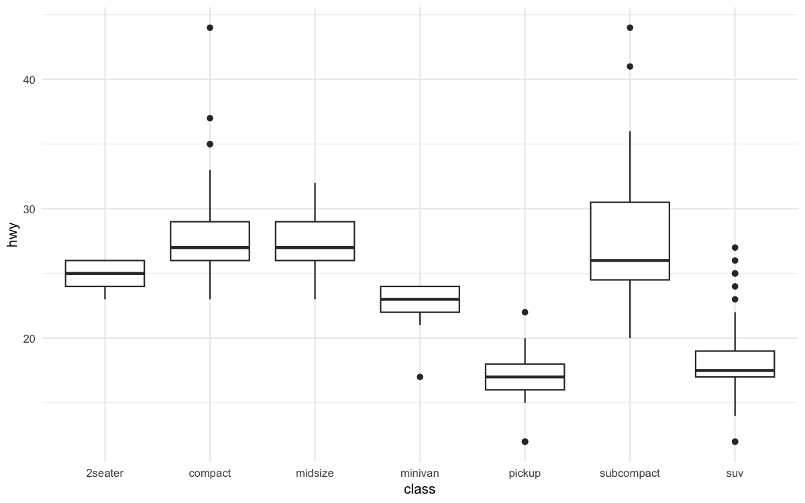
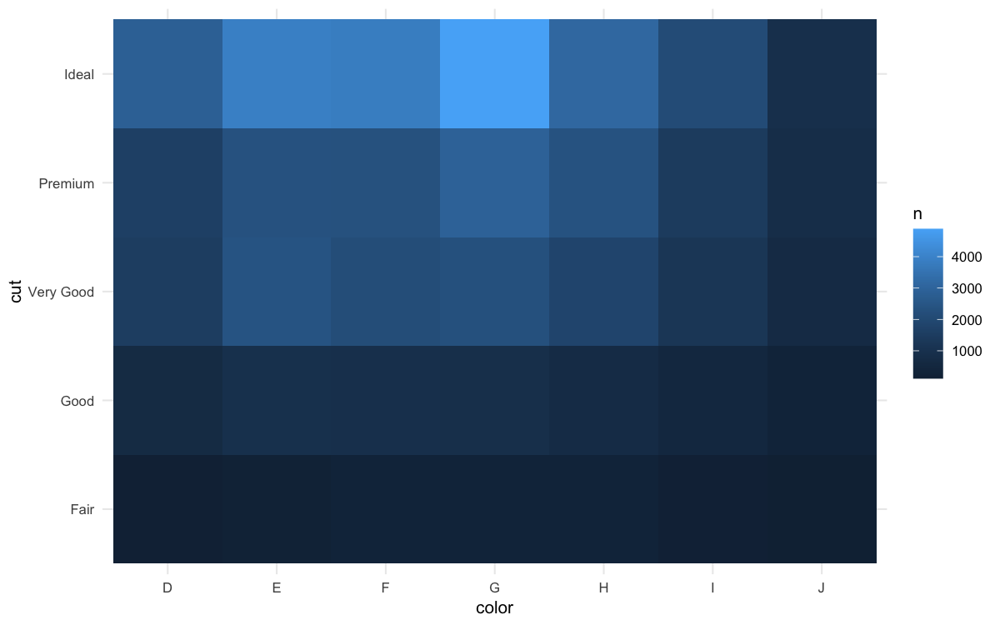

>  참고 자료:  
> [tidyverse 공식 문서](https://www.tidyverse.org/) | [R for Data Science](https://r4ds.had.co.nz/)

## 개요

**데이터 분석의 핵심**은 원하는 형태로 데이터를 가공하는 것입니다! 이번 포스팅에서는 tidyverse의 핵심 패키지인 **dplyr**을 활용한 데이터 조작 기법들을 다룹니다.

**filter**, **arrange**, **select**, **mutate**, **summarize** 등 실무에서 가장 많이 사용되는 함수들을 예제와 함께 배워보세요. 이 기법들만 익혀도 대부분의 데이터 전처리 작업을 효율적으로 처리할 수 있습니다!

## 1. 환경 설정 및 라이브러리 로드

### 필수 패키지 설치 및 로드

```r
library('tidyverse')
library('nycflights13')  # 2013년 뉴욕시 출발 항공편 정보 패키지

# 플롯 최적화 설정
options(
  repr.plot.width = 8,
  repr.plot.height = 5,
  repr.plot.res = 150
)
theme_set(theme_minimal(base_size = 10))
```

### 데이터셋 살펴보기

```r
flights %>% head()
```

| year | month | day | dep_time | carrier | flight | dest | arr_delay |
|------|-------|-----|----------|---------|--------|------|-----------|
| 2013 | 1 | 1 | 517 | UA | 1545 | IAH | 11 |
| 2013 | 1 | 1 | 533 | UA | 1714 | IAH | 20 |
| 2013 | 1 | 1 | 542 | AA | 1141 | MIA | 33 |

nycflights13 패키지의 `flights` 데이터셋은 2013년 뉴욕의 공항에서 출발한 336,776개의 항공편 정보를 담고 있습니다.

####  주요 변수 설명
- `dep_time`, `arr_time`: 출발/도착 시간
- `dep_delay`, `arr_delay`: 출발/도착 지연시간
- `carrier`: 항공사 코드
- `distance`: 비행 거리
- `dttm`: 날짜-시간형(날짜 + 시간)

## 2. filter() - 행 필터링

### 기본 사용법

```r
# 1월 1일 항공편만 선택
filter(flights, month == 1, day == 1)
```

| year | month | day | dep_time | carrier | flight | dest | arr_delay |
|------|-------|-----|----------|---------|--------|------|-----------|
| 2013 | 1 | 1 | 517 | UA | 1545 | IAH | 11 |
| 2013 | 1 | 1 | 533 | UA | 1714 | IAH | 20 |
| 2013 | 1 | 1 | 542 | AA | 1141 | MIA | 33 |

*결과: 842개의 항공편이 1월 1일에 출발했습니다.*

### 부동소수점 비교

컴퓨터에서 부동소수점 연산은 정확하지 않을 수 있습니다.

```r
# 안전한 부동소수점 비교
near(sqrt(2)^2, 2)
```

```
[1] TRUE
```

### 논리 연산자 활용

```r
# 11월 또는 12월 항공편
filter(flights, month == 11 | month == 12)

# %in% 연산자 사용 (더 간결)
nov_dec <- filter(flights, month %in% c(11, 12))
nov_dec %>% tail()
```

| year | month | day | dep_time | carrier | dest | arr_delay |
|------|-------|-----|----------|---------|------|-----------|
| 2013 | 12 | 31 | NA | UA | JAC | NA |
| 2013 | 12 | 31 | NA | UA | DEN | NA |
| 2013 | 12 | 31 | NA | US | CLT | NA |

*결과: 11월과 12월에 총 55,403개의 항공편이 있었습니다.*

### 복합 조건

```r
# 출발 지연 120분 이하이고 도착 지연 120분 이하
filter(flights, !(arr_delay > 120 | dep_delay > 120))
```

####  팁: 드모르간의 법칙
`!(x & y)`는 `!x | !y`와 같고, `!(x | y)`는 `!x & !y`와 같습니다.

## 3. arrange() - 행 정렬

### 기본 정렬

```r
# 도착 지연시간 기준 내림차순 정렬
arrange(flights, desc(arr_delay))
```

| year | month | day | dep_time | carrier | flight | dest | arr_delay |
|------|-------|-----|----------|---------|--------|------|-----------|
| 2013 | 1 | 9 | 641 | HA | 51 | HNL | 1272 |
| 2013 | 6 | 15 | 1432 | MQ | 3535 | CMH | 1127 |
| 2013 | 1 | 10 | 1121 | MQ | 3695 | ORD | 1109 |

*결과: 최대 지연시간은 1272분(약 21시간)이었습니다.*

### 결측값 처리

```r
df <- tibble(x = c(5, 2, NA))
arrange(df, x)  # NA는 항상 마지막에 위치
```

| x |
|---|
| 2 |
| 5 |
| NA |

####  중요사항
결측값(NA)은 정렬 시 항상 마지막에 배치됩니다.

## 4. select() - 열 선택

### 기본 사용법

```r
# 특정 열만 선택
select(flights, year, month, day)

# 범위 선택
select(flights, year:arr_delay)

# 특정 열 제외
select(flights, -(year:air_time))
```

### 고급 선택 함수

```r
# 패턴 기반 선택
select(flights, starts_with("dep"))  # 'dep'로 시작
select(flights, ends_with("delay"))  # 'delay'로 끝남
select(flights, contains("time"))    # 'time' 포함
```

####  select() 도우미 함수들
- `starts_with('abc')`: 'abc'로 시작하는 이름
- `ends_with("xyz")`: 'xyz'로 끝나는 이름  
- `contains('abc')`: 'abc'를 포함한 이름
- `num_range('x', 1:3)`: x1, x2, x3에 매칭

### 변수명 변경과 재배치

```r
# 변수명 변경
rename(flights, tail_num = tailnum)

# 특정 변수를 앞으로 이동
select(flights, time_hour, air_time, everything())
```

## 5. mutate() - 새 변수 생성

### 기본 변수 추가

```r
flights_sml <- select(flights,
                      year:day,
                      ends_with('delay'),
                      distance,
                      air_time)

mutate(flights_sml,
       gain = arr_delay - dep_delay,        # 지연시간 개선
       speed = distance / air_time * 60)    # 속도(mph)
```

### transmute() - 새 변수만 유지

```r
transmute(flights,
          gain = arr_delay - dep_delay,
          hours = air_time / 60,
          gain_per_hour = gain / hours)
```

### 유용한 mutate 함수들

#### 산술 연산자
```r
# 나눗셈과 나머지
x <- 1:10
x %/% 3  # 정수 나눗셈
x %% 3   # 나머지
```

#### 위치 함수
```r
# 데이터 이동
lag(x)   # 한 칸 뒤로
lead(x)  # 한 칸 앞으로
```

#### 누적 함수
```r
cumsum(x)   # 누적 합
cummean(x)  # 누적 평균
```

## 6. summarize() - 그룹화 요약

### 기본 요약

```r
# 전체 평균 출발 지연시간
summarize(flights, delay = mean(dep_delay, na.rm = TRUE))
```

### group_by()와 함께 사용

```r
# 날짜별 평균 지연시간
by_day <- group_by(flights, year, month, day)
summarize(by_day, delay = mean(dep_delay, na.rm = TRUE))
```

### 파이프 연산자로 연결

```r
delays <- flights %>%
  group_by(dest) %>%
  summarize(
    count = n(),
    dist = mean(distance, na.rm = TRUE),
    delay = mean(arr_delay, na.rm = TRUE)
  ) %>%
  filter(count > 20, dest != "HNL")
```

####  시각화로 패턴 확인

```r
ggplot(data = delays, mapping = aes(x = dist, y = delay)) + 
  geom_point(aes(size = count), alpha = 1/3) +
  geom_smooth(se = FALSE)
```


### 결측값 처리의 중요성

```r
# 취소된 항공편 제외
not_cancelled <- flights %>%
  filter(!is.na(dep_delay), !is.na(arr_delay))

# 더 정확한 분석
not_cancelled %>%
  group_by(year, month, day) %>%
  summarize(mean = mean(dep_delay))
```

## 7. 유용한 요약 함수들

### 데이터 분포 시각화

```r
ggplot(data = delays, mapping = aes(x = delay)) +
  geom_freqpoly(binwidth = 10)
```


애초에 평균으로 요약된 데이터로 구한 plot으로 특정 항공기 종류는 도착 지연시간 평균이 300분을 넘어가는 것을 볼 수 있습니다.

### 운항 횟수와 지연시간의 관계

```r
ggplot(data = delays, mapping = aes(x = n, y = delay)) +
  geom_point(alpha = 0.1)
```


**해석**: n은 해당 비행기 기종의 운행 횟수를 나타낸 것으로 운행횟수가 많아질수록 평균 지연시간의 변동폭이 적어짐을 알 수 있습니다(평균이기에). 반대로 평균 운행횟수가 적은 경우 변동폭이 비교적 더 큽니다.

```r
# 항공기별 운항 횟수와 평균 지연시간
delays <- not_cancelled %>%
  group_by(tailnum) %>%
  summarize(
    delay = mean(arr_delay),
    n = n()  # 개수 세기
  )
```

### 위치 측도

```r
# 일별 첫 출발과 마지막 출발
not_cancelled %>%
  group_by(year, month, day) %>%
  summarize(
    first = min(dep_time),
    last = max(dep_time)
  )
```

### 순위 함수

```r
# 각 날짜의 가장 빠른/늦은 출발편
not_cancelled %>%
  group_by(year, month, day) %>%
  mutate(r = min_rank(desc(dep_time))) %>%
  filter(r %in% range(r))
```

### 고급 요약 기법

#### 조건부 요약

```r
# 60분 이상 지연된 항공편 비율
not_cancelled %>%
  group_by(year, month, day) %>%
  summarize(hour_prop = mean(arr_delay > 60))
```

#### 고유값 개수

```r
# 목적지별 항공사 수
not_cancelled %>%
  group_by(dest) %>%
  summarize(carriers = n_distinct(carrier)) %>%
  arrange(desc(carriers))
```

#### 가중 카운트

```r
# 항공기별 총 비행 거리
not_cancelled %>%
  count(tailnum, wt = distance)
```

## 8. 그룹화의 고급 활용

### 점진적 요약

```r
daily <- group_by(flights, year, month, day)
(per_day <- summarize(daily, flights = n()))
(per_month <- summarize(per_day, flights = sum(flights)))
(per_year <- summarize(per_month, flights = sum(flights)))
```

####  주의사항
점진적 요약에서 `sum()`과 `count()`는 문제없지만, 중앙값의 경우 그룹별 중앙값의 중앙값은 실제 전체 중앙값과 다릅니다.

### 그룹 해제

```r
daily %>%
  ungroup() %>%  # 그룹화 해제
  summarize(flights = n())  # 전체 항공편 수
```

## 9. mutate()와 filter()에서 그룹 활용

### 그룹별 필터링

```r
# 각 날짜별 지연시간 상위 10개
flights_sml %>%
  group_by(year, month, day) %>%
  filter(rank(desc(arr_delay)) < 10)

# 인기 목적지만 선택 (연간 365편 초과)
popular_dests <- flights %>%
  group_by(dest) %>%
  filter(n() > 365)
```

### 그룹별 비율 계산

```r
# 목적지별 지연시간 비율
popular_dests %>%
  filter(arr_delay > 0) %>%
  mutate(prop_delay = arr_delay / sum(arr_delay)) %>%
  select(year:day, dest, arr_delay, prop_delay)
```

##  데이터 핸들링 실무 팁

###  효율적인 작업 흐름

1. **데이터 탐색**: `glimpse()`, `summary()`, `head()` 활용
2. **결측값 확인**: `is.na()`, `complete.cases()` 검토
3. **필터링**: 분석에 필요한 데이터만 선별
4. **변수 생성**: 분석 목적에 맞는 파생 변수 추가
5. **그룹화 요약**: 패턴과 인사이트 도출

###  코드 최적화 전략

```r
# 파이프 연산자로 연결된 효율적인 코드
result <- flights %>%
  filter(!is.na(dep_delay), !is.na(arr_delay)) %>%
  group_by(carrier) %>%
  summarize(
    avg_delay = mean(arr_delay),
    flights = n(),
    .groups = 'drop'
  ) %>%
  arrange(desc(avg_delay))
```

###  성능 고려사항

- **큰 데이터**: `slice_sample()`로 샘플링 후 개발
- **메모리 효율**: 불필요한 열은 일찍 제거
- **속도 최적화**: 필터링을 먼저, 연산은 나중에

## 마무리

**tidyverse의 데이터 조작 함수들**을 마스터하면 복잡한 데이터 전처리도 직관적이고 효율적으로 처리할 수 있습니다. 이번 포스팅에서 다룬 핵심 내용들을 정리하면:

- **filter()**: 조건에 맞는 행 선택으로 데이터 범위 설정
- **arrange()**: 정렬을 통한 데이터 순서 조정
- **select()**: 필요한 변수만 선택하여 분석 초점 맞추기
- **mutate()**: 새로운 변수 생성으로 분석 확장
- **summarize() + group_by()**: 그룹별 요약으로 패턴 발견

이 기법들은 **데이터 분석의 기초**이자 **실무의 핵심**입니다. 반복 연습을 통해 자연스럽게 사용할 수 있도록 익혀보세요!

---

## 개요

**탐색적 데이터 분석(EDA)**은 데이터 사이언스의 핵심 단계입니다. 이번 포스팅에서는 R의 tidyverse를 활용하여 **변동(Variation)**과 **공변동(Covariation)** 분석을 통해 데이터의 숨겨진 패턴을 발견하는 방법을 다룹니다.

**시각화 기법**, **결측값 처리**, **이상값 탐지**, **패턴 분석**까지 - 실무에서 바로 활용할 수 있는 체계적인 데이터 탐색 기법을 배워보세요!

## 1. 환경 설정 및 기본 개념

### 라이브러리 로드 및 설정

```r
library('tidyverse')  # 데이터 분석 핵심 패키지
library('hexbin')     # 육각형 빈 플롯
library('nycflights13') # 실습용 데이터

# 플롯 최적화 설정
options(
  repr.plot.width = 8,
  repr.plot.height = 5,
  repr.plot.res = 150
)
theme_set(theme_minimal(base_size = 10))
```

###  변동(Variation)과 공변동(Covariation)

**변동(Variation)**: 동일한 변수의 측정값이 변하는 경향
- 모든 변수는 고유한 변동 패턴을 가짐
- 연속형/범주형 변수마다 다른 시각화 방법 필요

**공변동(Covariation)**: 둘 이상의 변수가 연관되어 동시에 변하는 경향
- 변수 간 상관관계의 단서 제공
- 예측력 향상에 핵심적 역할

## 2. 변동 분석 - 시각화 기법

### 범주형 변수 시각화

```r
# 기본 막대 그래프
ggplot(data = diamonds) + 
  geom_bar(mapping = aes(x = cut))
```


```r
# 수치로 확인
diamonds %>% count(cut)
```

### 연속형 변수 시각화

#### 히스토그램을 이용한 분포 분석

```r
# 기본 히스토그램
ggplot(data = diamonds) +
  geom_histogram(mapping = aes(x = carat), binwidth = 0.5)
```


```r
# 수치로 구간별 확인
diamonds %>%
  count(cut_width(carat, 0.5))
```

#### 세밀한 분포 탐색

```r
# 3캐럿 미만으로 필터링 후 세밀한 분석
smaller <- diamonds %>%
  filter(carat < 3)

ggplot(data = smaller, mapping = aes(x = carat)) +
  geom_histogram(binwidth = 0.1)
```



### 다중 그룹 비교: geom_freqpoly

```r
ggplot(data = smaller, mapping = aes(x = carat, color = cut)) +
  geom_freqpoly(binwidth = 0.1)
```


###  패턴 발견하기

매우 세밀한 binwidth로 분석하면 흥미로운 패턴이 보입니다:

```r
ggplot(data = smaller, mapping = aes(x = carat)) +
  geom_histogram(binwidth = 0.01)
```


####  발견한 패턴
특정 캐럿 값(0.3, 0.7, 1.0 등)에서 관측값이 급증합니다. 이는 다이아몬드 업계의 표준 크기와 관련이 있을 것으로 추정됩니다.

## 3. 이상값 탐지 및 처리

### Faithful 데이터셋 분석

```r
# Old Faithful 간헐천 데이터
ggplot(data = faithful, mapping = aes(x = eruptions)) + 
  geom_histogram(binwidth = 0.25)
```


### 이상값 탐지

```r
# y 변수의 분포 확인
ggplot(diamonds) +
  geom_histogram(mapping = aes(x = y), binwidth = 0.5)
```


### coord_cartesian()을 활용한 확대

```r
# 이상값이 있는 구간 확대
ggplot(diamonds) +
  geom_histogram(mapping = aes(x = y), binwidth = 0.5) +
  coord_cartesian(ylim = c(0, 50))
```


### 이상값 확인

```r
# 이상값 추출
unusual <- diamonds %>%
  filter(y < 3 | y > 20) %>%
  select(price, x, y, z) %>%
  arrange(y)

unusual
```

## 4. 결측값 처리 전략

### 방법 1: 이상값이 포함된 행 제거 (비권장)

```r
diamonds2 <- diamonds %>%
  filter(between(y, 3, 20))
```

### 방법 2: 이상값을 결측값으로 변환 (권장)

```r
diamonds2 <- diamonds %>%
  mutate(y = ifelse(y < 3 | y > 20, NA, y))
```

#### 결측값이 있는 데이터 시각화

```r
ggplot(data = diamonds2, mapping = aes(x = x, y = y)) +
  geom_point()
```


### 실제 사례: 항공편 취소 분석

```r
# 취소된 항공편 vs 정상 항공편의 출발시간 비교
nycflights13::flights %>%
  mutate(
    cancelled = is.na(dep_time),
    sched_hour = sched_dep_time %/% 100,
    sched_min = sched_dep_time %% 100,
    sched_dep_time = sched_hour + sched_min / 60
  ) %>%
  ggplot(mapping = aes(sched_dep_time)) +
  geom_freqpoly(
    mapping = aes(color = cancelled),
    binwidth = 1/4
  )
```


## 5. 공변동 분석 (Covariation)

### 범주형 vs 연속형 변수

#### 문제: 빈도수 차이로 인한 비교 어려움

```r
# 기본 frequency polygon - 비교가 어려움
ggplot(data = diamonds) +
  geom_freqpoly(mapping = aes(x = price, color = cut), binwidth = 500)
```



#### 해결책 1: 밀도(Density) 사용

```r
# 밀도로 표준화하여 패턴 비교
ggplot(
  data = diamonds,
  mapping = aes(x = price, y = after_stat(density))
) +
geom_freqpoly(mapping = aes(color = cut), binwidth = 500)
```


#### 해결책 2: 박스플롯 활용

```r
ggplot(data = diamonds, mapping = aes(x = cut, y = price)) +
  geom_boxplot()
```


####  핵심 인사이트
더 좋은 품질의 다이아몬드가 평균적으로 더 저렴합니다! 이는 직관에 반하는 흥미로운 발견입니다.

### 순서가 없는 범주형 변수

#### reorder()를 활용한 정렬

```r
# 기본 순서 (알파벳순)
ggplot(data = mpg, mapping = aes(x = class, y = hwy)) +
  geom_boxplot()
```



```r
# 중간값 기준으로 재정렬
ggplot(data = mpg) +
  geom_boxplot(
    mapping = aes(
      x = reorder(class, hwy, FUN = median),
      y = hwy
    )
  )
```


#### 축 뒤집기로 가독성 향상

```r
ggplot(data = mpg) +
  geom_boxplot(
    mapping = aes(
      x = reorder(class, hwy, FUN = median),
      y = hwy
    )
  ) +
  coord_flip()
```


## 6. 범주형 변수 간 공변동

### geom_count()로 조합 빈도 시각화

```r
ggplot(data = diamonds) +
  geom_count(mapping = aes(x = cut, y = color))
```


### count()와 geom_tile() 조합

```r
# 데이터 전처리
diamonds %>%
  count(color, cut) %>%
  ggplot(mapping = aes(x = color, y = cut)) +
  geom_tile(mapping = aes(fill = n))
```



## 7. 연속형 변수 간 공변동

### 산점도의 한계와 해결책

#### 기본 산점도

```r
ggplot(data = diamonds) +
  geom_point(mapping = aes(x = carat, y = price))
```


#### 투명도로 겹침 문제 해결

```r
ggplot(data = diamonds) +
  geom_point(
    mapping = aes(x = carat, y = price),
    alpha = 0.01
  )
```


### 2D 빈(Bin) 활용

#### 직사각형 빈

```r
ggplot(data = smaller) +
  geom_bin2d(mapping = aes(x = carat, y = price))
```


#### 육각형 빈 (추천)

```r
ggplot(data = smaller) +
  geom_hex(mapping = aes(x = carat, y = price))
```


### 연속형 변수를 범주형으로 변환

#### cut_width() 활용

```r
ggplot(data = smaller, mapping = aes(x = carat, y = price)) +
  geom_boxplot(mapping = aes(group = cut_width(carat, 0.1)))
```


#### cut_number()로 균등 분할

```r
ggplot(data = smaller, mapping = aes(x = carat, y = price)) +
  geom_boxplot(mapping = aes(group = cut_number(carat, 20)))
```


## 8. 패턴과 모델 (고급)

### 패턴 분석을 위한 질문들

패턴을 발견했을 때 스스로에게 던져야 할 질문들:

1. **우연의 일치인가?** 랜덤한 가능성은 얼마나 될까?
2. **상관관계를 어떻게 설명할까?** 인과관계가 있을까?
3. **상관관계의 강도는?** 얼마나 강한 관계인가?
4. **다른 변수의 영향은?** 제3의 변수가 영향을 주는가?
5. **하위집단별 차이는?** 그룹별로 패턴이 다른가?

### Old Faithful 간헐천 사례

```r
ggplot(data = faithful) +
  geom_point(mapping = aes(x = eruptions, y = waiting))
```


####  발견된 패턴
분출 사이의 대기 시간이 길수록 분출 시간도 길어지는 강한 양의 상관관계

### 모델을 활용한 패턴 추출

#### 로그 변환 회귀 모델

```r
library('modelr')

# 캐럿-가격 관계 모델링
mod <- lm(log(price) ~ log(carat), data = diamonds)

# 잔차 계산
diamonds2 <- diamonds %>%
  add_residuals(mod) %>%
  mutate(resid = exp(resid))

# 잔차 vs 캐럿
ggplot(data = diamonds2) +
  geom_point(mapping = aes(x = carat, y = resid))
```


#### 캐럿 효과 제거 후 컷 품질 분석

```r
ggplot(data = diamonds2) +
  geom_boxplot(mapping = aes(x = cut, y = resid))
```


####  핵심 발견
캐럿의 효과를 제거하고 나니, 더 좋은 품질의 다이아몬드가 실제로 더 비싸다는 것을 확인할 수 있습니다!

##  탐색적 데이터 분석 체크리스트

###  변동 분석
- [ ] **범주형**: 막대 그래프로 빈도 확인
- [ ] **연속형**: 히스토그램으로 분포 탐색
- [ ] **이상값**: coord_cartesian()으로 세밀 검토
- [ ] **결측값**: 의미 있는 패턴인지 확인

###  공변동 분석
- [ ] **범주형 vs 연속형**: 박스플롯 또는 밀도 플롯
- [ ] **범주형 vs 범주형**: count 플롯 또는 타일 플롯
- [ ] **연속형 vs 연속형**: 산점도, 2D 빈, 또는 그룹화된 박스플롯

###  패턴 탐지
- [ ] **순서 조정**: reorder()로 의미 있는 순서
- [ ] **모델 활용**: 주요 효과 제거 후 세부 패턴 탐색
- [ ] **하위집단**: 그룹별 패턴 차이 확인

## 마무리

**탐색적 데이터 분석**은 데이터 사이언스의 핵심 단계입니다. 이번 포스팅에서 다룬 핵심 개념들을 정리하면:

- **변동 분석**: 각 변수의 고유한 패턴 이해
- **공변동 분석**: 변수 간 상관관계 탐색  
- **시각화 기법**: 데이터 유형별 최적 시각화 선택
- **이상값 처리**: 탐지와 적절한 대응 방법
- **패턴 발견**: 모델을 활용한 숨겨진 관계 발굴

**실무에서는 이러한 탐색 과정을 통해 데이터의 품질을 확인하고, 분석 방향을 설정하며, 모델링을 위한 인사이트를 얻습니다.** 

체계적인 EDA를 통해 **데이터가 말하는 이야기**를 발견하고, **가설 생성**의 기초를 마련하세요. 다음 포스팅에서는 **데이터 전처리와 변환 기법**에 대해 더 자세히 다뤄보겠습니다!