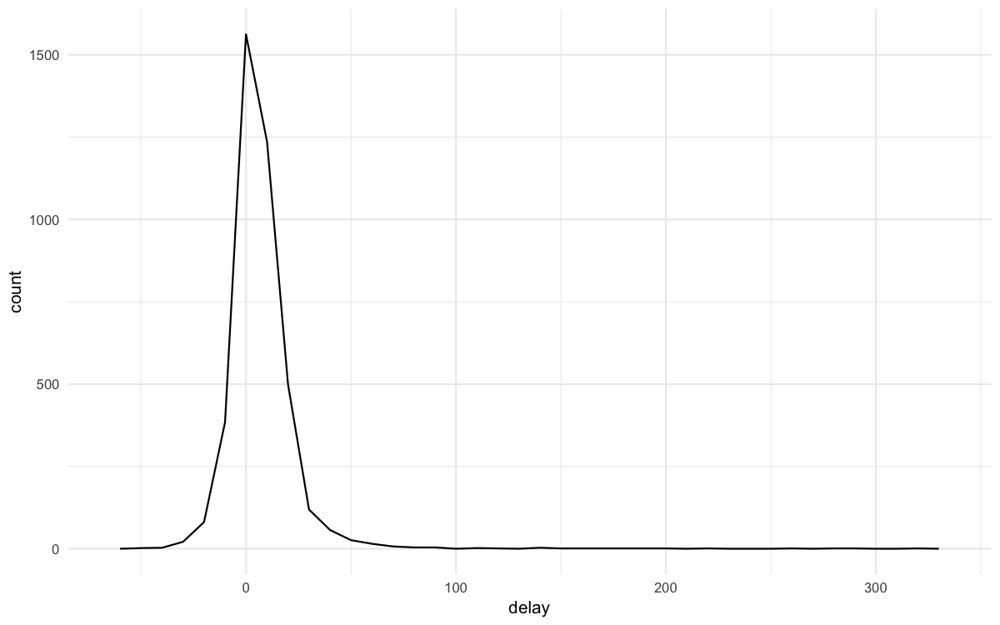

>  참고 자료:
> [dplyr 공식 문서](https://dplyr.tidyverse.org/) | [R for Data Science](https://r4ds.had.co.nz/)

## 개요

**dplyr**은 tidyverse의 핵심 패키지로, 데이터프레임을 직관적으로 조작할 수 있게 해줍니다. 이 포스팅에서는 데이터 분석에서 가장 자주 사용되는 dplyr 함수들과 여러 테이블을 결합하는 Join 기법을 다룹니다.

```r title="환경 설정"
library('tidyverse')
library('nycflights13')  # 2013년 뉴욕시 출발 항공편 정보 패키지

# 플롯 최적화 설정
options(
  repr.plot.width = 8,
  repr.plot.height = 5,
  repr.plot.res = 150
)
theme_set(theme_minimal(base_size = 10))
```

**데이터셋 살펴보기**
```r
flights %>% head()
```

| year | month | day | dep_time | carrier | flight | dest | arr_delay |
|------|-------|-----|----------|---------|--------|------|-----------|
| 2013 | 1 | 1 | 517 | UA | 1545 | IAH | 11 |
| 2013 | 1 | 1 | 533 | UA | 1714 | IAH | 20 |
| 2013 | 1 | 1 | 542 | AA | 1141 | MIA | 33 |

nycflights13 패키지의 `flights` 데이터셋은 2013년 뉴욕의 공항에서 출발한 336,776개의 항공편 정보를 담고 있습니다.

**주요 변수**
- `dep_time`, `arr_time`: 출발/도착 시간
- `dep_delay`, `arr_delay`: 출발/도착 지연시간
- `carrier`: 항공사 코드
- `distance`: 비행 거리
- `time_hour`: 날짜-시간형(날짜 + 시간)

## 1. filter()

조건에 맞는 행만 선택할 때 사용합니다. 데이터의 범위를 좁히거나 특정 그룹만 분석할 때 필수적입니다.

**기본 사용법**
```r
# 1월 1일 항공편만 선택
filter(flights, month == 1, day == 1)
```

| year | month | day | dep_time | carrier | flight | dest | arr_delay |
|------|-------|-----|----------|---------|--------|------|-----------|
| 2013 | 1 | 1 | 517 | UA | 1545 | IAH | 11 |
| 2013 | 1 | 1 | 533 | UA | 1714 | IAH | 20 |
| 2013 | 1 | 1 | 542 | AA | 1141 | MIA | 33 |

842개의 항공편이 1월 1일에 출발했습니다.

**부동소수점 비교**

컴퓨터에서 부동소수점 연산은 정확하지 않을 수 있으므로 `near()` 함수를 사용합니다.
```r
# 안전한 부동소수점 비교
near(sqrt(2)^2, 2)
```
```
[1] TRUE
```

**논리 연산자 활용**
```r
# 11월 또는 12월 항공편
filter(flights, month == 11 | month == 12)

# %in% 연산자 사용 (더 간결)
nov_dec <- filter(flights, month %in% c(11, 12))
nov_dec %>% tail()
```

| year | month | day | dep_time | carrier | dest | arr_delay |
|------|-------|-----|----------|---------|------|-----------|
| 2013 | 12 | 31 | NA | UA | JAC | NA |
| 2013 | 12 | 31 | NA | UA | DEN | NA |
| 2013 | 12 | 31 | NA | US | CLT | NA |

11월과 12월에 총 55,403개의 항공편이 있었습니다.

**복합 조건**
```r
# 출발 지연 120분 이하이고 도착 지연 120분 이하
filter(flights, !(arr_delay > 120 | dep_delay > 120))
```

:::tip
드모르간의 법칙: `!(x & y)`는 `!x | !y`와 같고, `!(x | y)`는 `!x & !y`와 같습니다.
:::

## 2. arrange()

데이터를 특정 순서로 정렬할 때 사용합니다. 최댓값, 최솟값을 찾거나 순위를 매길 때 유용합니다.

**기본 정렬**
```r
# 도착 지연시간 기준 내림차순 정렬
arrange(flights, desc(arr_delay))
```

| year | month | day | dep_time | carrier | flight | dest | arr_delay |
|------|-------|-----|----------|---------|--------|------|-----------|
| 2013 | 1 | 9 | 641 | HA | 51 | HNL | 1272 |
| 2013 | 6 | 15 | 1432 | MQ | 3535 | CMH | 1127 |
| 2013 | 1 | 10 | 1121 | MQ | 3695 | ORD | 1109 |

최대 지연시간은 1272분(약 21시간)이었습니다.

**결측값 처리**
```r
df <- tibble(x = c(5, 2, NA))
arrange(df, x)  # NA는 항상 마지막에 위치
```

| x |
|---|
| 2 |
| 5 |
| NA |

결측값(NA)은 정렬 시 항상 마지막에 배치됩니다.

## 3. select()

분석에 필요한 변수만 선택할 때 사용합니다. 데이터셋이 클 때 메모리를 절약하고 가독성을 높입니다.

**기본 사용법**
```r
# 특정 열만 선택
select(flights, year, month, day)

# 범위 선택
select(flights, year:arr_delay)

# 특정 열 제외
select(flights, -(year:air_time))
```

**패턴 기반 선택**
```r
# 패턴 기반 선택
select(flights, starts_with("dep"))  # 'dep'로 시작
select(flights, ends_with("delay"))  # 'delay'로 끝남
select(flights, contains("time"))    # 'time' 포함
```

**select() 도우미 함수들**
- `starts_with('abc')`: 'abc'로 시작하는 이름
- `ends_with("xyz")`: 'xyz'로 끝나는 이름
- `contains('abc')`: 'abc'를 포함한 이름
- `num_range('x', 1:3)`: x1, x2, x3에 매칭

**변수명 변경과 재배치**
```r
# 변수명 변경
rename(flights, tail_num = tailnum)

# 특정 변수를 앞으로 이동
select(flights, time_hour, air_time, everything())
```

## 4. mutate()

기존 변수를 활용해 새로운 변수를 만들 때 사용합니다. 파생변수 생성은 데이터 분석의 핵심 과정입니다.

**기본 변수 추가**
```r
flights_sml <- select(flights,
                      year:day,
                      ends_with('delay'),
                      distance,
                      air_time)

mutate(flights_sml,
       gain = arr_delay - dep_delay,        # 지연시간 개선
       speed = distance / air_time * 60)    # 속도(mph)
```

**transmute() - 새 변수만 유지**

새로 만든 변수만 남기고 나머지는 제거할 때 사용합니다.
```r
transmute(flights,
          gain = arr_delay - dep_delay,
          hours = air_time / 60,
          gain_per_hour = gain / hours)
```

**산술 연산자**
```r
# 나눗셈과 나머지
x <- 1:10
x %/% 3  # 정수 나눗셈
x %% 3   # 나머지
```

**위치 함수**
```r
# 데이터 이동
lag(x)   # 한 칸 뒤로
lead(x)  # 한 칸 앞으로
```

**누적 함수**
```r
cumsum(x)   # 누적 합
cummean(x)  # 누적 평균
```

## 5. 그룹화와 요약

그룹별로 데이터를 요약하고 집계할 때 사용합니다. 집단 간 비교와 패턴 발견에 핵심적입니다.

**기본 요약**
```r
# 전체 평균 출발 지연시간
summarize(flights, delay = mean(dep_delay, na.rm = TRUE))
```

**group_by()와 함께 사용**
```r
# 날짜별 평균 지연시간
by_day <- group_by(flights, year, month, day)
summarize(by_day, delay = mean(dep_delay, na.rm = TRUE))
```

**파이프 연산자로 연결**
```r
delays <- flights %>%
  group_by(dest) %>%
  summarize(
    count = n(),
    dist = mean(distance, na.rm = TRUE),
    delay = mean(arr_delay, na.rm = TRUE)
  ) %>%
  filter(count > 20, dest != "HNL")
```

**시각화로 패턴 확인**
```r
ggplot(data = delays, mapping = aes(x = dist, y = delay)) +
  geom_point(aes(size = count), alpha = 1/3) +
  geom_smooth(se = FALSE)
```


**결측값 처리의 중요성**

취소된 항공편을 제외하면 더 정확한 분석이 가능합니다.
```r
# 취소된 항공편 제외
not_cancelled <- flights %>%
  filter(!is.na(dep_delay), !is.na(arr_delay))

# 더 정확한 분석
not_cancelled %>%
  group_by(year, month, day) %>%
  summarize(mean = mean(dep_delay))
```

**데이터 분포 시각화**
```r
# 항공기별 평균 지연시간 분포
delays <- not_cancelled %>%
  group_by(tailnum) %>%
  summarize(
    delay = mean(arr_delay),
    n = n()
  )

ggplot(data = delays, mapping = aes(x = delay)) +
  geom_freqpoly(binwidth = 10)
```



특정 항공기는 도착 지연시간 평균이 300분을 넘어가는 것을 볼 수 있습니다.

**운항 횟수와 지연시간의 관계**
```r
ggplot(data = delays, mapping = aes(x = n, y = delay)) +
  geom_point(alpha = 0.1)
```


운행횟수가 많아질수록 평균 지연시간의 변동폭이 적어집니다. 운행횟수가 적은 경우 변동폭이 비교적 더 큽니다.

**위치 측도**
```r
# 일별 첫 출발과 마지막 출발
not_cancelled %>%
  group_by(year, month, day) %>%
  summarize(
    first = min(dep_time),
    last = max(dep_time)
  )
```

**순위 함수**
```r
# 각 날짜의 가장 빠른/늦은 출발편
not_cancelled %>%
  group_by(year, month, day) %>%
  mutate(r = min_rank(desc(dep_time))) %>%
  filter(r %in% range(r))
```

**조건부 요약**
```r
# 60분 이상 지연된 항공편 비율
not_cancelled %>%
  group_by(year, month, day) %>%
  summarize(hour_prop = mean(arr_delay > 60))
```

**고유값 개수**
```r
# 목적지별 항공사 수
not_cancelled %>%
  group_by(dest) %>%
  summarize(carriers = n_distinct(carrier)) %>%
  arrange(desc(carriers))
```

**가중 카운트**
```r
# 항공기별 총 비행 거리
not_cancelled %>%
  count(tailnum, wt = distance)
```

**점진적 요약**
```r
daily <- group_by(flights, year, month, day)
(per_day <- summarize(daily, flights = n()))
(per_month <- summarize(per_day, flights = sum(flights)))
(per_year <- summarize(per_month, flights = sum(flights)))
```

:::caution
점진적 요약에서 `sum()`과 `count()`는 문제없지만, 중앙값의 경우 그룹별 중앙값의 중앙값은 실제 전체 중앙값과 다릅니다.
:::

**그룹 해제**
```r
daily %>%
  ungroup() %>%  # 그룹화 해제
  summarize(flights = n())  # 전체 항공편 수
```

**그룹별 필터링**
```r
# 각 날짜별 지연시간 상위 10개
flights_sml %>%
  group_by(year, month, day) %>%
  filter(rank(desc(arr_delay)) < 10)

# 인기 목적지만 선택 (연간 365편 초과)
popular_dests <- flights %>%
  group_by(dest) %>%
  filter(n() > 365)
```

**그룹별 비율 계산**
```r
# 목적지별 지연시간 비율
popular_dests %>%
  filter(arr_delay > 0) %>%
  mutate(prop_delay = arr_delay / sum(arr_delay)) %>%
  select(year:day, dest, arr_delay, prop_delay)
```

## 6. 기본키와 Join

데이터 분석에서는 여러 테이블을 연결하여 통합 분석을 수행하는 경우가 많습니다.

**기본키 중복 확인**

```r
# weather 데이터의 기본키 중복 검사
weather %>%
  count(year, month, day, hour, origin) %>%
  filter(n > 1)
#   year month day hour origin n
# 1 2013    11   3    1    EWR 2
# 2 2013    11   3    1    JFK 2
# 3 2013    11   3    1    LGA 2
```

**flights 데이터의 중복 항공편 확인**

```r
# 같은 날짜에 같은 항공편 번호가 여러 번 운항되는 경우
flights %>%
  count(year, month, day, flight) %>%
  filter(n > 1) %>% head()
#   year month day flight n
# 1 2013     1   1      1 2
# 2 2013     1   1      3 2
# 3 2013     1   1      4 2
# 4 2013     1   1     11 3  # 같은 항공편이 하루에 3번!
# 5 2013     1   1     15 2
# 6 2013     1   1     21 2
```

:::tip 데이터 품질 검증 팁
- **기본키 확인**: `count() + filter(n > 1)`로 중복 검사
- **데이터 무결성**: 예상과 다른 중복이 있다면 원인 파악 필요
- **비즈니스 로직**: 항공편은 하루에 여러 번 운항 가능 (정상)
:::

**기본 테이블 설정**

```r
# 예제 데이터 생성
x <- tribble(
  ~key, ~val_x,
  1, "x1",
  2, "x2",
  3, "x3"
)

y <- tribble(
  ~key, ~val_y,
  1, "y1",
  2, "y2",
  4, "y3"
)

x
#   key val_x
# 1   1    x1
# 2   2    x2
# 3   3    x3

y
#   key val_y
# 1   1    y1
# 2   2    y2
# 3   4    y3
```

**inner_join - 교집합**

```r
# 양쪽 테이블에 모두 존재하는 키만 유지
x %>% inner_join(y, by = "key")
#   key val_x val_y
# 1   1    x1    y1
# 2   2    x2    y2
```

## 7. Join 유형

여러 테이블을 결합하는 다양한 방법을 소개합니다.

**Join 유형 비교표**

| Join 유형 | 설명 | 결과 행 수 | 사용 상황 |
|-----------|------|------------|-----------|
| **inner_join** | 양쪽에 모두 있는 키만 | 교집합 | 완전 매칭만 필요할 때 |
| **left_join** | 왼쪽 기준, 오른쪽 보완 | 왼쪽과 동일 | 기본 테이블 유지 |
| **right_join** | 오른쪽 기준, 왼쪽 보완 | 오른쪽과 동일 | 참조 테이블 기준 |
| **full_join** | 양쪽 모두 포함 | 합집합 | 모든 데이터 보존 |

**left_join 실전 예제**

```r
# 항공사 정보 추가
flights2 %>%
  select(-origin, -dest) %>%
  left_join(airlines, by = "carrier") %>% head()
#   year month day hour tailnum carrier                    name
# 1 2013     1   1    5  N14228      UA  United Air Lines Inc.
# 2 2013     1   1    5  N24211      UA  United Air Lines Inc.
# 3 2013     1   1    5  N619AA      AA American Airlines Inc.
# 4 2013     1   1    5  N804JB      B6        JetBlue Airways
# 5 2013     1   1    6  N668DN      DL   Delta Air Lines Inc.
# 6 2013     1   1    5  N39463      UA  United Air Lines Inc.
```

**match를 활용한 수동 매칭**

```r
# mutate + match로 join과 같은 효과
flights2 %>%
  select(-origin, -dest) %>%
  mutate(name = airlines$name[match(carrier, airlines$carrier)]) %>% head()
#   year month day hour tailnum carrier                    name
# 1 2013     1   1    5  N14228      UA  United Air Lines Inc.
# 2 2013     1   1    5  N24211      UA  United Air Lines Inc.
# 3 2013     1   1    5  N619AA      AA American Airlines Inc.
# 4 2013     1   1    5  N804JB      B6        JetBlue Airways
# 5 2013     1   1    6  N668DN      DL   Delta Air Lines Inc.
# 6 2013     1   1    5  N39463      UA  United Air Lines Inc.
```

**match vs join 비교**

| 방법 | 장점 | 단점 | 권장 사용 |
|------|------|------|-----------|
| **match** | 간단한 1:1 매칭에 빠름 | 복잡한 조건 처리 어려움 | 단순 코드 변환 |
| **join** | 유연하고 명확한 의도 | 약간의 오버헤드 | 일반적인 테이블 결합 |

**Natural Join (자동 키 매칭)**

```r
# 공통 변수로 자동 join
flights2 %>%
  left_join(weather) %>% head()
# Joining with `by = join_by(year, month, day, hour, origin)`
#   year month day hour origin dest tailnum carrier  temp  dewp humid wind_dir
# 1 2013     1   1    5    EWR  IAH  N14228      UA 39.02 28.04 64.43      260
# 2 2013     1   1    5    LGA  IAH  N24211      UA 39.92 24.98 54.81      250
# 3 2013     1   1    5    JFK  MIA  N619AA      AA 39.02 26.96 61.63      260
```

**다른 이름의 키로 Join**

```r
# dest(목적지)와 faa(공항코드) 매칭
flights2 %>%
  left_join(airports, c("dest" = "faa")) %>% head()
#   year month day hour origin dest tailnum carrier                         name      lat       lon
# 1 2013     1   1    5    EWR  IAH  N14228      UA George Bush Intercontinental 29.98443 -95.34144
# 2 2013     1   1    5    LGA  IAH  N24211      UA George Bush Intercontinental 29.98443 -95.34144
# 3 2013     1   1    5    JFK  MIA  N619AA      AA                   Miami Intl 25.79325 -80.29056
# 4 2013     1   1    5    JFK  BQN  N804JB      B6                         <NA>       NA        NA
# 5 2013     1   1    6    LGA  ATL  N668DN      DL    Hartsfield Jackson Atlanta 33.63672 -84.42807
# 6 2013     1   1    5    EWR  ORD  N39463      UA             Chicago Ohare Intl 41.97860 -87.90484
```

**중복 키 처리**

```r
# 한쪽 테이블에 중복 키가 있는 경우
x <- tribble(
  ~key, ~val_x,
  1, "x1",
  2, "x2",
  2, "x3",  # 중복 키
  1, "x4"   # 중복 키
)

y <- tribble(
  ~key, ~val_y,
  1, "y1",
  2, "y2"
)

left_join(x, y, by = "key")
#   key val_x val_y
# 1   1    x1    y1
# 2   2    x2    y2
# 3   2    x3    y2  # x2, x3 모두 y2와 매칭
# 4   1    x4    y1  # x1, x4 모두 y1과 매칭
```

:::note 주의사항
중복 키가 있으면 카르테시안 곱이 발생하여 행 수가 급격히 증가할 수 있습니다.
:::

## 8. Filtering Joins

다른 테이블과의 매칭 여부로 행을 필터링하는 방법입니다.

**semi_join - 매칭되는 행만 필터링**

```r
# 상위 10개 목적지 추출
top_dest <- flights %>%
  count(dest, sort = TRUE) %>%
  head(10)

top_dest
#   dest     n
# 1  ORD 17283
# 2  ATL 17215
# 3  LAX 16174
# 4  BOS 15508
# 5  MCO 14082
# 6  CLT 14064
# 7  SFO 13331
# 8  FLL 12055
# 9  MIA 11728
# 10 DCA  9705

# 상위 목적지로 가는 항공편만 필터링
flights %>%
  semi_join(top_dest) %>% head()
# Joining with `by = join_by(dest)`
#   year month day dep_time sched_dep_time dep_delay arr_time sched_arr_time
# 1 2013     1   1      542            540         2      923            850
# 2 2013     1   1      554            600        -6      812            837
# 3 2013     1   1      554            558        -4      740            728
# 4 2013     1   1      555            600        -5      913            854
# 5 2013     1   1      557            600        -3      838            846
# 6 2013     1   1      558            600        -2      753            745
```

**filter vs semi_join 비교**

```r
# 동일한 결과를 얻는 두 가지 방법
# 방법 1: filter 사용
flights %>%
  filter(dest %in% top_dest$dest) %>% head()

# 방법 2: semi_join 사용
flights %>%
  semi_join(top_dest) %>% head()
```

:::tip semi_join의 장점
- **의도 명확**: "매칭되는 것만 필터링" 의도가 분명
- **성능**: 큰 데이터셋에서 더 효율적
- **안전성**: 실수로 변수가 추가되지 않음
:::

**anti_join - 매칭되지 않는 행 찾기**

```r
# planes 테이블에 없는 항공기를 사용하는 항공편
flights %>%
  anti_join(planes, by = "tailnum") %>%
  count(tailnum, sort = TRUE) %>% head()
#   tailnum     n
# 1    <NA>  2512  # 항공기 번호가 누락된 경우
# 2 N725MQ   575   # 데이터베이스에 없는 항공기
# 3 N722MQ   513
# 4 N723MQ   507
# 5 N713MQ   483
# 6 N735MQ   396
```

:::tip anti_join 활용 사례
- **데이터 품질 검사**: 참조 무결성 위반 찾기
- **누락 데이터 파악**: 어떤 데이터가 빠져있는지 확인
- **예외 상황 분석**: 정상적이지 않은 케이스 발견
:::

## 9. 집합 연산

두 데이터셋 간의 교집합, 합집합, 차집합을 구합니다.

**기본 집합 연산**

```r
# 예제 데이터
df1 <- tribble(
  ~x, ~y,
  1,  1,
  2,  1
)

df2 <- tribble(
  ~x, ~y,
  1,  1,
  1,  2
)

# 교집합
intersect(df1, df2)
#   x y
# 1 1 1

# 합집합
union(df1, df2)
#   x y
# 1 1 1
# 2 2 1
# 3 1 2

# 차집합 (df1에는 있지만 df2에는 없는 행)
setdiff(df1, df2)
#   x y
# 1 2 1
```

**실무 활용 예제**

```r
# 공통 변수명 확인
common_vars <- intersect(colnames(flights2), colnames(weather))
common_vars
# [1] "year"   "month"  "day"    "hour"   "origin"

# 전체 변수명 확인
all_vars <- union(colnames(flights2), colnames(weather))
all_vars
# [1] "year"       "month"      "day"        "hour"       "origin"
# [6] "dest"       "tailnum"    "carrier"    "temp"       "dewp"
# [11] "humid"      "wind_dir"   "wind_speed" "wind_gust"  "precip"
# [16] "pressure"   "visib"      "time_hour"
```

## 함수 요약

| 함수 | 목적 | 사용 시나리오 |
|------|------|---------------|
| `filter()` | 행 선택 | 조건에 맞는 데이터만 분석 |
| `arrange()` | 정렬 | 최대/최소값 찾기, 순위 매기기 |
| `select()` | 열 선택 | 필요한 변수만 추출 |
| `mutate()` | 변수 생성 | 파생 변수 만들기 |
| `summarize()` | 요약 | 평균, 합계 등 집계 |
| `group_by()` | 그룹화 | 그룹별 분석 |
| `left_join()`| 왼쪽 기준 결합 | 메인 테이블에 정보 보강 |
| `inner_join()`| 교집합 결합 | 양쪽 모두 정보가 있는 데이터만 분석 |
| `semi_join()` | 필터링 | 다른 테이블에 존재하는 데이터만 남기기 |
| `anti_join()` | 필터링(제외)| 다른 테이블에 존재하지 않는 데이터 찾기 |
