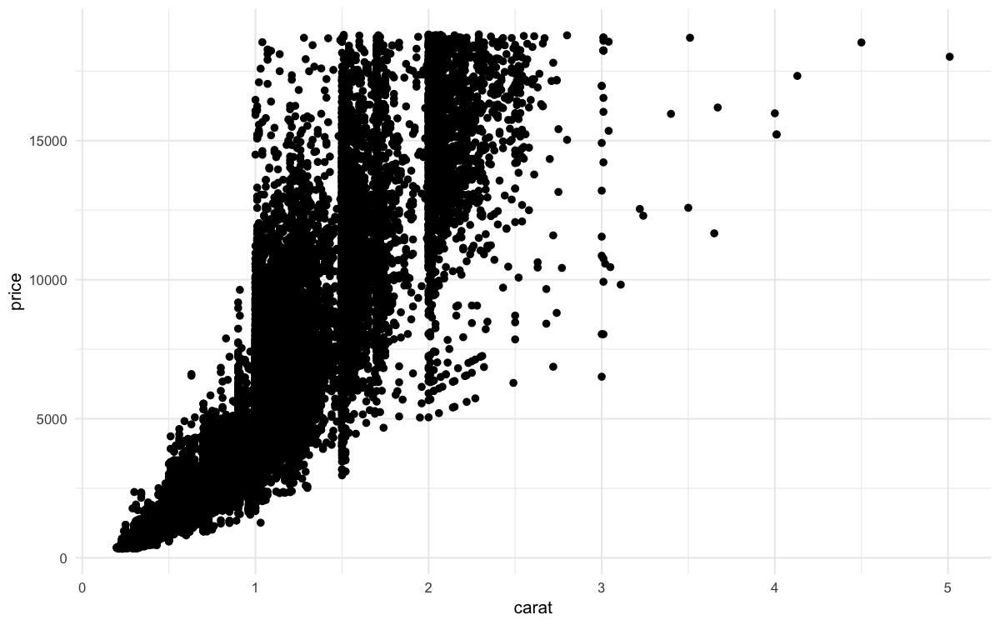
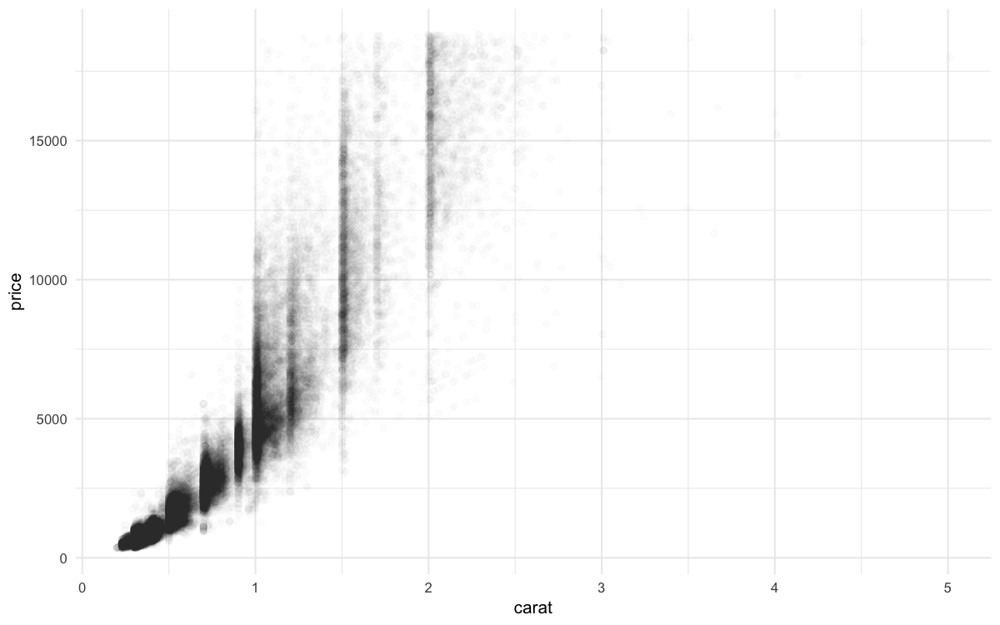

>  참고 자료:  
> [R for Data Science - EDA](https://r4ds.had.co.nz/exploratory-data-analysis.html)

## 개요

**탐색적 데이터 분석(EDA)**은 데이터의 패턴과 특성을 파악하는 과정입니다. 이 포스팅에서는 변동(Variation)과 공변동(Covariation) 분석을 통해 데이터를 이해하는 방법을 다룹니다.

```r title="환경 설정"
library('tidyverse')  # 데이터 분석 핵심 패키지
library('hexbin')     # 육각형 빈 플롯
library('nycflights13') # 실습용 데이터
library('modelr')     # 모델링

# 플롯 최적화 설정
options(
  repr.plot.width = 8,
  repr.plot.height = 5,
  repr.plot.res = 150
)
theme_set(theme_minimal(base_size = 10))
```

**변동과 공변동**

- **변동(Variation)**: 동일한 변수의 측정값이 변하는 경향. 모든 변수는 고유한 변동 패턴을 가집니다.
- **공변동(Covariation)**: 둘 이상의 변수가 연관되어 함께 변하는 경향. 변수 간 관계를 이해하는 핵심입니다.

## 1. 변동(Variation) 분석

### 1.1 범주형 변수

범주형 변수는 **막대 그래프**로 각 범주의 빈도를 확인합니다.
```r
# 기본 막대 그래프
ggplot(data = diamonds) + 
  geom_bar(mapping = aes(x = cut))
```


```r
# 수치로 확인
diamonds %>% count(cut)
```

### 1.2 연속형 변수

연속형 변수는 **히스토그램**으로 분포를 파악합니다.

**기본 히스토그램**
```r
# 기본 히스토그램
ggplot(data = diamonds) +
  geom_histogram(mapping = aes(x = carat), binwidth = 0.5)
```


```r
# 수치로 구간별 확인
diamonds %>%
  count(cut_width(carat, 0.5))
```

**세밀한 분포 탐색**

`binwidth`를 조정하여 더 자세한 패턴을 발견할 수 있습니다.
```r
# 3캐럿 미만으로 필터링 후 세밀한 분석
smaller <- diamonds %>%
  filter(carat < 3)

ggplot(data = smaller, mapping = aes(x = carat)) +
  geom_histogram(binwidth = 0.1)
```


**다중 그룹 비교: geom_freqpoly**

여러 그룹을 겹쳐서 비교할 때는 **frequency polygon**이 막대 그래프보다 명확합니다.
```r
ggplot(data = smaller, mapping = aes(x = carat, color = cut)) +
  geom_freqpoly(binwidth = 0.1)
```


**패턴 발견**

매우 세밀한 binwidth로 분석하면 흥미로운 패턴을 발견할 수 있습니다.
```r
ggplot(data = smaller, mapping = aes(x = carat)) +
  geom_histogram(binwidth = 0.01)
```


특정 캐럿 값(0.3, 0.7, 1.0 등)에서 관측값이 급증합니다. 이는 다이아몬드 업계의 표준 크기와 관련이 있을 것으로 추정됩니다.

**Faithful 데이터셋 분석**
```r
# Old Faithful 간헐천 데이터
ggplot(data = faithful, mapping = aes(x = eruptions)) + 
  geom_histogram(binwidth = 0.25)
```


### 1.3 이상값 탐지

이상값은 **패턴에서 벗어난 관측치**로, 데이터 입력 오류일 수도 있고 중요한 발견일 수도 있습니다.

**이상값 발견**
```r
# y 변수의 분포 확인
ggplot(diamonds) +
  geom_histogram(mapping = aes(x = y), binwidth = 0.5)
```


**coord_cartesian()으로 확대**

이상값이 의심되는 구간을 확대하여 자세히 확인합니다.
```r
# 이상값이 있는 구간 확대
ggplot(diamonds) +
  geom_histogram(mapping = aes(x = y), binwidth = 0.5) +
  coord_cartesian(ylim = c(0, 50))
```


**이상값 확인**
```r
# 이상값 추출
unusual <- diamonds %>%
  filter(y < 3 | y > 20) %>%
  select(price, x, y, z) %>%
  arrange(y)

unusual
```

### 1.4 결측값 처리

이상값을 발견했을 때 두 가지 선택지가 있습니다.

**방법 1: 이상값이 포함된 행 제거 (비권장)**
```r
diamonds2 <- diamonds %>%
  filter(between(y, 3, 20))
```

이 방법은 다른 변수의 정보까지 함께 삭제하므로 권장하지 않습니다.

**방법 2: 이상값을 결측값으로 변환 (권장)**

이상값만 NA로 바꾸면 다른 변수의 정보는 유지됩니다.
```r
diamonds2 <- diamonds %>%
  mutate(y = ifelse(y < 3 | y > 20, NA, y))
```

**결측값이 있는 데이터 시각화**
```r
ggplot(data = diamonds2, mapping = aes(x = x, y = y)) +
  geom_point()
```


ggplot2는 결측값이 있는 행을 자동으로 제거하고 경고 메시지를 표시합니다.

**결측값의 의미 파악**

때로는 **결측값 자체가 중요한 정보**입니다. 항공편 데이터에서 취소된 항공편의 패턴을 분석해봅시다.
```r
# 취소된 항공편 vs 정상 항공편의 출발시간 비교
nycflights13::flights %>%
  mutate(
    cancelled = is.na(dep_time),
    sched_hour = sched_dep_time %/% 100,
    sched_min = sched_dep_time %% 100,
    sched_dep_time = sched_hour + sched_min / 60
  ) %>%
  ggplot(mapping = aes(sched_dep_time)) +
  geom_freqpoly(
    mapping = aes(color = cancelled),
    binwidth = 1/4
  )
```


## 2. 공변동(Covariation) 분석

### 2.1 범주형 vs 연속형

범주형 변수와 연속형 변수의 관계를 파악할 때는 **그룹별 분포를 비교**합니다.

**문제: 빈도수 차이로 인한 비교 어려움**
```r
# 기본 frequency polygon - 비교가 어려움
ggplot(data = diamonds) +
  geom_freqpoly(mapping = aes(x = price, color = cut), binwidth = 500)
```


그룹별 관측치 개수가 다르면 패턴을 비교하기 어렵습니다.

**해결책 1: 밀도(Density) 사용**

밀도로 표준화하면 빈도수와 무관하게 패턴을 비교할 수 있습니다.
```r
# 밀도로 표준화하여 패턴 비교
ggplot(
  data = diamonds,
  mapping = aes(x = price, y = after_stat(density))
) +
geom_freqpoly(mapping = aes(color = cut), binwidth = 500)
```


**해결책 2: 박스플롯 활용**

박스플롯은 **분포의 요약 정보**(중앙값, 사분위수, 이상값)를 한눈에 보여줍니다.
```r
ggplot(data = diamonds, mapping = aes(x = cut, y = price)) +
  geom_boxplot()
```


더 좋은 품질의 다이아몬드가 평균적으로 더 저렴합니다. 이는 직관에 반하는 흥미로운 발견입니다.

**순서가 없는 범주형 변수**

범주에 자연스러운 순서가 없을 때는 **reorder()**로 정렬하면 패턴이 명확해집니다.
```r
# 기본 순서 (알파벳순)
ggplot(data = mpg, mapping = aes(x = class, y = hwy)) +
  geom_boxplot()
```


```r
# 중간값 기준으로 재정렬
ggplot(data = mpg) +
  geom_boxplot(
    mapping = aes(
      x = reorder(class, hwy, FUN = median),
      y = hwy
    )
  )
```


**축 뒤집기로 가독성 향상**

범주명이 길 때는 축을 뒤집으면 읽기 쉽습니다.
```r
ggplot(data = mpg) +
  geom_boxplot(
    mapping = aes(
      x = reorder(class, hwy, FUN = median),
      y = hwy
    )
  ) +
  coord_flip()
```


### 2.2 범주형 vs 범주형

두 범주형 변수의 관계는 **조합의 빈도**를 세어 파악합니다.

**geom_count()로 조합 빈도 시각화**

점의 크기로 빈도를 표현합니다.
```r
ggplot(data = diamonds) +
  geom_count(mapping = aes(x = cut, y = color))
```


**count()와 geom_tile() 조합**

히트맵 형태로 표현하면 패턴을 더 명확히 볼 수 있습니다.
```r
# 데이터 전처리
diamonds %>%
  count(color, cut) %>%
  ggplot(mapping = aes(x = color, y = cut)) +
  geom_tile(mapping = aes(fill = n))
```


### 2.3 연속형 vs 연속형

두 연속형 변수의 관계는 **산점도**가 기본이지만, 데이터가 많을 때는 다른 방법이 필요합니다.

**산점도의 한계**
```r
ggplot(data = diamonds) +
  geom_point(mapping = aes(x = carat, y = price))
```



데이터가 많으면 점들이 겹쳐서 밀도를 파악하기 어렵습니다.

**투명도로 겹침 문제 해결**
```r
ggplot(data = diamonds) +
  geom_point(
    mapping = aes(x = carat, y = price),
    alpha = 0.01
  )
```



**2D 빈(Bin) 활용**

데이터를 **격자로 나눠 빈도를 계산**하면 패턴이 선명해집니다.

**직사각형 빈**
```r
ggplot(data = smaller) +
  geom_bin2d(mapping = aes(x = carat, y = price))
```


**육각형 빈 (추천)**

육각형 빈이 직사각형보다 **더 자연스러운 패턴**을 보여줍니다.
```r
ggplot(data = smaller) +
  geom_hex(mapping = aes(x = carat, y = price))
```


**연속형 변수를 범주형으로 변환**

한 변수를 구간으로 나누면 **박스플롯**을 활용할 수 있습니다.

**cut_width() - 동일한 너비**
```r
ggplot(data = smaller, mapping = aes(x = carat, y = price)) +
  geom_boxplot(mapping = aes(group = cut_width(carat, 0.1)))
```


**cut_number() - 동일한 개수**

각 구간에 동일한 개수의 관측치가 들어가도록 분할합니다.
```r
ggplot(data = smaller, mapping = aes(x = carat, y = price)) +
  geom_boxplot(mapping = aes(group = cut_number(carat, 20)))
```


### 2.4 패턴과 모델

**패턴 분석 질문**

패턴을 발견했을 때 스스로에게 던져야 할 질문들:

1. **우연의 일치인가?** 랜덤한 가능성은 얼마나 될까?
2. **상관관계를 어떻게 설명할까?** 인과관계가 있을까?
3. **상관관계의 강도는?** 얼마나 강한 관계인가?
4. **다른 변수의 영향은?** 제3의 변수가 영향을 주는가?
5. **하위집단별 차이는?** 그룹별로 패턴이 다른가?

**Old Faithful 간헐천 사례**
```r
ggplot(data = faithful) +
  geom_point(mapping = aes(x = eruptions, y = waiting))
```


분출 사이의 대기 시간이 길수록 분출 시간도 길어지는 강한 양의 상관관계가 보입니다.

**모델을 활용한 패턴 추출**

회귀 모델로 **주요 관계를 제거**하면 숨겨진 패턴을 발견할 수 있습니다.
```r
# 캐럿-가격 관계 모델링
mod <- lm(log(price) ~ log(carat), data = diamonds)

# 잔차 계산
diamonds2 <- diamonds %>%
  add_residuals(mod) %>%
  mutate(resid = exp(resid))

# 잔차 vs 캐럿
ggplot(data = diamonds2) +
  geom_point(mapping = aes(x = carat, y = resid))
```


**캐럿 효과 제거 후 컷 품질 분석**
```r
ggplot(data = diamonds2) +
  geom_boxplot(mapping = aes(x = cut, y = resid))
```


캐럿의 효과를 제거하고 나니, 더 좋은 품질의 다이아몬드가 실제로 더 비싸다는 것을 확인할 수 있습니다.

## 시각화 기법 선택 가이드

| 변수 조합 | 추천 방법 | 목적 |
|-----------|-----------|------|
| 범주형 단일 | 막대 그래프 | 빈도 확인 |
| 연속형 단일 | 히스토그램 | 분포 파악 |
| 범주형 vs 연속형 | 박스플롯, 바이올린 플롯 | 그룹별 분포 비교 |
| 범주형 vs 범주형 | count 플롯, 타일 플롯 | 조합 빈도 |
| 연속형 vs 연속형 | 산점도, 2D 빈, 육각형 빈 | 상관관계 |