>  참고 자료:  
> [R for Data Science - EDA](https://r4ds.had.co.nz/exploratory-data-analysis.html)

## 개요

<b>탐색적 데이터 분석(EDA)</b>은 데이터의 패턴과 특성을 파악하는 과정입니다. 이 포스팅에서는 변동(Variation)과 공변동(Covariation) 분석을 통해 데이터를 이해하는 방법을 다룹니다.

```r title="환경 설정"
library('tidyverse')  # 데이터 분석 핵심 패키지
library('hexbin')     # 육각형 빈 플롯
library('nycflights13') # 실습용 데이터
library('modelr')     # 모델링

# 플롯 최적화 설정
options(
  repr.plot.width = 8,
  repr.plot.height = 5,
  repr.plot.res = 150
)
theme_set(theme_minimal(base_size = 10))
```

**변동과 공변동**

- **변동(Variation)**: 동일한 변수의 측정값이 변하는 경향. 모든 변수는 고유한 변동 패턴을 가집니다.
- **공변동(Covariation)**: 둘 이상의 변수가 연관되어 함께 변하는 경향. 변수 간 관계를 이해하는 핵심입니다.

## 1. 변동(Variation) 분석

### 1.1 범주형 변수

범주형 변수는 **막대 그래프**로 각 범주의 빈도를 확인합니다.
```r
# 기본 막대 그래프
ggplot(data = diamonds) + 
  geom_bar(mapping = aes(x = cut))
```


```r
# 수치로 확인
diamonds %>% count(cut)
```

```text
# A tibble: 5 x 2
  cut        n
  <ord>     <int>
1 Fair       1610
2 Good       4906
3 Very Good 12082
4 Premium   13791
5 Ideal     21551
```

### 1.2 연속형 변수

연속형 변수는 **히스토그램**으로 분포를 파악합니다.

**기본 히스토그램**
```r
# 기본 히스토그램
ggplot(data = diamonds) +
  geom_histogram(mapping = aes(x = carat), binwidth = 0.5)
```


```r
# 수치로 구간별 확인
diamonds %>%
  count(cut_width(carat, 0.5))
```

```text
# A tibble: 11 x 2
   cut_width(carat, 0.5)       n
   <fct>                   <int>
 1 [-0.25,0.25]              785
 2 (0.25,0.75]             29498
 3 (0.75,1.25]             15977
 4 (1.25,1.75]              5313
 5 (1.75,2.25]              2002
 6 (2.25,2.75]               322
 7 (2.75,3.25]                32
 8 (3.25,3.75]                 5
 9 (3.75,4.25]                 4
10 (4.25,4.75]                 1
11 (4.75,5.25]                 1
```

**세밀한 분포 탐색**

`binwidth`를 조정하여 더 자세한 패턴을 발견할 수 있습니다.
```r
# 3캐럿 미만으로 필터링 후 세밀한 분석
smaller <- diamonds %>%
  filter(carat < 3)

ggplot(data = smaller, mapping = aes(x = carat)) +
  geom_histogram(binwidth = 0.1)
```


**다중 그룹 비교: geom_freqpoly**

여러 그룹을 겹쳐서 비교할 때는 **frequency polygon**이 막대 그래프보다 명확합니다.
```r
ggplot(data = smaller, mapping = aes(x = carat, color = cut)) +
  geom_freqpoly(binwidth = 0.1)
```


**패턴 발견**

매우 세밀한 binwidth로 분석하면 흥미로운 패턴을 발견할 수 있습니다.
```r
ggplot(data = smaller, mapping = aes(x = carat)) +
  geom_histogram(binwidth = 0.01)
```

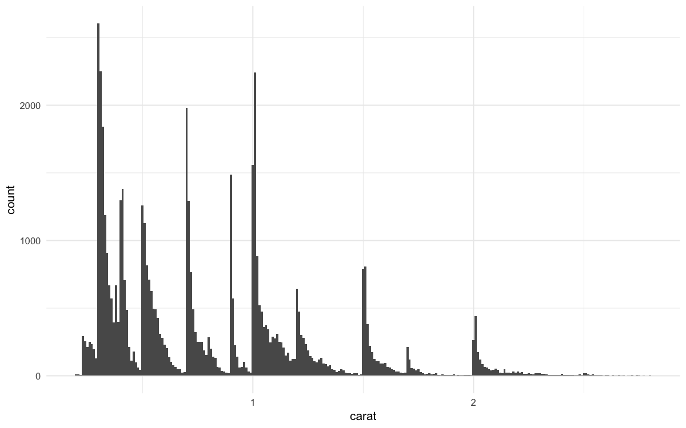

특정 캐럿 값(0.3, 0.7, 1.0 등)에서 관측값이 급증합니다. 이는 다이아몬드 업계의 표준 크기와 관련이 있을 것으로 추정됩니다.

### 1.3 이상값 탐지

이상값은 **패턴에서 벗어난 관측치**로, 데이터 입력 오류일 수도 있고 중요한 발견일 수도 있습니다.

**Faithful 데이터셋 분석**  
faithful: 미국 옐로스톤 국립공원의 Old Faithful 간헐천의 분출 시간(eruptions)과 다음 분출까지의 대기 시간(waiting)을 기록한 데이터

```r
# Old Faithful 간헐천 데이터
ggplot(data = faithful, mapping = aes(x = eruptions)) + 
  geom_histogram(binwidth = 0.25)
```

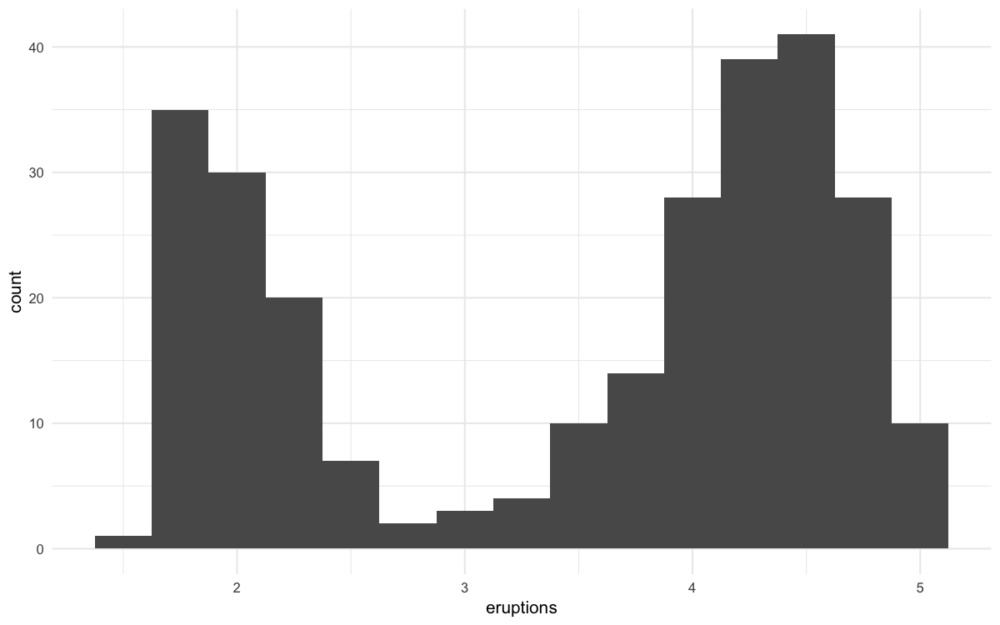

이 그래프를 보면 데이터가 두 개의 봉우리를 가진 분포를 띠고 있음을 알 수 있습니다. 짧은 분출과 긴 분출이라는 두 가지 뚜렷한 패턴이 존재하며, 이 패턴에서 크게 벗어난 값은 보이지 않습니다.  

**이상값 발견의 어려움: diamonds 데이터셋**  
하지만 실제 대규모 데이터셋에서는 이상값이 거대한 데이터군에 묻혀 보이지 않는 경우가 많습니다. `diamonds`데이터의`y`변수(다이아몬드 너비, mm)를 살펴봅시다.
```r
# y 변수의 분포 확인
ggplot(diamonds) +
  geom_histogram(mapping = aes(x = y), binwidth = 0.5)
```

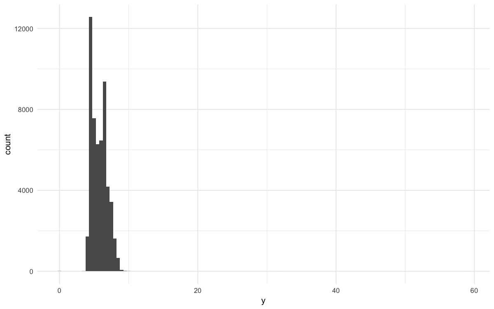

이 히스토그램을 보면 대부분의 데이터가 10mm 미만의 좁은 구간에 쏠려 있습니다. 이 때문에 y축(count)의 범위가 0에서 12,000 이상으로 매우 넓게 설정되는데, 빈도수가 고작 몇 개뿐인 이상값들은 막대의 높이가 너무 낮아 보이지 않습니다. 이대로는 이상값이 있는지조차 알기 힘든 상태입니다.

**coord_cartesian()으로 숨은 데이터 확대**  
`coord_cartesian`은 특정 구간을 확대하여 보여줍니다. 이상값이 의심되는 구간(0, 50)을 확대하여 자세히 확인합니다.  
```r
# 이상값이 있는 구간 확대
ggplot(diamonds) +
  geom_histogram(mapping = aes(x = y), binwidth = 0.5) +
  coord_cartesian(ylim = c(0, 50))
```

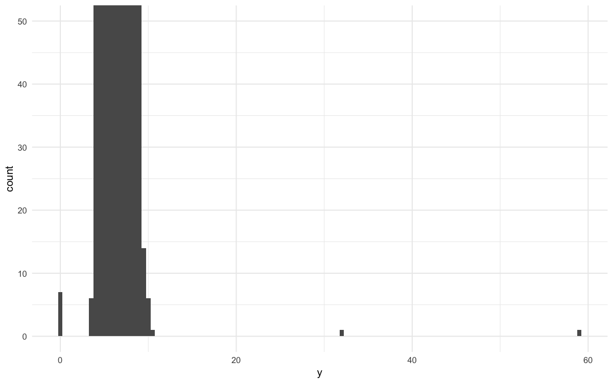

확대 결과, 0 근처와 30~60 사이에서 평소에는 보이지 않던 **비정상적인 관측치**들이 3곳에서 막대 형태로 나타나는 것을 확인할 수 있습니다.

**이상값 확인 및 데이터 추출**  
그래프에서 확인한 수치를 바탕으로, 실제 어떤 데이터들이 문제인지 `filter`를 통해 추출해 봅니다.
```r
# 그래프에서 확인된 비정상 구간(y < 3 또는 y > 20) 필터링
unusual <- diamonds %>%
  filter(y < 3 | y > 20) %>%
  select(price, x, y, z) %>%
  arrange(y)

unusual
```

```text
# A tibble: 9 x 4
  price     x     y     z
  <int> <dbl> <dbl> <dbl>
1  5139  0     0     0   
2  6381  0     0     0   
3 12800  0     0     0   
4 15686  0     0     0   
5 18034  0     0     0   
6  2130  0     0     0   
7  2130  0     0     0   
8  2075  5.15 31.8   5.12
9 12210  8.09 58.9   8.06
```

**분석 결과**  
1. y가 0인 데이터: 다이아몬드의 폭이 0일 수는 없으므로 측정 누락 또는 입력 오류입니다.
2. y가 31.8, 58.9인 데이터: 일반적인 다이아몬드 크기에 비해 비정상적으로 큽니다. 가격(price)과 비교했을 때 물리적으로 불가능한 수치라면 이 역시 이상값으로 판단하고 전처리를 고민해야합니다.

### 1.4 결측값 처리

이상값을 발견했을 때 두 가지 선택지가 있습니다.

**방법 1: 이상값이 포함된 행 제거 (비권장)**
```r
diamonds2 <- diamonds %>%
  filter(between(y, 3, 20))
```

이 방법은 다른 변수의 정보까지 함께 삭제하므로 권장하지 않습니다.

**방법 2: 이상값을 결측값으로 변환 (권장)**

이상값만 NA로 바꾸면 다른 변수의 정보는 유지됩니다.
```r
diamonds2 <- diamonds %>%
  mutate(y = ifelse(y < 3 | y > 20, NA, y))
```

**결측값이 있는 데이터 시각화**  
결측값이 포함된 데이터를 `ggplot2`로 시각화하면 어떻게 될까?
```r
ggplot(data = diamonds2, mapping = aes(x = x, y = y)) +
  geom_point()
```


:::tip
`ggplot2`는 결측값이 포함된 행을 자동으로 제외하고 그래프를 그립니다.  
이때 "Removed n rows containing missing values"라는 경고 메시지를 띄워 사용자에게 데이터 일부가 빠졌음을 알려줍니다.
:::

**결측값 그 자체가 담고 있는 정보**

때로는 <b>데이터가 존재하지 않는다는 사실(NA)</b>자체가 분석의 핵심이 되기도 합니다. 예를 들어 항공편 데이터에서 '출발시간(dep_time)이 결측치'라는 것은 곧 '해당 항공편이 취소됨'을 의미합니다.

**취소된 항공편의 패턴 분석 예시**
```r
# 취소된 항공편 vs 정상 항공편의 출발시간 비교
nycflights13::flights %>%
  mutate(
    cancelled = is.na(dep_time),
    sched_hour = sched_dep_time %/% 100,
    sched_min = sched_dep_time %% 100,
    sched_dep_time = sched_hour + sched_min / 60
  ) %>%
  ggplot(mapping = aes(sched_dep_time)) +
  geom_freqpoly(
    mapping = aes(color = cancelled),
    binwidth = 1/4
  )
```


## 2. 공변동(Covariation) 분석

공변동은 변수들 사이의 관계를 나타냅니다. 두 개 이상의 변수가 함께 변하는 패턴을 파악하면 데이터 속에 숨겨진 이야기를 찾을 수 있습니다.

### 2.1 범주형 vs 연속형

범주형 변수(예: `cut`)에 따라 연속형 변수(예: `price`)가 어떻게 달라지는지 파악할 때는 **그룹별 분포의 차이**를 보는 것이 핵심입니다.

**문제: 빈도수 차이로 인한 비교의 함정** 앞서 본 항공편 취소 데이터처럼, 그룹 간 데이터 개수(`count`)차이가 너무 크면 일반적인 히스토그램이나 빈도 다각형(`geom_freqpoly`)으로는 패턴을 비교할 수 없습니다.
```r
# 개수(Count) 기반 비교 - Fair 등급은 바닥에 붙어서 보이지 않음
ggplot(data = diamonds) +
  geom_freqpoly(mapping = aes(x = price, color = cut), binwidth = 500)
```


- **통계적 문제**: `Ideal` 등급은 많고 `Fair` 등급은 너무 적어서, 개별 그룹의 내부 분포 모양보다 그룹 전체의 크기 차이만 눈에 띄게 됩니다.

**해결책 1: 밀도(Density)로 표준화하기**  
이럴 때는 y축을 빈도가 아닌 <b>밀도(Density)</b>로 바꿔야 합니다. 밀도는 각 그룹의 전체 면적을 1로 표준화하여, 데이터 개수와 상관없이 분포의 '모양'을 직접 비교할 수 있게 해줍니다.
```r
# y축을 density로 설정하여 비교
ggplot(
  data = diamonds,
  mapping = aes(x = price, y = after_stat(density))
) +
geom_freqpoly(mapping = aes(color = cut), binwidth = 500)
```

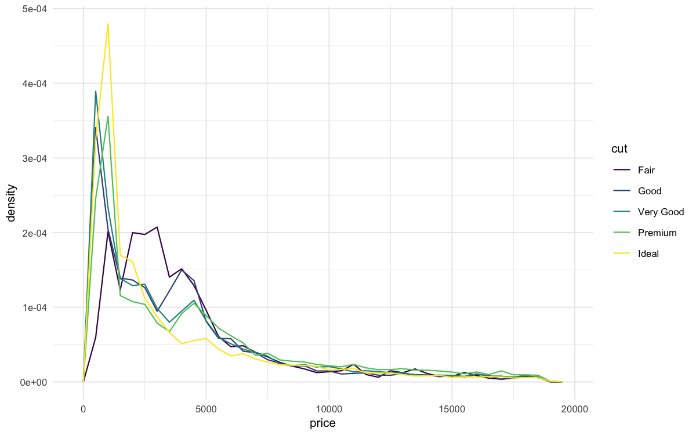

놀랍게도 품질이 가장 낮은 `Fair` 등급의 가격 중앙값이 품질이 좋은 등급보다 더 높게 형성되는 패턴을 확인할 수 있습니다.

**해결책 2: 박스플롯(Boxplot) 활용**  
분포가 복잡할 때는 박스 플롯이 요약 통계량을 보여주는 데 훨씬 효율적입니다.

```r
ggplot(data = diamonds, mapping = aes(x = cut, y = price)) +
  geom_boxplot()
```


박스플롯을 통해 중앙값(`median`)을 비교해 보면, 품질이 낮은 등급이 더 비싸다는 역설적인 사실이 더 명확히 드러납니다.(뒤에서 나오지만 이 이유는 `carat` 때문입니다.)

**순서가 없는 범주형 변수**  
범주에 자연스러운 순서가 없을 때는 <b>reorder()</b>로 정렬하면 패턴이 명확해집니다.
```r
# 기본 순서 (알파벳순)
ggplot(data = mpg, mapping = aes(x = class, y = hwy)) +
  geom_boxplot()
```


```r
# 중간값 기준으로 재정렬
ggplot(data = mpg) +
  geom_boxplot(
    mapping = aes(
      x = reorder(class, hwy, FUN = median),
      y = hwy
    )
  )
```

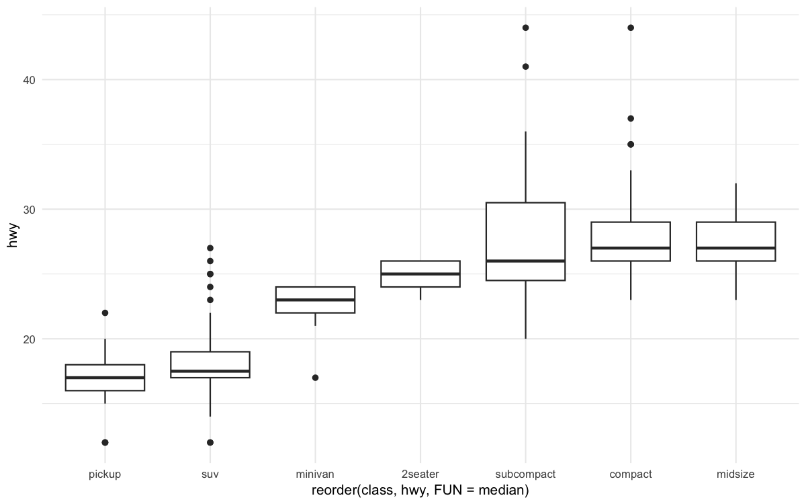

**축 뒤집기(coord_flip)**  
범주형 변수의 이름이 길어 x축에서 서로 겹친다면, 억지로 글자를 기울이지말고 축을 뒤집어보자.
```r
ggplot(data = mpg) +
  geom_boxplot(
    mapping = aes(
      x = reorder(class, hwy, FUN = median),
      y = hwy
    )
  ) +
  coord_flip()
```

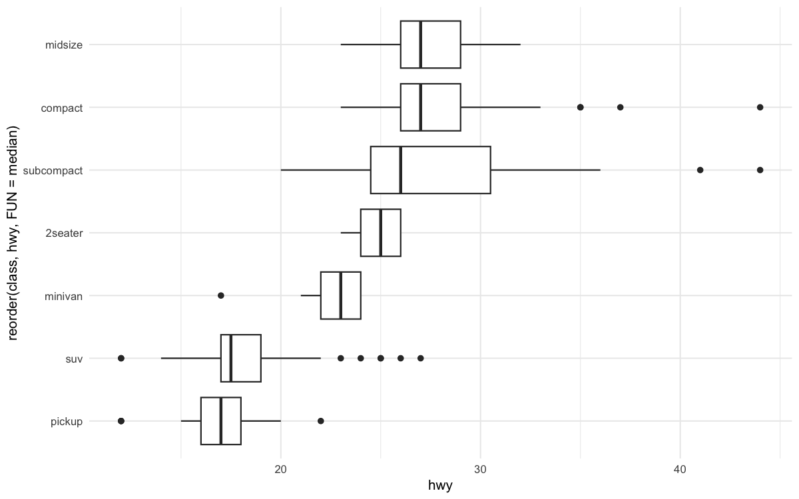

### 2.2 범주형 vs 범주형

두 개의 범주형 변수 사이의 관계를 파악하는 핵심은 <b>조합별 빈도(Frequency)</b>를 확인하는 것입니다.

<b>1) 점의 크기로 보는 geom_count()</b>  
각 좌표에 데이터가 얼마나 몰려 있는지 점의 크기로 표현합니다.
```r
ggplot(data = diamonds) +
  geom_count(mapping = aes(x = cut, y = color))
```


:::note
원의 크기가 클수록 해당 조합의 데이터가 많음을 의미합니다. 직관적이지만, 색상 정보가 없어 각 조합의 상대적 비율을 정밀하게 비교하기엔 한계가 있습니다.
:::

<b>2) 색상의 농도로 보는 geom_tile() (추천)</b>  
`count()`함수로 미리 데이터를 집계한 뒤 히트맵형태로 시각화 합니다.

```r
diamonds %>%
  count(color, cut) %>%
  ggplot(mapping = aes(x = color, y = cut)) +
  geom_tile(mapping = aes(fill = n))
```


- 장점: 색상의 진하기를 통해 데이터의 쏠림 현상을 한눈에 파악할 수 있습니다.
- 분석 포인트: 특정 컬러(예: G)와 특정 컷(예: Ideal)의 조합이 압도적으로 많은지 등을 확인하여 두 변수 간의 연관성을 파악합니다.

### 2.3 연속형 vs 연속형

연속형 변수끼리는 산점도(`geom_point`)가 기본이지만, **빅데이터**에서는 점들이 겹쳐서 덩어리처럼 보이는 **Overplotting** 문제가 발생합니다.

<b>1) 산점도의 한계 극복: 투명도(alpha)</b>  
<b>투명도(alpha)</b>를 이용하면 다음처럼 점들이 겹치는 문제를 해결할 수 있습니다.

```r
p1 <- ggplot(data = diamonds) +
  geom_point(
    mapping = aes(x = carat, y = price)
  ) +
  ggtitle("Standard")

p2 <- ggplot(data = diamonds) +
  geom_point(
    mapping = aes(x = carat, y = price),
    alpha = 0.01
  ) +
  ggtitle("Alpha Blending")

p1 + p2
```

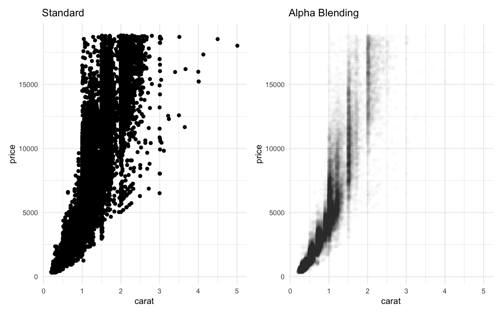


<b>2) 2D공간의 히스토그램: 빈(Bin) 시각화</b>  
데이터를 작은 격자로 나누어 각 격자 안에 들어가는 포인트의 개수를 세는 방식입니다.

- **geom_bin2d()**: 직사각형 격자
- **geom_hex()**: 육각형 격자

**직사각형 빈**
```r
ggplot(data = smaller) +
  geom_bin2d(mapping = aes(x = carat, y = price))
```

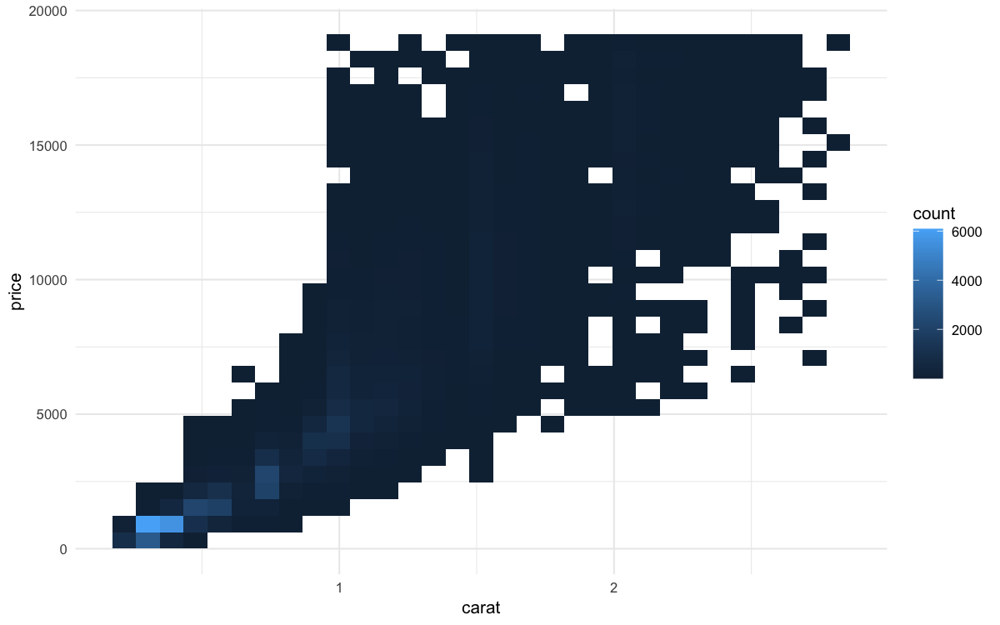

**육각형 빈 (추천)**

육각형 빈이 직사각형보다 **더 자연스러운 패턴**을 보여줍니다.
```r
ggplot(data = smaller) +
  geom_hex(mapping = aes(x = carat, y = price))
```


**3) 연속형 변수를 범주화하여 분석하기**  
연속형 변수 하나를 일정 구간으로 나누면(Binning), 박스플롯을 활용해 분포의 변화를 추적할 수 있습니다.

- **cut_width(carat, 0.1)**: 캐럿을 0.1단위로 동일하게 자릅니다.
- **cut_number(carat, 20)**: 각 구간에 들어가는 **데이터의 개수가 동일**하도록 자릅니다.


**cut_width() - 동일한 너비**
```r title="0.1캐럿 간격"
ggplot(data = smaller, mapping = aes(x = carat, y = price)) +
  geom_boxplot(mapping = aes(group = cut_width(carat, 0.1)))
```

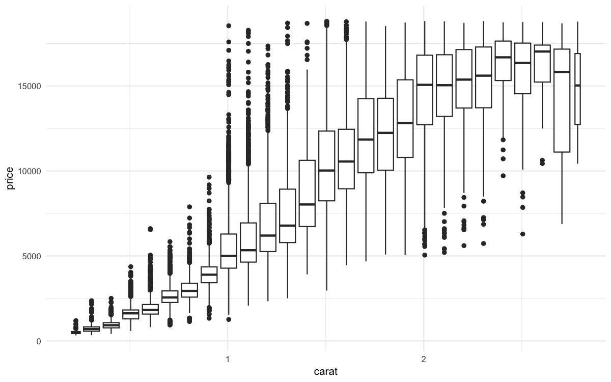

x축 구간의 너비가 0.1 단위로 일정합니다. 데이터가 몰린 구간(작은 캐럿)은 박스가 밀집되어 있고, 데이터가 적은 구간(큰 캐럿)은 박스가 왜소하게 보입니다.

**cut_number() - 동일한 개수**

```r title="20개 그룹"
ggplot(data = smaller, mapping = aes(x = carat, y = price)) +
  geom_boxplot(mapping = aes(group = cut_number(carat, 20)))
```

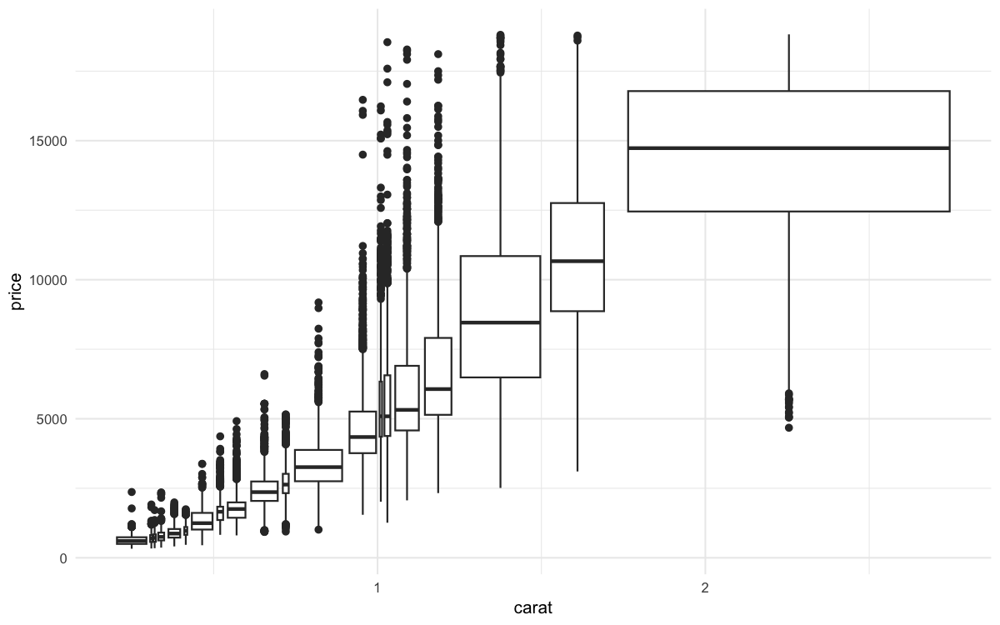

각 박스에 포함된 데이터 개수가 같으므로, 데이터가 희소한 구간(고중량 캐럿)은 박스의 폭이 넓게 그려집니다.

### 2.4 잔차 분석

**패턴 분석 질문**

패턴을 발견했을 때 스스로에게 던져야 할 질문들:

1. **우연의 일치인가?** 랜덤한 가능성은 얼마나 될까?
2. **상관관계를 어떻게 설명할까?** 인과관계가 있을까?
3. **상관관계의 강도는?** 얼마나 강한 관계인가?
4. **다른 변수의 영향은?** 제3의 변수가 영향을 주는가?
5. **하위집단별 차이는?** 그룹별로 패턴이 다른가?

faithful 데이터 셋을 살펴보면, 분출 사이의 대기 시간이 길수록 분출 시간도 길어지는 뚜렷한 양의 상관관계가 보입니다.

```r
ggplot(data = faithful) +
  geom_point(mapping = aes(x = eruptions, y = waiting))
```


다이아몬드 데이터를 살펴보면 그렇지 않습니다. 캐럿과 가격은 지수적 관계이며, 품질과 가격은 평균값으로 보면 어떠한 관계도 없어 보입니다. 오히려 더 낮은 품질이 가격 평균이 높은 경우도 있습니다. 왜 그럴까요?

```r
p1 <- ggplot(data = diamonds, aes(x = carat, y = price)) + 
  geom_point(alpha = 0.1) +
  ggtitle("Price vs Carat")

p2 <- ggplot(data = diamonds, aes(x = cut, y = price)) + 
  geom_boxplot() +
  ggtitle("Price vs Cut")

p1 + p2
```

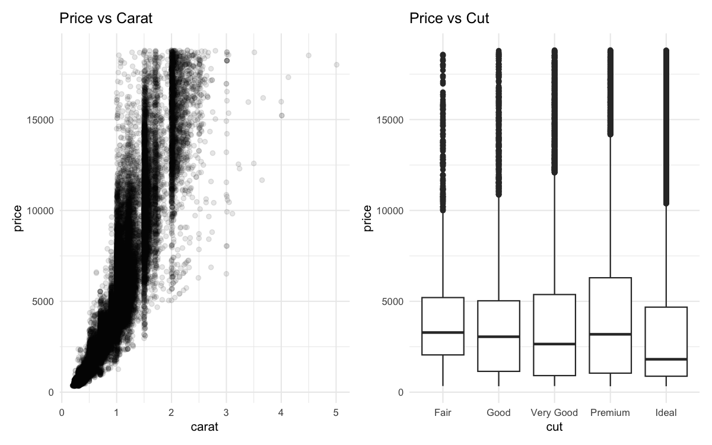

**모델을 활용한 패턴 추출**  
"품질이 좋은데 왜 가격이 낮을까?"라는 의문을 해결하기 위해, 가격에 가장 큰 영향을 주는 '캐럿' 변수의 효과를 모델로 제거해 봅니다.

```r
# 가격과 캐럿의 지수적 관계를 고려하여 로그 변환 후 선형 회귀
mod <- lm(log(price) ~ log(carat), data = diamonds)

# 모델이 설명하지 못하는 '가격의 차이(잔차)'를 데이터셋에 추가
diamonds2 <- diamonds %>%
  add_residuals(mod) %>%
  mutate(resid = exp(resid))

ggplot(data = diamonds2) +
  geom_point(mapping = aes(x = carat, y = resid))
```


잔차가 캐럿에 따라 크고 작음이 뚜렷하게 보입니다. 특정 캐럿은 가격에 큰 영향을 주기에 캐럿은 가격을 결정짓는 큰 요인이었음을 알 수 있습니다. 캐럿의 효과(잔차)를 제거한다면 가격 분포는 어떻게 될까요?

**캐럿 효과 제거 후의 결과 분석**  
이제 가격에서 캐럿의 영향력을 제거한 '잔차'를 기준으로 품질(`cut`)별 분포를 다시 확인합니다.
```r
ggplot(data = diamonds2) +
  geom_boxplot(mapping = aes(x = cut, y = resid))
```


캐럿의 효과를 통제하고 나니, 예상했던 대로 **품질(cut)이 좋을수록 가격(잔차)이 높게 형성**되는 정상적인 패턴을 볼 수 있습니다.