>  참고 자료:  
> [ggplot2 공식 문서](https://ggplot2.tidyverse.org/) | [R for Data Science](https://r4ds.had.co.nz/)

## 개요

**ggplot2**는 R에서 가장 강력하고 널리 사용되는 데이터 시각화 패키지입니다. 이번 포스팅에서는 ggplot2의 핵심 개념인 **aes(aesthetic mapping)**, **facet**, **geom**, **mapping**, **filter** 등을 실습 예제와 함께 체계적으로 알아보겠습니다.

```r title="환경 설정"
# 패키지 로드
library('tidyverse')  # ggplot2 포함
library('maps')       # 지도 데이터
library('ggrepel')    # 라벨 겹침 방지
library('viridis')    # 색상 팔레트

# 플롯 최적화 설정
options(
  repr.plot.width = 8,    # 너비 설정
  repr.plot.height = 5,   # 높이 설정  
  repr.plot.res = 150     # 해상도 설정
)

# 테마 설정 (깔끔한 스타일)
theme_set(theme_minimal(base_size = 10))
```

## 1. Aesthetic Mapping(aes)

`aes()`는 데이터의 변수를 시각적 요소로 변환하여 `ggplot2`가 그래프를 그릴 수 있게 해주는 핵심 엔진입니다. 데이터의 특성을 색상, 크기, 모양 등 시각적 속성으로 매핑하여 정보를 직관적으로 표현합니다.

**1) 색상 매핑 (color)**

데이터의 범주형 변수를 **서로 다른 색상**으로 구분하여 그룹별 패턴을 쉽게 파악할 수 있습니다.
```r
ggplot(data = mpg) + 
  geom_point(mapping = aes(x = displ, y = hwy, color = class))
```


차량 클래스(class)별로 자동으로 다른 색상이 할당되어 2인승 스포츠카, SUV, 컴팩트 등을 명확히 구분할 수 있습니다.

**2) 크기 매핑 (size)**

점의 크기를 변수 값에 따라 조절하여 **데이터의 상대적 크기나 중요도**를 시각적으로 표현합니다.
```r
ggplot(data = mpg) + 
  geom_point(mapping = aes(x = displ, y = hwy, size = class))
```


:::caution
이산형 변수(범주형)에 `size` 매핑을 사용하면 경고가 발생합니다. 크기는 연속형 변수(숫자)에 사용하는 것이 더 적합하며, 범주 구분에는 `color`나 `shape`을 권장합니다.
:::

**3) 투명도 매핑 (alpha)**

점의 투명도를 조절하여 **데이터의 밀도나 중첩 패턴**을 효과적으로 표현할 수 있습니다. 값이 작을수록 투명해집니다.
```r
ggplot(data = mpg) + 
  geom_point(mapping = aes(x = displ, y = hwy, alpha = class))
```

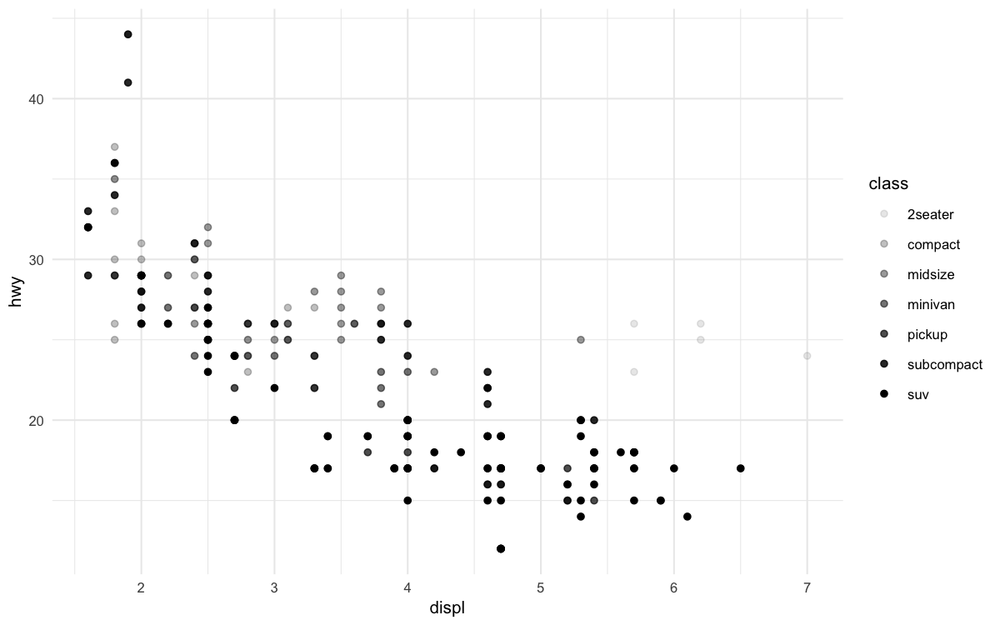

**4) 모양 매핑 (shape)**

서로 다른 **기하학적 모양**(원, 삼각형, 사각형 등)으로 그룹을 구분합니다. 흑백 인쇄물에서 특히 유용합니다.
```r
ggplot(data = mpg) + 
  geom_point(mapping = aes(x = displ, y = hwy, shape = class))
```

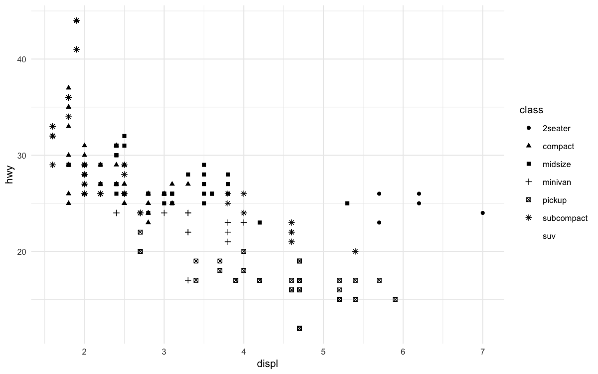

:::tip
`shape`는 최대 6개의 그룹까지만 자동으로 구분 가능합니다. 그 이상의 범주가 있으면 일부 데이터가 표시되지 않으므로 색상과 함께 사용하는 것이 좋습니다.
:::

**고정 속성 설정**

`aes()` 함수 **밖에서** 속성을 지정하면 데이터와 무관하게 **모든 요소에 동일한 스타일**이 적용됩니다.
```r
# aes 밖에서 설정하면 모든 점에 동일하게 적용
ggplot(data = mpg) +
  geom_point(mapping = aes(x = displ, y = hwy), color = 'blue')
```

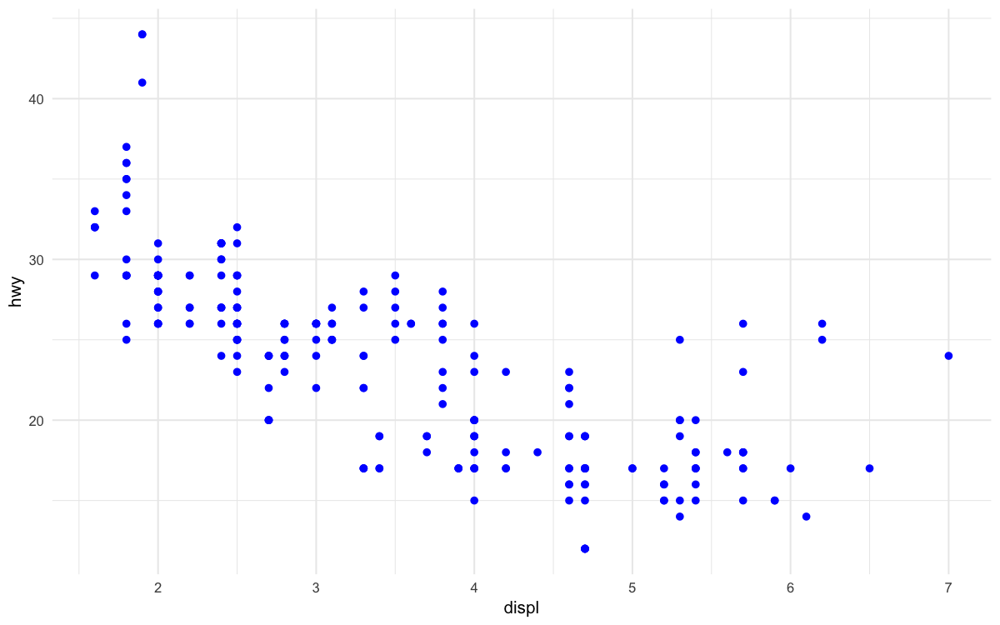

## 2. facet_

전체 데이터를 하나의 그래프에 담기 어려울 때, 특정 변수를 기준으로 **화면을 여러 개의 소그래프로 분할**하여 비교하는 기법입니다. 데이터의 그룹별 패턴(Subset)을 한눈에 파악하기에 매우 유용합니다.

**facet_wrap()** : 단일 변수 기준 분할

하나의 범주형 변수를 기준으로 그래프를 **격자 형태로 자동 배열**합니다. 화면 공간에 맞춰 자동으로 줄바꿈을 하므로 많은 범주를 효율적으로 표시할 수 있습니다.
```r
ggplot(data = mpg) +
  geom_point(mapping = aes(x = displ, y = hwy)) +
  facet_wrap(~ class, nrow = 3)
```

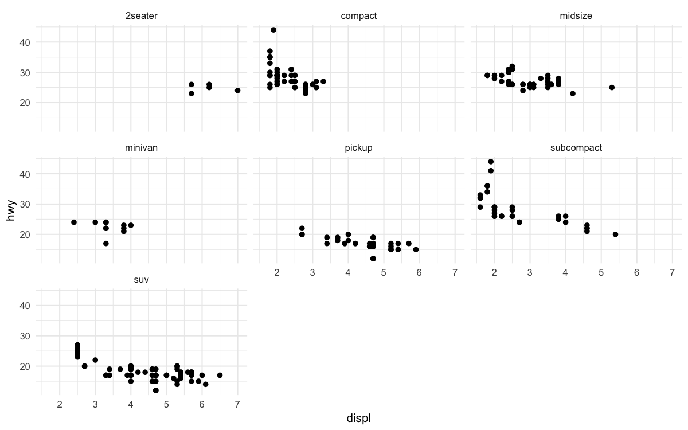

차량 클래스별로 분리된 플롯이 생성되어 SUV, 컴팩트, 픽업트럭 등 각 그룹의 연비 패턴을 독립적으로 관찰할 수 있습니다.

**facet_grid()** : 두 변수 기준 격자 분할

두 개의 범주형 변수를 각각 **행과 열**로 배치하여 교차 비교가 가능한 격자 형태의 플롯을 생성합니다.
```r
ggplot(data = mpg) +
  geom_point(mapping = aes(x = displ, y = hwy)) +
  facet_grid(drv ~ cyl)
```


구동 방식(drv)을 행으로, 실린더 수(cyl)를 열로 배치하여 "4륜구동 8기통 차량"처럼 특정 조합의 특성을 바로 확인할 수 있습니다.

**데이터 탐색**
```r
# 구동 방식 확인
mpg$drv %>% unique()  # "f"(전륜), "4"(4륜), "r"(후륜)

# 실린더 수 확인  
mpg$cyl %>% unique()  # 4, 6, 8, 5
```

**단방향 분할**

한 차원만 분할하고 다른 차원은 통합하여 표시하려면 `.`을 사용합니다.
```r
# 열만 분할 (행은 통합)
ggplot(data = mpg) +
  geom_point(mapping = aes(x = displ, y = hwy)) +
  facet_grid(. ~ cyl)
```

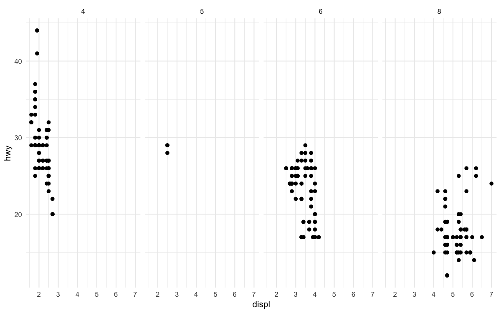

실린더 수별로만 분할하고 구동 방식은 하나의 플롯에 모두 표시됩니다.

## 3. geom_

**geom**은 데이터를 **어떤 시각적 형태로 표현할지** 결정하는 핵심 요소입니다. 같은 데이터라도 점(point), 선(line), 막대(bar) 등 다양한 방식으로 표현할 수 있습니다.

### geom_smooth() : 평활선 추가

데이터의 전체적인 **추세(trend)**를 부드러운 곡선으로 표현하여 노이즈 속에서 패턴을 찾아냅니다.
```r
ggplot(data = mpg) +
  geom_smooth(mapping = aes(x = displ, y = hwy))
```


**LOESS 회귀선**이 자동으로 추가되어 엔진 배기량이 증가할수록 고속도로 연비가 감소하는 전체적인 경향을 명확히 보여줍니다. 회색 영역은 신뢰구간입니다.

**라인 타입으로 그룹 구분**

서로 다른 **선의 스타일**(실선, 점선, 파선 등)로 그룹을 구분하여 흑백 인쇄에서도 효과적입니다.
```r
ggplot(data = mpg) +
  geom_smooth(mapping = aes(x = displ, y = hwy, linetype = drv))
```


전륜(f), 후륜(r), 4륜(4) 구동 방식별로 다른 선 스타일이 적용되어 각 그룹의 추세를 비교할 수 있습니다.

**색상으로 그룹 구분**

가장 직관적인 방법으로, **색상**을 사용해 여러 그룹의 추세선을 한 번에 표시합니다.
```r
ggplot(data = mpg) +
  geom_smooth(mapping = aes(x = displ, y = hwy, color = drv))
```


**포인트와 스무딩 결합**

**원본 데이터(점)와 추세선을 함께** 표시하여 데이터의 분포와 경향을 동시에 파악할 수 있습니다.
```r
ggplot(data = mpg) + 
  geom_point(mapping = aes(x = displ, y = hwy, color = drv)) +
  geom_smooth(mapping = aes(x = displ, y = hwy, color = drv, linetype = drv))
```

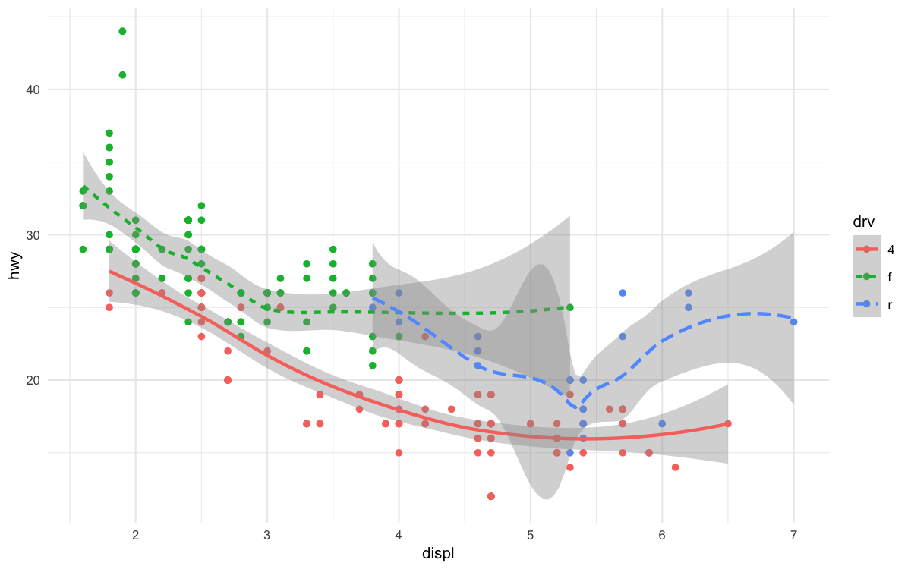

### geom_bar() : 막대 그래프

범주형 데이터의 **빈도수나 개수**를 막대의 높이로 표현합니다. 기본적으로 자동으로 데이터를 집계합니다.
```r
ggplot(data = diamonds) +
  geom_bar(mapping = aes(x = cut))
```


다이아몬드 컷팅 등급별 개수가 자동으로 계산되어 표시됩니다. Ideal 등급이 가장 많고 Fair가 가장 적습니다.

## 4. 매핑 최적화 기법

**전역 매핑 설정**

여러 레이어에서 **공통으로 사용하는 매핑**은 `ggplot()` 함수에 직접 지정하여 코드 중복을 줄일 수 있습니다.
```r
# ggplot()에서 공통 매핑 설정
ggplot(data = mpg, mapping = aes(x = displ, y = hwy)) +
  geom_point() +
  geom_smooth()
```


x축(배기량)과 y축(연비) 매핑이 포인트와 스무딩 레이어 모두에 자동 적용됩니다.

**선택적 매핑 추가**

전역 매핑은 유지하면서 **특정 레이어에만 추가 속성**을 적용할 수 있습니다.
```r
# 전역 매핑 + 개별 레이어 매핑
ggplot(data = mpg, mapping = aes(x = displ, y = hwy)) +
  geom_point(mapping = aes(color = class)) +  # 포인트만 색상 구분
  geom_smooth()  # 전체 데이터로 스무딩
```


점은 차량 클래스별로 색상이 다르지만, 추세선은 전체 데이터를 하나로 합쳐서 그립니다.

## 5. filter로 데이터 필터링

**특정 그룹만 스무딩**

전체 데이터는 점으로 표시하되, **특정 조건을 만족하는 데이터만** 추세선을 그릴 때 유용합니다.
```r
ggplot(data = mpg, mapping = aes(x = displ, y = hwy)) +
  geom_point(mapping = aes(color = class)) +
  geom_smooth(
    data = filter(mpg, class == 'subcompact'),  # 서브컴팩트만 필터링
    se = FALSE  # 신뢰구간 제거
  )
```


모든 차량 클래스의 점이 표시되지만, 추세선은 서브컴팩트 차량만을 대상으로 그려집니다.

## 6. 통계 변환 (Statistical Transformations)

**사용자 정의 데이터로 막대 그래프**

`geom_bar()`는 기본적으로 데이터를 자동 집계하지만, `stat = 'identity'`를 사용하면 **이미 집계된 값**을 그대로 사용할 수 있습니다.
```r
# 커스텀 데이터 생성
demo <- tribble(
  ~cut, ~freq,
  "Fair", 1610,
  "Good", 4906,
  "Very Good", 12082,
  "Premium", 13791,
  "Ideal", 21551
)

# stat = 'identity'로 실제 값 사용
ggplot(data = demo) +
  geom_bar(mapping = aes(x = cut, y = freq), stat = 'identity')
```

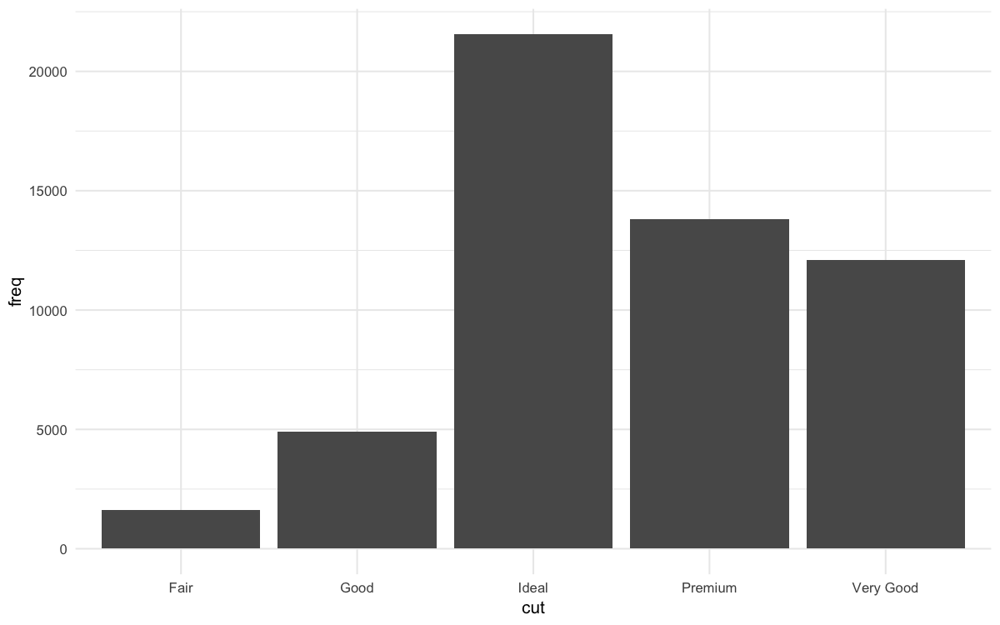

**비율 표시**

`after_stat(prop)`를 사용하면 절대 개수 대신 **전체 대비 비율**을 표시할 수 있습니다. `group = 1`은 전체를 하나의 그룹으로 취급하여 비율을 계산합니다.
```r
ggplot(data = diamonds) +
  geom_bar(mapping = aes(x = cut, y = after_stat(prop), group = 1))
```


**stat_summary()** : 통계 요약

각 그룹의 **통계 요약값**(최솟값, 최댓값, 중앙값 등)을 시각화합니다.
```r
ggplot(data = diamonds) +
  stat_summary(
    mapping = aes(x = cut, y = depth),
    fun.min = min,    # 최솟값
    fun.max = max,    # 최댓값
    fun = median      # 중앙값 (가운데 점)
  )
```

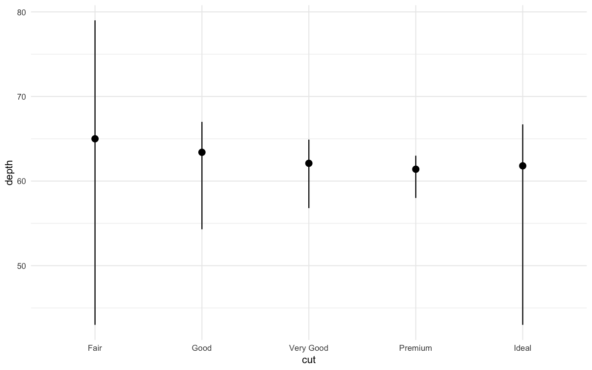

각 컷팅 등급별 깊이(depth)의 범위와 중앙값을 한눈에 파악할 수 있습니다.

## 7. Color & Fill의 차이

**color vs fill 이해하기**

`color`는 도형의 **테두리(외곽선) 색상**을 지정하고, `fill`은 도형 **내부의 채우기 색상**을 지정합니다. 막대 그래프처럼 면적이 있는 도형에서 그 차이가 명확히 드러납니다.
```r
# 테두리 색상만 변경
ggplot(data = diamonds) +
  geom_bar(mapping = aes(x = cut, color = cut))
```

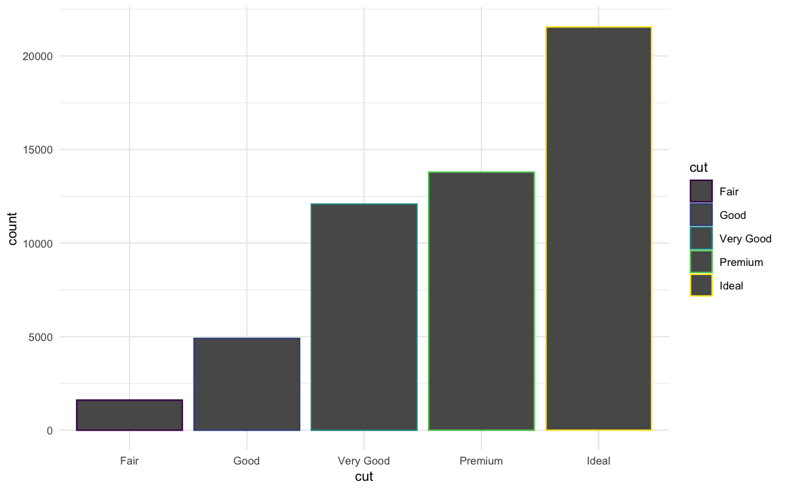

막대의 테두리만 색이 바뀌고 내부는 회색으로 유지됩니다.
```r
# 내부 채우기 색상 변경
ggplot(data = diamonds) +
  geom_bar(mapping = aes(x = cut, fill = cut))
```

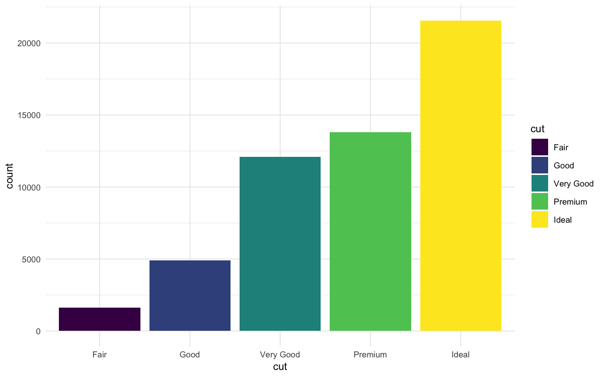

막대 전체가 해당 색상으로 채워져 훨씬 더 시각적으로 명확합니다.

**그룹별 적층 막대**

`fill`에 다른 변수를 매핑하면 **막대 내부가 여러 그룹으로 나뉘어** 하위 분류를 한눈에 볼 수 있습니다.
```r
ggplot(data = diamonds) +
  geom_bar(mapping = aes(x = cut, fill = clarity))
```


각 컷팅 등급별로 투명도(clarity) 등급의 구성 비율을 적층 막대로 표현하여 두 변수 간의 관계를 동시에 파악할 수 있습니다.
## 8. position

**position = 'identity'** : 원래 위치

```r
ggplot(data = diamonds, mapping = aes(x = cut, fill = clarity)) +
  geom_bar(alpha = 0.3, position = 'identity')
```

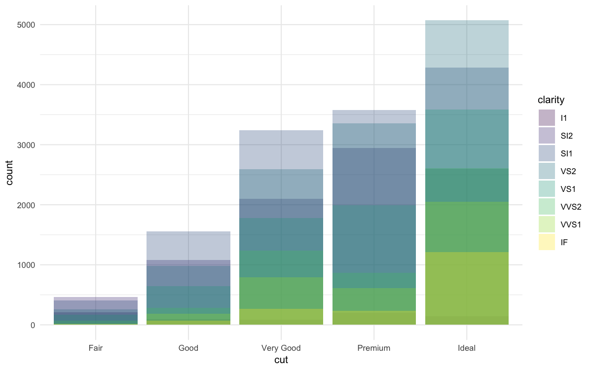

**position = 'fill'** : 비율 비교

```r
ggplot(data = diamonds) +
  geom_bar(mapping = aes(x = cut, fill = clarity), position = 'fill')
```

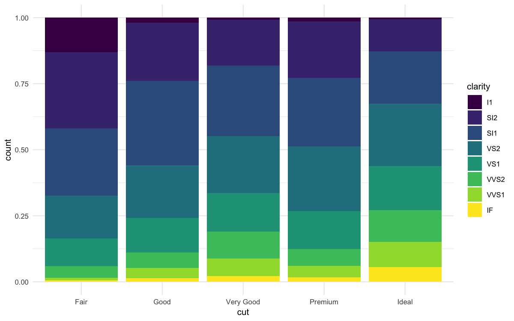

**position = 'dodge'** : 나란히 배치

```r
ggplot(data = diamonds) +
  geom_bar(mapping = aes(x = cut, fill = clarity), position = 'dodge')
```

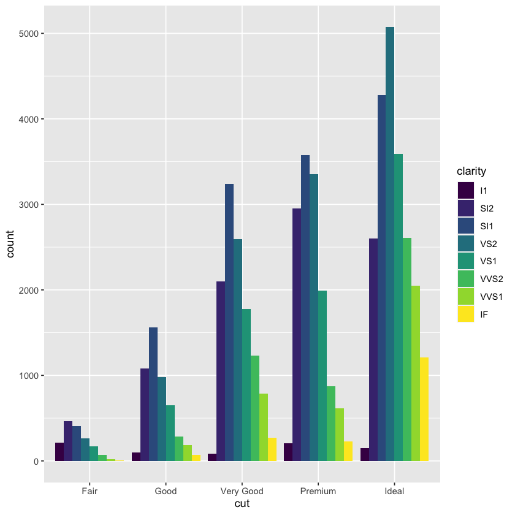

**position = 'jitter'** : 점 분산

```r
ggplot(data = mpg) +
  geom_point(mapping = aes(x = displ, y = hwy), position = 'jitter')
```


**겹치는 점들을 약간 분산**시켜 데이터 밀도를 더 잘 보여줍니다.

## 9. 좌표계 변환

**coord_flip()** : 축 뒤집기

```r
# 기본 박스플롯
ggplot(data = mpg, mapping = aes(x = class, y = hwy)) +
  geom_boxplot()

# 축 뒤집기  
ggplot(data = mpg, mapping = aes(x = class, y = hwy)) + 
  geom_boxplot() +
  coord_flip()
```


## 10. 지도 시각화

**기본 지도 그리기**

```r
# 뉴질랜드 지도 데이터
nz <- map_data('nz')

ggplot(nz, aes(long, lat, group = group)) +
  geom_polygon(fill = 'white', color = 'black')
```


**coord_quickmap()** : 비율 보정

```r
ggplot(nz, aes(long, lat, group = group)) +
  geom_polygon(fill = 'white', color = 'black') +
  coord_quickmap()  # 지도 비율 보정
```


## 11. 극좌표와 파이 차트

**막대 그래프를 파이 차트로 변환**

```r
# 기본 막대 그래프 설정
bar <- ggplot(data = diamonds) +
  geom_bar(mapping = aes(x = cut, fill = cut), 
           show.legend = FALSE, width = 1) +
  theme(aspect.ratio = 1) +
  labs(x = NULL, y = NULL)

# 축 뒤집기
bar + coord_flip()
```

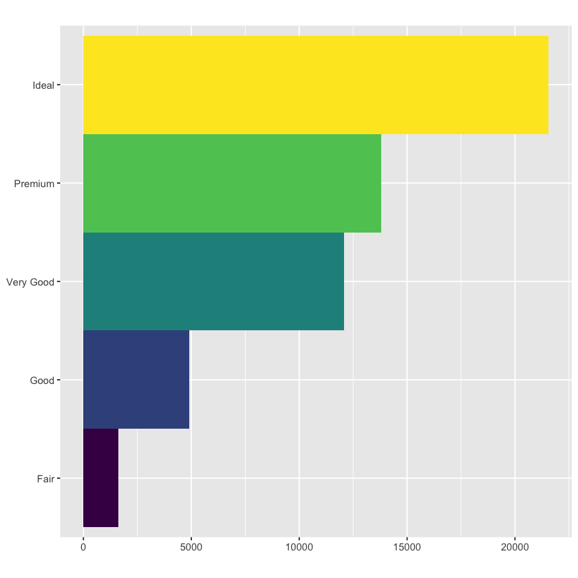

**coord_polar()** : 파이 차트 생성

```r
bar + coord_polar()
```


## 12. 라벨 (Labels)

**기본 제목과 라벨 추가**

```r
ggplot(mpg, aes(displ, hwy)) +
  geom_point(aes(color = class)) +
  geom_smooth(se = FALSE) +
  labs(
    title = "Engine Size and Fuel Efficiency",
    subtitle = "Exception: Coupe category",
    caption = "Source: fueleconomy.gov"
  )
```

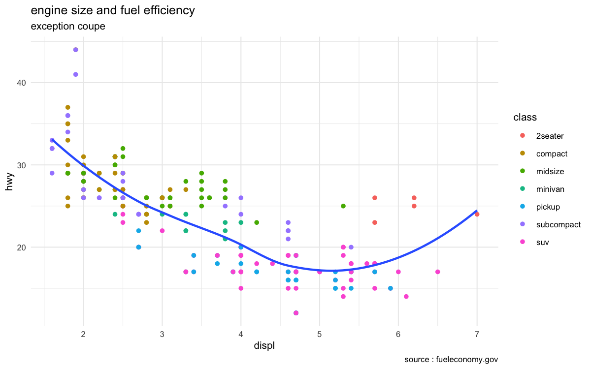

**축 라벨 커스터마이징**

```r
ggplot(mpg, aes(displ, hwy)) +
  geom_point(aes(color = class)) +
  geom_smooth(se = FALSE) +
  labs(
    x = "Engine Displacement (L)",
    y = "Highway Fuel Efficiency (MPG)",
    color = "Car Type"
  )
```

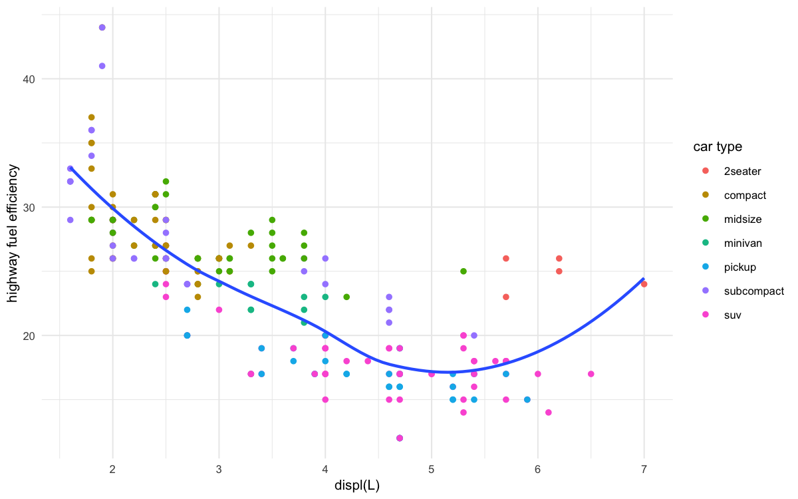

**수학 수식 라벨**

`quote()`를 사용하여 수학 수식을 라벨로 사용할 수 있습니다.

```r
df <- tibble(
  x = runif(10),
  y = runif(10)
)

ggplot(df, aes(x, y)) +
  geom_point() +
  labs(
    x = quote(sum(x[i]^2, i == 1, n)),
    y = quote(alpha + beta + frac(delta, theta))
  )
```


:::note
더 많은 수학 표현식은 `?plotmath`를 참조하세요.
:::

## 13. 주석 (Annotations)

**geom_text()** : 개별 데이터 포인트 라벨링

```r
# 각 클래스별 최고 연비 차량 선별
best_in_class <- mpg %>%
  group_by(class) %>%
  filter(row_number(desc(hwy)) == 1)

ggplot(mpg, aes(displ, hwy)) +
  geom_point(aes(color = class)) +
  geom_text(aes(label = model), data = best_in_class)
```


**geom_label()** : 배경이 있는 라벨

```r
ggplot(mpg, aes(displ, hwy)) +
  geom_point(aes(color = class)) +
  geom_label(
    aes(label = model),
    data = best_in_class,
    nudge_y = 2,      # 위로 2만큼 이동
    alpha = 0.5       # 반투명 설정
  )
```

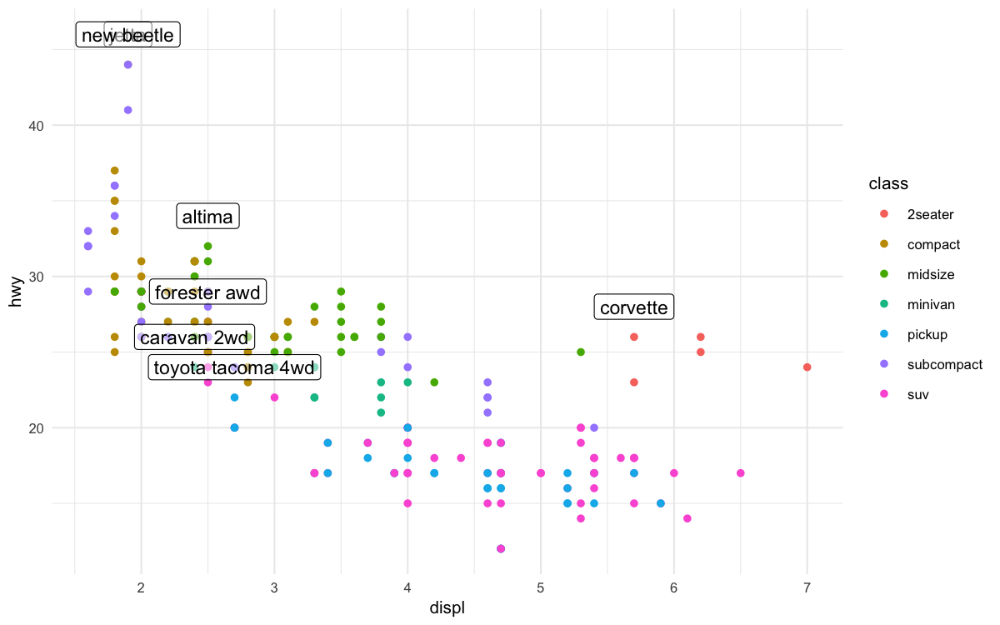

**ggrepel** : 라벨 겹침 해결

라벨이 겹치는 문제를 해결하는 강력한 도구입니다.

```r
ggplot(mpg, aes(displ, hwy)) +
  geom_point(aes(color = class)) +
  geom_point(size = 3, shape = 1, data = best_in_class) +  # 강조 테두리
  ggrepel::geom_label_repel(
    aes(label = model),
    data = best_in_class
  )
```


:::tip
`ggrepel` 패키지는 라벨 겹침을 자동으로 방지하여 깔끔한 시각화를 만들어줍니다.
:::

**범례 대신 직접 라벨링**

```r
# 클래스별 중앙값 계산
class_avg <- mpg %>%
  group_by(class) %>%
  summarize(
    displ = median(displ),
    hwy = median(hwy)
  )

ggplot(mpg, aes(displ, hwy, color = class)) +
  ggrepel::geom_label_repel(
    aes(label = class),
    data = class_avg,
    size = 6,
    label.size = 0,
    segment.color = NA
  ) +
  geom_point() +
  theme(legend.position = "none")  # 범례 제거
```


**모퉁이에 설명 텍스트 추가**

```r
# 최대값 위치에 라벨 배치
label <- mpg %>%
  summarize(
    displ = max(displ),
    hwy = max(hwy),
    label = "Increasing engine size is \nrelated to decreasing fuel economy"
  )

ggplot(mpg, aes(displ, hwy)) +
  geom_point() +
  geom_text(
    aes(label = label),
    data = label,
    vjust = "top",    # 수직 정렬
    hjust = "right"   # 수평 정렬
  )
```

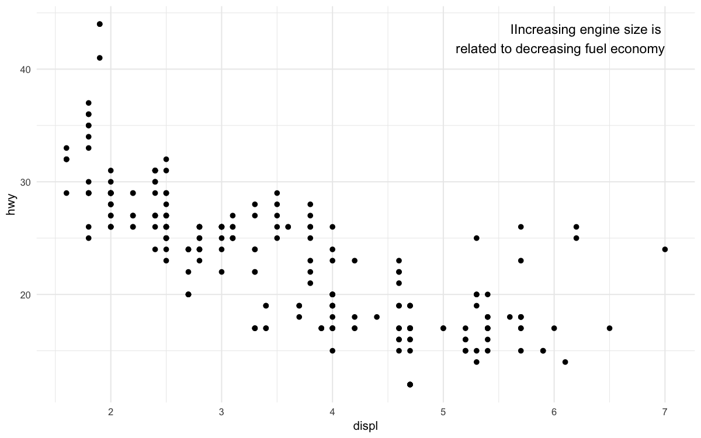

**Inf를 활용한 테두리 배치**

```r
label <- tibble(
  displ = Inf,      # 무한대로 설정
  hwy = Inf,
  label = paste(
    "Increasing engine size is \nrelated to",
    "decreasing fuel economy"
  )
)

ggplot(mpg, aes(displ, hwy)) +
  geom_point() +
  geom_text(
    aes(label = label),
    data = label,
    vjust = "top",
    hjust = "right"
  )
```


**str_wrap** : 자동 줄바꿈 기능

```r
# stringr::str_wrap()으로 자동 줄바꿈
"Increasing engine size is related to decreasing fuel economy." %>%
  stringr::str_wrap(width = 40) %>%
  writeLines()
```

## 14. 스케일 (Scales)

**기본 스케일 이해**

ggplot2는 자동으로 스케일을 추가합니다:

```r
# 기본 플롯
ggplot(mpg, aes(displ, hwy)) +
  geom_point(aes(color = class))

# 명시적 스케일 (위와 동일한 결과)
ggplot(mpg, aes(displ, hwy)) +
  geom_point(aes(color = class)) +
  scale_x_continuous() +
  scale_y_continuous() +
  scale_color_discrete()
```


> **스케일 명명 규칙**: `scale_` + `심미성이름` + `_` + `스케일타입`

## 15. 축, 눈금, 범례 키 조정

**breaks** : 눈금 위치 조정

```r
ggplot(mpg, aes(displ, hwy)) +
  geom_point() +
  scale_y_continuous(breaks = seq(15, 40, by = 5))
```


**labels** : 라벨 숨기기

```r
ggplot(mpg, aes(displ, hwy)) +
  geom_point() +
  scale_x_continuous(labels = NULL) +
  scale_y_continuous(labels = NULL)
```


**대통령 임기 시각화**

```r
presidential %>%
  mutate(id = 33 + row_number()) %>%
  ggplot(aes(start, id, color = party)) +
  geom_point() +
  geom_segment(aes(xend = end, yend = id)) +
  scale_x_date(
    NULL,
    breaks = presidential$start,
    date_labels = "'%y"  # 2자리 연도 표시
  )
```


## 16. 범례 레이아웃 조정

**범례 위치 조정**

```r
base <- ggplot(mpg, aes(displ, hwy)) +
  geom_point(aes(color = class))

# 다양한 위치 설정
base + theme(legend.position = "left")
base + theme(legend.position = "top")
base + theme(legend.position = "bottom")
base + theme(legend.position = "right")
```


**범례 세부 조정**

```r
ggplot(mpg, aes(displ, hwy)) +
  geom_point(aes(color = class)) +
  geom_smooth(se = FALSE) +
  theme(legend.position = "bottom") +
  guides(
    color = guide_legend(
      nrow = 1,                        # 한 줄로 배치
      override.aes = list(size = 4)    # 범례 점 크기 조정
    )
  )
```


## 17. 스케일 교체하기

### 로그 변환

**기본 플롯 (변환 전)**

```r
ggplot(diamonds, aes(carat, price)) +
  geom_bin2d()
```

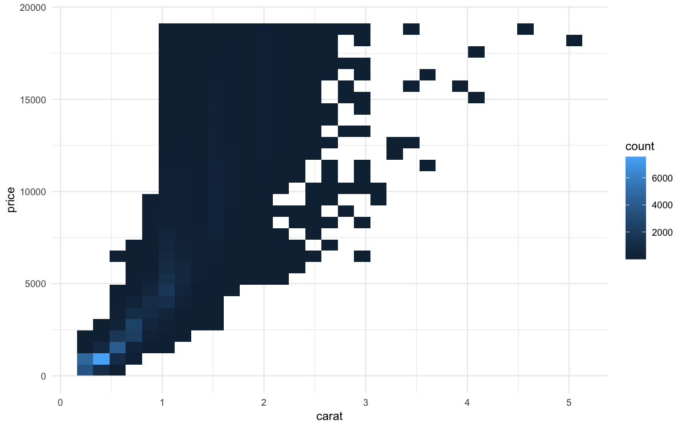

**방법 1: 데이터 직접 변환** (권장하지 않음)

```r
ggplot(diamonds, aes(log10(carat), log10(price))) +
  geom_bin2d()
```


**방법 2: 스케일 변환** (권장)

```r
ggplot(diamonds, aes(carat, price)) +
  geom_bin2d() +
  scale_x_log10() +
  scale_y_log10()
```


### 색상 스케일

**ColorBrewer 팔레트 사용**

```r
# 기본 색상
ggplot(mpg, aes(displ, hwy)) +
  geom_point(aes(color = drv))

# ColorBrewer 팔레트
ggplot(mpg, aes(displ, hwy)) +
  geom_point(aes(color = drv)) +
  scale_color_brewer(palette = "Set1")
```


**색상 + 모양 중복 매핑**

```r
ggplot(mpg, aes(displ, hwy)) +
  geom_point(aes(color = drv, shape = drv)) +
  scale_color_brewer(palette = "Set1")
```

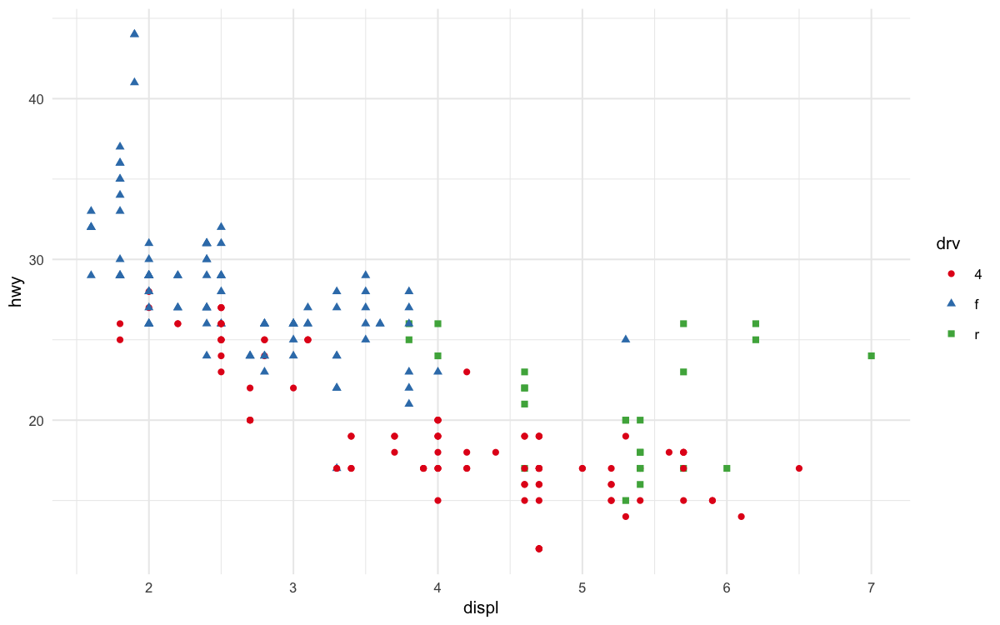

:::tip
색상과 모양을 함께 사용하면 색맹이 있는 사람도 구분할 수 있습니다.
:::

**수동 색상 설정**

```r
presidential %>%
  mutate(id = 33 + row_number()) %>%
  ggplot(aes(start, id, color = party)) +
  geom_point() +
  geom_segment(aes(xend = end, yend = id)) +
  scale_color_manual(values = c(Republican = "red", Democratic = "blue"))
```

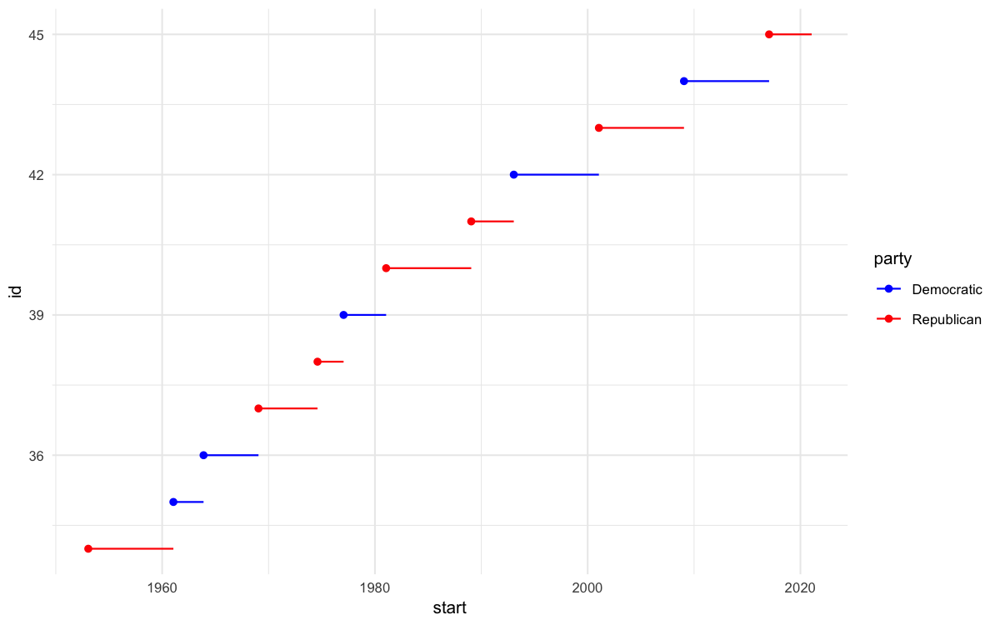

**Viridis 색상 스케일**

```r
df <- tibble(
  x = rnorm(10000),
  y = rnorm(10000)
)

# 기본 색상
ggplot(df, aes(x, y)) +
  geom_hex() +
  coord_fixed()

# Viridis 색상 (색맹 친화적)
ggplot(df, aes(x, y)) +
  geom_hex() +
  viridis::scale_fill_viridis() +
  coord_fixed()
```


## 18. 확대/축소 (Zooming)

**coord_cartesian() vs filter() 비교**

```r
# coord_cartesian() 사용 (권장)
ggplot(mpg, mapping = aes(displ, hwy)) +
  geom_point(aes(color = class)) +
  geom_smooth() +
  coord_cartesian(xlim = c(5, 7), ylim = c(10, 30))

# filter() 사용 (데이터 손실)
mpg %>%
  filter(displ >= 5, displ <= 7, hwy >= 10, hwy <= 30) %>%
  ggplot(aes(displ, hwy)) +
  geom_point(aes(color = class)) +
  geom_smooth()
```


**중요한 차이점**
- `coord_cartesian()`: 전체 데이터 기준으로 통계 계산 후 확대
- `filter()`: 일부 데이터만으로 통계 계산

## 19. 스케일 통일하기

**문제: 서로 다른 스케일**

```r
suv <- mpg %>%
  filter(class == "suv")
compact <- mpg %>%
  filter(class == "compact")

# 비교하기 어려운 플롯들
ggplot(suv, aes(displ, hwy, color = drv)) +
  geom_point()

ggplot(compact, aes(displ, hwy, color = drv)) +
  geom_point()
```

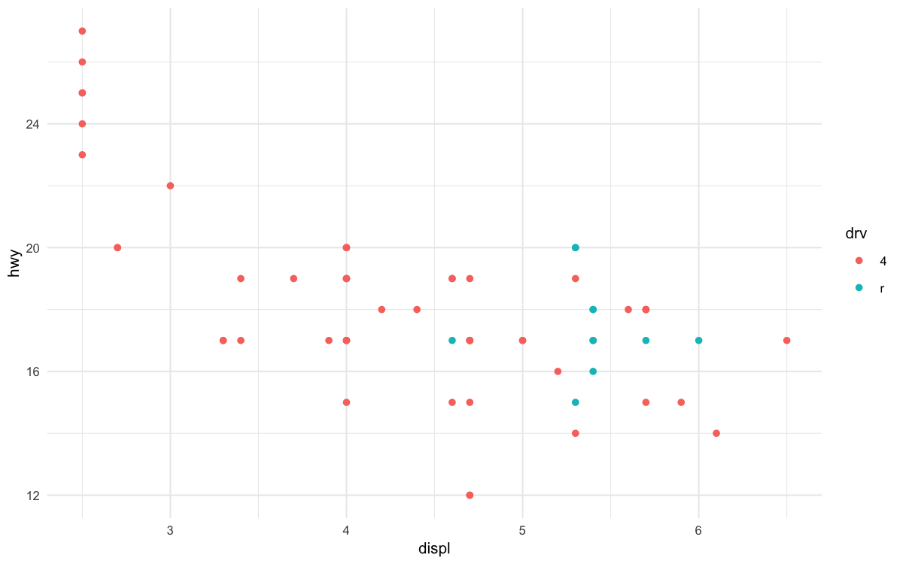

**해결: 공통 스케일 적용**

```r
# 공통 스케일 정의
x_scale <- scale_x_continuous(limits = range(mpg$displ))
y_scale <- scale_y_continuous(limits = range(mpg$hwy))
col_scale <- scale_color_discrete(limits = unique(mpg$drv))

# 동일한 스케일 적용
ggplot(suv, aes(displ, hwy, color = drv)) +
  geom_point() +
  x_scale + y_scale + col_scale

ggplot(compact, aes(displ, hwy, color = drv)) +
  geom_point() +
  x_scale + y_scale + col_scale
```

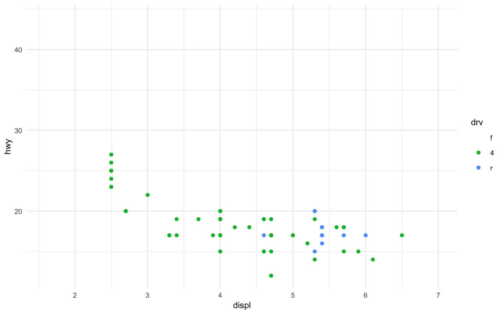

## 20. 테마 (Themes)

**기본 테마**

```r
ggplot(mpg, aes(displ, hwy)) +
  geom_point(aes(color = class)) +
  geom_smooth(se = FALSE) +
  theme_bw()  # 흑백 테마
```

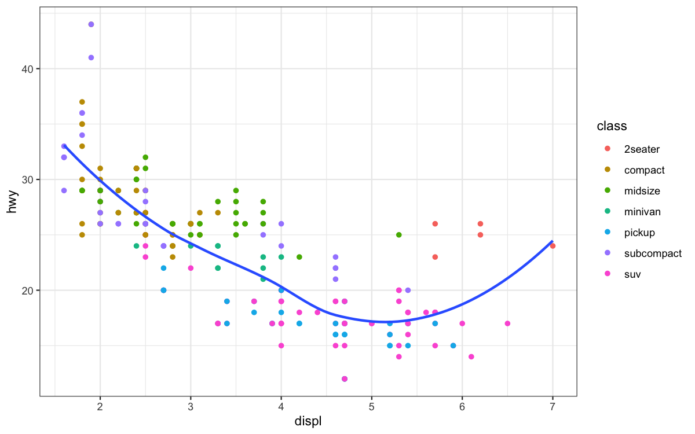

**주요 내장 테마들**

- `theme_minimal()`: 미니멀한 스타일
- `theme_classic()`: 클래식한 스타일  
- `theme_void()`: 배경 없는 스타일
- `theme_dark()`: 어두운 배경
- `theme_bw()`: 흑백 스타일

**마무리**
