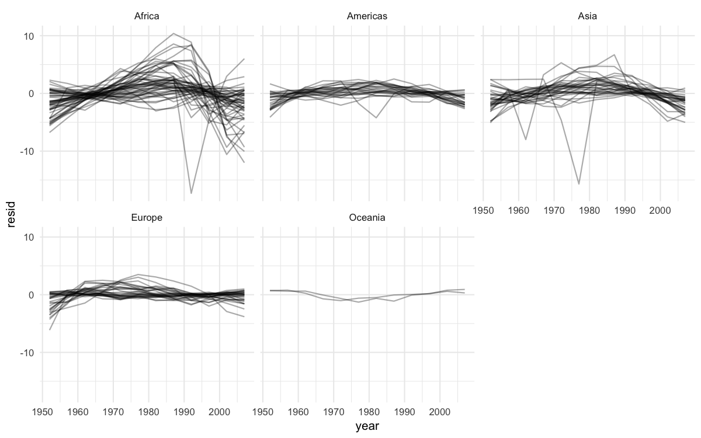

> 참고 자료:
> [purrr 공식 문서](https://purrr.tidyverse.org/) | [broom 공식 문서](https://broom.tidymodels.org/) | [R for Data Science - Iteration](https://r4ds.had.co.nz/iteration.html)

## 개요

반복문과 벡터 연산은 R에서 데이터 처리의 핵심 도구입니다. 복잡한 데이터 분석에서는 여러 그룹별로 모델을 적합하거나, 다양한 모델을 비교하거나, 복잡한 중첩 구조의 데이터를 다뤄야 할 때가 많습니다. 이 포스트에서는 전통적인 for 루프부터 함수형 프로그래밍 패러다임의 purrr 패키지까지 다양한 반복 처리 방법을 알아보고, 이를 활용해 중첩 데이터와 여러 모델을 효율적으로 다루는 방법을 알아봅니다.

```r title="환경 설정"
# 패키지 로드
library('tidyverse')  # purrr 패키지 포함
library('modelr')     # 모델링 도구
library('broom')      # 모델을 tidy 데이터로 변환
library('gapminder')  # 예제 데이터셋

# 플롯 최적화 설정
options(
  repr.plot.width = 8,
  repr.plot.height = 5,
  repr.plot.res = 150
)

# 테마 설정
theme_set(theme_minimal(base_size = 10))
```

## 1. Vector와 List 기초

R의 데이터 구조에서 List는 서로 다른 타입의 데이터를 하나의 객체에 담을 수 있는 유연한 구조입니다.

**에러 처리 함수**

```r
# stop: 즉시 중단하고 메시지 표시
# stopifnot: 조건이 FALSE일 때만 중단 (다중 조건 검사에 유용)
```

**List 생성과 활용**

List는 이름을 지정할 수 있고, 다양한 타입을 혼합하여 저장할 수 있습니다.

```r
# 이름이 있는 리스트 생성
x_named <- list(a = 1, b = 2, c = 3)
x_named
# $a
# [1] 1
# $b
# [1] 2
# $c
# [1] 3
```

```r
# 서로 다른 타입들을 하나의 리스트에 저장
y <- list("a", 1L, 1.5, TRUE)
y
# [[1]]
# [1] "a"
# [[2]]
# [1] 1
# [[3]]
# [1] 1.5
# [[4]]
# [1] TRUE
```

리스트 안에 리스트를 포함하는 중첩 구조도 가능합니다.

```r
# 리스트 안에 리스트 포함
z <- list(list(1, 2), list(3, 4))
str(z)
# List of 2
#  $ :List of 2
#   ..$ : num 1
#   ..$ : num 2
#  $ :List of 2
#   ..$ : num 3
#   ..$ : num 4
```

**리스트 구조 비교**

```r
x1 <- list(c(1, 2), c(3, 4))          # 벡터들의 리스트
x2 <- list(list(1, 2), list(3, 4))    # 리스트들의 리스트
x3 <- list(1, list(2, list(3)))       # 깊이가 다른 중첩 리스트
```

**리스트 서브셋팅**

서브셋팅 방법에 따라 추출되는 결과의 형태가 다릅니다.

```r
# 예제 리스트 생성
a <- list(a = 1:3, b = "a string", c = pi, d = list(-1, -5))

# [ ] : 부분 리스트 추출 (결과는 항상 리스트)
str(a[1:2])
# List of 2
#  $ a: int [1:3] 1 2 3
#  $ b: chr "a string"

# [[ ]] : 단일 구성요소 추출 (리스트 계층 한 단계 제거)
str(a[[1]])
# int [1:3] 1 2 3

# $ : 명명된 요소 추출 (따옴표 불필요)
a$a        # 동일: a[["a"]]
# [1] 1 2 3
```

:::note
**핵심 포인트**
- **`[`**: 더 작은 새 리스트 반환
- **`[[`**: 리스트 안으로 들어가서 내용 추출
:::

## 2. for 루프

R에서 가장 기본적인 반복 구조입니다. 출력 벡터를 미리 할당하고, 각 반복에서 결과를 채워 넣는 패턴을 사용합니다.

**기본 구조**

```r
# 데이터프레임 생성
df <- tibble(
  a = rnorm(10),
  b = rnorm(10),
  c = rnorm(10),
  d = rnorm(10)
)

# 각 열의 중앙값 계산
output <- vector("double", ncol(df))
for(i in seq_along(df)){
  output[[i]] <- median(df[[i]])
}
output
```

**seq_along vs 1:length**

빈 벡터를 다룰 때 `seq_along()`이 더 안전합니다.

```r
y <- vector("double", 0)

seq_along(y)  # integer(0) - 안전함
1:length(y)   # [1] 1 0 - 예상치 못한 결과!
```

:::tip
**`seq_along()`**을 사용하면 빈 벡터에서도 안전하게 작동합니다.
:::

**데이터 정규화 예제**

```r
# 0-1 스케일링 함수
rescale01 <- function(x){
  rng <- range(x, na.rm = TRUE)
  (x - rng[1]) / (rng[2] - rng[1])
}

# for 루프로 모든 열에 적용
for (i in seq_along(df)){
  df[[i]] <- rescale01(df[[i]])
}
```

**길이를 모르는 출력 처리**

반복 결과의 길이를 사전에 알 수 없을 때는 리스트에 저장 후 평탄화하는 것이 효율적입니다.

비효율적인 방법 (벡터 늘리기):

```r
means <- c(0, 1, 2)
output <- double()
for (i in seq_along(means)){
  n <- sample(100, 1)
  output <- c(output, rnorm(n, means[[i]]))  # 매번 복사!
}
```

효율적인 방법 (리스트 사용):

```r
out <- vector("list", length(means))
for(i in seq_along(means)){
  n <- sample(100, 1)
  out[[i]] <- rnorm(n, means[[i]])
}
# 최종적으로 평탄화
result <- unlist(out)
```

## 3. map 함수군

purrr 패키지의 `map()` 함수군은 for 루프를 함수형 프로그래밍 스타일로 대체합니다. 반환 타입에 따라 여러 변형이 있습니다.

**기본 사용법**

```r
# 각 열의 평균 계산
map_dbl(df, mean)
#    a       b       c       d
# 0.123  -0.456   0.789   0.234

# 다양한 통계량 계산
map_dbl(df, median)  # 중앙값
map_dbl(df, sd)      # 표준편차
```

**반환 타입별 함수**

| 함수 | 반환 타입 | 용도 |
|------|-----------|------|
| `map()` | 리스트 | 일반적인 변환 |
| `map_lgl()` | 논리형 벡터 | TRUE/FALSE 결과 |
| `map_int()` | 정수형 벡터 | 정수 결과 |
| `map_dbl()` | 더블형 벡터 | 실수 결과 |
| `map_chr()` | 문자형 벡터 | 문자 결과 |

**파이프와 함께 사용**

```r
# 파이프 연산자로 깔끔하게
df %>% map_dbl(mean)

# 이름 유지 확인
z <- list(x = 1:3, y = 4:5)
map_int(z, length)
# x y
# 3 2
```

**그룹별 모델링**

`split()`과 `map()`을 조합하면 그룹별로 모델을 적합할 수 있습니다.

```r
# 실린더 수별로 선형 모형 적합
models <- mtcars %>%
  split(.$cyl) %>%
  map(~lm(mpg ~ wt, data = .))

models
# $`4`
# Call: lm(formula = mpg ~ wt, data = .)
# Coefficients:
# (Intercept)          wt
#      39.571      -5.647
```

모델에서 R² 추출하기:

```r
# 방법 1: 익명 함수 사용
models %>%
  map(summary) %>%
  map_dbl(~.$r.squared)

# 방법 2: 이름으로 직접 추출
models %>%
  map(summary) %>%
  map_dbl("r.squared")
# 4         6         8
# 0.5086    0.4645    0.4230
```

**위치로 요소 선택**

정수를 전달하면 해당 위치의 요소를 추출합니다.

```r
# 각 리스트의 두 번째 요소 추출
x <- list(list(1,2,3), list(4,5,6), list(7,8,9))
x %>% map_dbl(2)
# [1] 2 5 8
```

## 4. apply 함수군

purrr 이전부터 R에 내장된 반복 처리 함수입니다. 입력과 출력 형태에 따라 사용을 구분합니다.

| 함수 | 입력 | 출력 | 특징 |
|------|------|------|------|
| `apply()` | 배열/행렬 | 벡터/배열 | 행/열 방향 적용 |
| `lapply()` | 벡터/리스트 | 리스트 | 항상 리스트 반환 |
| `sapply()` | 벡터/리스트 | 벡터/행렬 | 간단한 형태로 변환 |

`sapply()`는 결과 길이가 다를 때 예측 불가능한 타입을 반환할 수 있어 주의가 필요합니다.

```r
# 임계값 함수 정의
threshold <- function(x, cutoff = 0.9) x[x > cutoff]

# 데이터 생성
x1 <- list(
  c(0.27, 0.37, 0.57, 0.91, 0.20),
  c(0.90, 0.94, 0.66, 0.63, 0.06),
  c(0.21, 0.18, 0.69, 0.38, 0.77)
)

# sapply 적용
x1 %>% sapply(threshold) %>% str()
# List of 3
#  $ : num 0.91
#  $ : num 0.94
#  $ : num(0)
```

## 5. 오류 처리와 검사 함수

반복 처리 중 하나의 오류가 전체를 멈추지 않도록 안전하게 처리하는 함수들입니다.

**safely()**

`safely()`는 함수를 감싸서 결과(result)와 에러(error)를 분리하여 반환합니다.

```r
# 안전한 로그 함수 생성
safe_log <- safely(log)

# 정상 케이스
str(safe_log(10))
# List of 2
#  $ result: num 2.3
#  $ error : NULL

# 오류 케이스
str(safe_log("a"))
# List of 2
#  $ result: NULL
#  $ error :List of 2
#   ..$ message: chr "non-numeric argument to mathematical function"
```

**some과 every**

리스트 요소들이 특정 조건을 만족하는지 논리적으로 검사합니다.

```r
x <- list(1:5, letters, list(10))

# 일부 요소가 조건을 만족하는지
x %>% some(is.character)  # TRUE

# 모든 요소가 조건을 만족하는지
x %>% every(is_vector)    # TRUE
```

**detect 계열**

조건을 만족하는 첫 번째 요소나 위치를 찾습니다.

```r
x <- sample(10)  # [1] 9 4 8 3 7 2 10 6 5 1

# 조건을 만족하는 첫 번째 값
x %>% detect(~ . > 5)        # 9

# 조건을 만족하는 첫 번째 위치
x %>% detect_index(~ . > 5)  # 1

# 앞에서부터 조건 만족하는 연속 요소들
x %>% head_while(~ . > 5)    # 9

# 뒤에서부터 조건 만족하는 연속 요소들
x %>% tail_while(~ . > 5)    # (빈 결과)
```

## 6. 다중 인수 map과 reduce

두 개 이상의 입력을 동시에 순회하거나, 리스트를 순차적으로 축약하는 함수들입니다.

**map2() : 두 개 인수**

두 리스트의 대응하는 요소를 동시에 함수에 전달합니다.

```r
mu <- list(5, 10, -3)
sigma <- list(1, 5, 10)

# 평균과 표준편차를 동시에 적용
map2(mu, sigma, rnorm, n = 10)
```

| mu | sigma | 결과 |
|----|-------|------|
| 5 | 1 | rnorm(10, mean=5, sd=1) |
| 10 | 5 | rnorm(10, mean=10, sd=5) |
| -3 | 10 | rnorm(10, mean=-3, sd=10) |

**pmap() : 다중 인수**

3개 이상의 인수를 리스트로 묶어 전달합니다. 이름을 지정하면 인수 순서에 독립적으로 작동합니다.

```r
# 3개 이상의 인수 처리
n <- list(1, 3, 5)
args1 <- list(n, mu, sigma)
args1 %>% pmap(rnorm) %>% str()

# 이름으로 인수 지정 (더 안전!)
args2 <- list(mean = mu, sd = sigma, n = n)
args2 %>% pmap(rnorm) %>% str()
```

복잡한 매개변수 조합은 데이터프레임으로 관리하면 가독성이 좋습니다.

```r
params <- tribble(
  ~mean, ~sd, ~n,
  5,     1,   1,
  10,    5,   3,
  -3,    10,  5
)

params %>% pmap(rnorm)
```

**invoke_map() : 함수까지 변수로**

적용할 함수 자체도 리스트로 전달하여, 서로 다른 함수를 각기 다른 인수로 호출합니다.

```r
f <- c("runif", "rnorm", "rpois")
param <- list(
  list(min = -1, max = 1),
  list(sd = 5),
  list(lambda = 10)
)

invoke_map(f, param, n = 5) %>% str()
```

| 함수 | 매개변수 | 결과 |
|------|----------|------|
| "runif" | min=-1, max=1 | runif(n=5, min=-1, max=1) |
| "rnorm" | sd=5 | rnorm(n=5, sd=5) |
| "rpois" | lambda=10 | rpois(n=5, lambda=10) |

**reduce()**

리스트의 요소들을 이항 함수로 순차적으로 축약합니다. 여러 데이터프레임 조인이나 집합 연산에 유용합니다.

```r
# 여러 데이터프레임을 하나로 합치기
dfs <- list(
  age = tibble(name = "John", age = 30),
  sex = tibble(name = c("John", "Mary"), sex = c("M", "F")),
  trt = tibble(name = "Mary", treatment = "A")
)

# 순차적으로 조인
dfs %>% reduce(full_join)
#   name   age sex treatment
# 1 John    30  M      <NA>
# 2 Mary   <NA> F         A
```

```r
# 여러 벡터의 교집합
vs <- list(
  c(1, 3, 5, 6, 10),
  c(1, 2, 3, 7, 8, 10),
  c(1, 2, 3, 4, 8, 9, 10)
)

vs %>% reduce(intersect)
# [1]  1  3 10
```

## 7. 중첩 데이터

gapminder 데이터를 사용하여 국가별 모델링 워크플로우를 구축합니다. 핵심 아이디어 3가지:

> 1) 간단한 모델을 여러 개 사용하여 복잡한 데이터셋을 잘 이해한다.
> 2) 리스트-열(List-column)을 사용하여 임의의 데이터 구조를 데이터프레임에 저장한다.
> 3) broom 패키지를 사용하여 모델을 타이디 데이터로 변환한다.

**gapminder 데이터 탐색**

전 세계 국가들의 기대수명 변화 추이를 시각화하여 전반적인 패턴을 파악합니다.

```r
# 데이터 구조 확인
gapminder %>% head()

# 전체 트렌드 시각화
gapminder %>%
  ggplot(aes(year, lifeExp, group = country)) +
  geom_line(alpha = 1/3) +
  labs(
    title = "전 세계 기대수명 변화 추이",
    x = "연도", y = "기대수명"
  )
```


전반적으로 기대수명이 꾸준히 증가하고 있지만, 이 패턴을 따르지 않는 국가들이 있습니다. 숨겨진 추세를 확인하기 위해 선형 추세 모델을 적합하여 전반적인 선형 추세를 제거합니다.

**데이터 중첩하기**

**중첩(nesting)**은 그룹별로 데이터를 리스트 형태로 묶어 정리하는 방법입니다. 관련 데이터가 함께 저장되므로 필터링이나 정렬 시 자동으로 동기화됩니다.

```r
# 국가와 대륙별로 데이터 중첩
by_country <- gapminder %>%
  group_by(country, continent) %>%
  nest()

by_country %>% head()
```

```r
# 특정 국가의 데이터 확인
by_country$data[[1]]  # 첫 번째 국가(Afghanistan)의 데이터
```

## 8. 모델 적용과 잔차 분석

중첩된 데이터에 `map()`으로 모델을 일괄 적합하고, 잔차를 분석하여 모델이 설명하지 못하는 패턴을 탐색합니다.

**모델 적합**

```r
# 각 국가별로 선형 모델 적합
country_model <- function(df) {
  lm(lifeExp ~ year, data = df)
}

# 모든 국가에 모델 적용
by_country <- by_country %>%
  mutate(model = map(data, country_model))

# 결과 확인
by_country %>% head()
```

리스트-열을 사용하면 데이터와 모델이 같은 행에 저장되어 필터링이나 정렬 시 자동으로 동기화됩니다.

**잔차 분석**

모델의 잔차를 시각화하면 선형 추세를 제거한 후 남는 패턴을 확인할 수 있습니다.

```r
# 잔차 계산
by_country <- by_country %>%
  mutate(
    resids = map2(data, model, add_residuals)
  )

# 잔차 데이터 중첩 해제
resids <- by_country %>%
  unnest(resids)

# 잔차 시각화
resids %>%
  ggplot(aes(year, resid)) +
  geom_line(aes(group = country), alpha = 1/3) +
  geom_smooth(se = FALSE) +
  labs(
    title = "전 세계 기대수명 잔차 패턴",
    x = "연도", y = "잔차"
  )
```


**대륙별 잔차 패턴**

대륙별로 면분할하여 지역적 특성을 파악합니다.

```r
resids %>%
  ggplot(aes(year, resid, group = country)) +
  geom_line(alpha = 1/3) +
  facet_wrap(~continent) +
  labs(
    title = "대륙별 기대수명 잔차 패턴",
    x = "연도", y = "잔차"
  )
```



아프리카 대륙에서 매우 큰 잔차값이 보이며, 이는 HIV/AIDS 전염병과 르완다 집단 학살의 영향을 보여줍니다.

## 9. 모델 성능 평가

broom 패키지의 `glance()`로 모델 성능 지표를 추출하고, R²를 기준으로 적합도를 비교합니다.

**R² 분포 확인**

```r
# 모델 성능 지표 추출
by_country %>%
  mutate(glance = map(model, broom::glance)) %>%
  unnest(glance, .drop = TRUE) %>%
  head()
```

```r
# R-squared 분포 확인
glance %>%
  ggplot(aes(continent, r.squared)) +
  geom_jitter(width = 0.5) +
  labs(
    title = "대륙별 모델 적합도 분포",
    x = "대륙", y = "R-squared"
  )
```


**적합도가 낮은 모델 분석**

R²가 낮은 국가들은 기대수명이 선형 증가 패턴을 따르지 않는 경우입니다.

```r
# R-squared가 0.25 미만인 국가들
bad_fit <- glance %>%
  filter(r.squared < 0.25)

# 해당 국가들의 기대수명 추이 확인
gapminder %>%
  semi_join(bad_fit, by = "country") %>%
  ggplot(aes(year, lifeExp, color = country)) +
  geom_line() +
  labs(
    title = "선형 모델 적합도가 낮은 국가들",
    x = "연도", y = "기대수명"
  )
```


## 10. 리스트-열 활용

리스트-열은 데이터프레임의 한 열에 리스트를 저장하는 기법입니다. 생성 방법과 일반 열로 되돌리는 단순화 전략을 알아봅니다.

**생성 방법 4가지**

1) 중첩을 사용하여 생성:

```r
# 그룹별 중첩
gapminder %>%
  group_by(country, continent) %>%
  nest() %>%
  head(3)

# 특정 열 중첩
gapminder %>%
  nest(data = c(year, lifeExp, pop, gdpPercap)) %>%
  head(3)
```

2) 벡터화 함수에서 생성:

```r
# 문자열 분할 예제
df <- tribble(
  ~x1,
  "a,b,c",
  "d,e,f,g"
)

df %>%
  mutate(x2 = str_split(x1, ",")) %>%
  unnest(x2)
```

3) 다중값 요약에서 생성:

```r
# 분위수 계산 예제
probs <- c(0.01, 0.25, 0.5, 0.75, 0.99)

mtcars %>%
  group_by(cyl) %>%
  summarize(
    p = list(probs),
    q = list(quantile(mpg, probs))
  ) %>%
  unnest(c(p, q))
```

4) 명명된 리스트에서 생성:

```r
# 리스트를 데이터프레임으로 변환
x <- list(
  a = 1:5,
  b = 3:4,
  c = 5:6
)

df <- enframe(x)
df
```

**단순화 전략**

리스트-열을 일반 열로 변환하는 방법은 원하는 값의 개수에 따라 달라집니다.

단일 값 → 원자 벡터:

```r
df <- tribble(
  ~x,
  letters[1:5],
  1:3,
  runif(5)
)

df %>%
  mutate(
    type = map_chr(x, typeof),
    length = map_int(x, length)
  )
```

다중 값 → unnest():

```r
tibble(x = 1:2, y = list(1:4, 1)) %>%
  unnest(y)
```

중첩된 리스트에서 특정 요소 추출:

```r
df <- tribble(
  ~x,
  list(a = 1, b = 2),
  list(a = 2, c = 4)
)

df %>%
  mutate(
    a = map_dbl(x, "a"),
    b = map_dbl(x, "b", .null = NA_real_)
  )
```

## 11. broom 패키지

broom은 모델 객체를 타이디 데이터프레임으로 변환하는 3가지 핵심 함수를 제공합니다.

**glance() - 모델 전체 성능**

모델 하나당 한 행의 요약 지표(R², AIC, BIC 등)를 반환합니다.

```r
by_country %>%
  mutate(glance = map(model, broom::glance)) %>%
  unnest(glance) %>%
  arrange(r.squared) %>%
  head()
```

**tidy() - 계수 정보**

각 계수의 추정값, 표준오차, t값, p값 등을 반환합니다.

```r
by_country %>%
  mutate(tidy = map(model, broom::tidy)) %>%
  unnest(tidy) %>%
  head()
```

**augment() - 관측값별 통계량**

원본 데이터에 예측값, 잔차, 쿡의 거리 등을 추가합니다.

```r
by_country %>%
  mutate(augment = map2(model, data, broom::augment)) %>%
  unnest(augment) %>%
  head()
```

## 12. 실무 워크플로우

중첩 데이터 + purrr + broom을 결합한 체계적 분석 프로세스입니다.

**분석 프로세스**

```r
# 1단계: 데이터 중첩
nested_data <- raw_data %>%
  group_by(grouping_var) %>%
  nest()

# 2단계: 모델 적합
with_models <- nested_data %>%
  mutate(
    model = map(data, ~ model_function(.x)),
    predictions = map2(model, data, predict),
    residuals = map2(data, model, add_residuals)
  )

# 3단계: 모델 평가
model_summary <- with_models %>%
  mutate(
    glance = map(model, broom::glance),
    tidy = map(model, broom::tidy)
  )

# 4단계: 결과 정리 및 시각화
final_results <- model_summary %>%
  unnest(glance) %>%
  arrange(desc(r.squared))
```

**성능 비교 시각화**

```r
model_comparison <- function(data) {
  data %>%
    unnest(glance) %>%
    ggplot(aes(r.squared)) +
    geom_histogram(bins = 30) +
    facet_wrap(~continent) +
    labs(
      title = "모델 성능 분포",
      x = "R-squared", y = "빈도"
    )
}
```

**모범 사례**

1. 점진적 구축: 간단한 모델부터 시작해서 복잡도를 점차 늘려가기
2. 성능 모니터링: 정기적으로 모델 성능 지표 확인하기
3. 결과 검증: 이상치나 예외 케이스 별도 분석하기
4. 문서화: 각 단계의 목적과 결과를 명확히 기록하기

**확장 가능한 구조**

여러 모델을 비교할 때는 모델 함수 자체를 데이터프레임으로 관리합니다.

```r
model_comparison <- tribble(
  ~model_name, ~model_func,
  "linear", ~ lm(y ~ x, data = .x),
  "polynomial", ~ lm(y ~ poly(x, 2), data = .x),
  "smooth", ~ mgcv::gam(y ~ s(x), data = .x)
)

results <- nested_data %>%
  crossing(model_comparison) %>%
  mutate(
    fitted_model = map2(data, model_func, ~ .y(.x)),
    performance = map(fitted_model, broom::glance)
  )
```

:::caution
- 메모리 관리: 큰 데이셋의 경우 메모리 사용량 주의
- 에러 처리: `safely()` 함수로 안전한 모델 적합
- 병렬 처리: `future_map()` 등으로 성능 최적화 고려
:::
