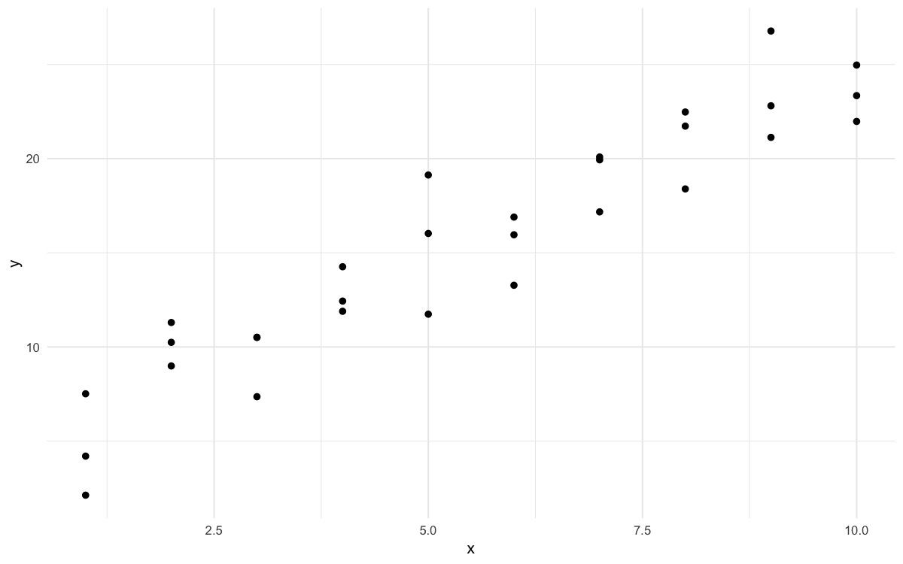
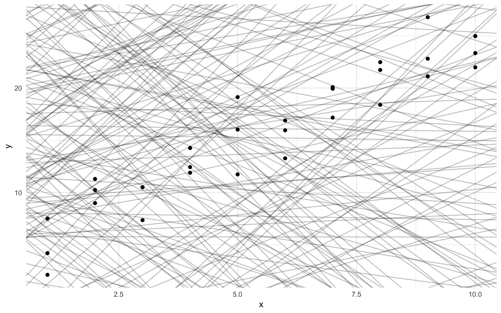
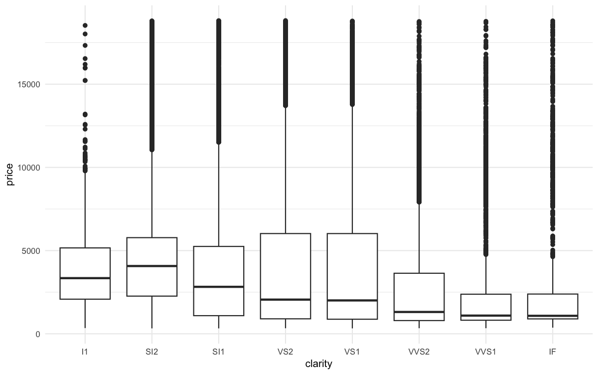
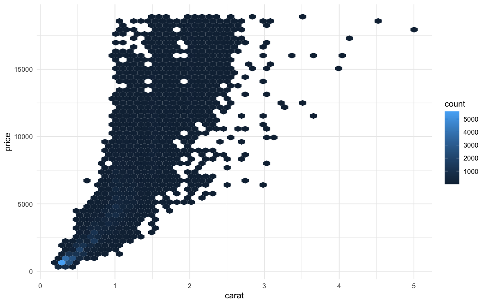
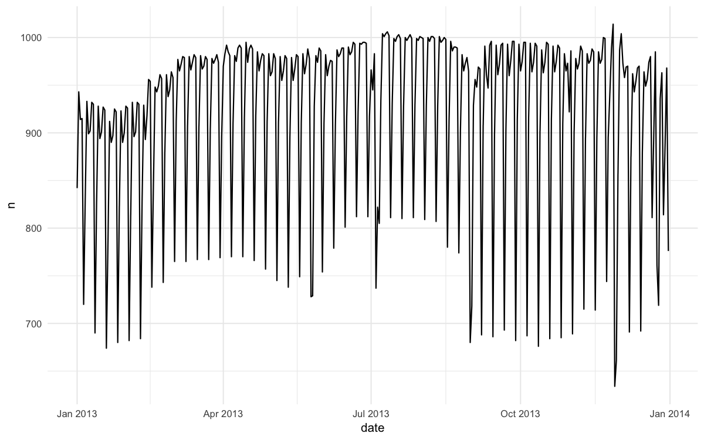
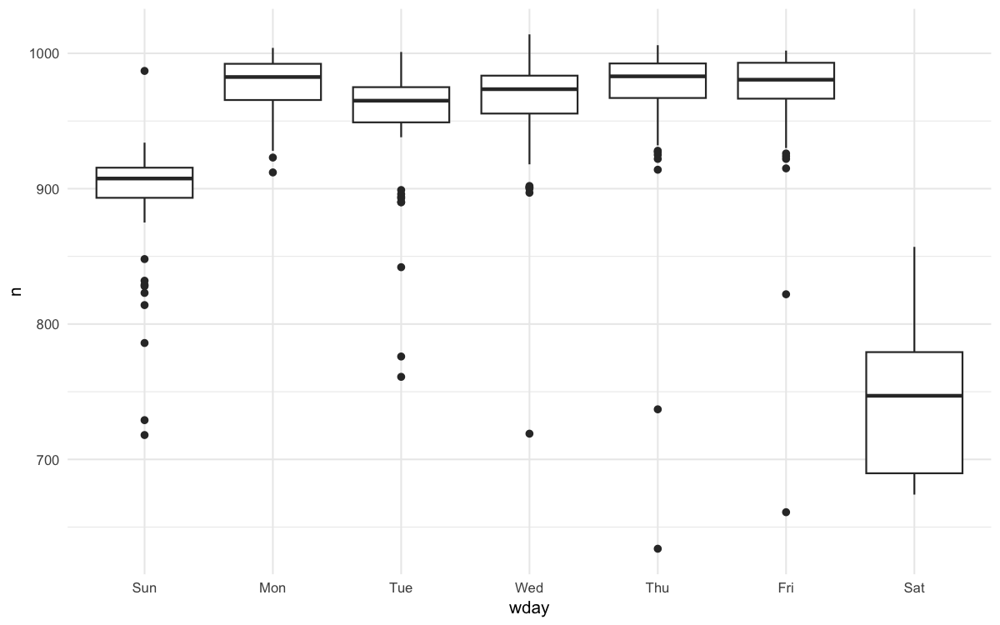
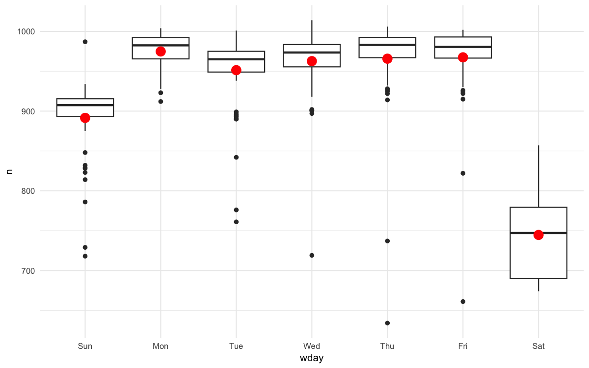
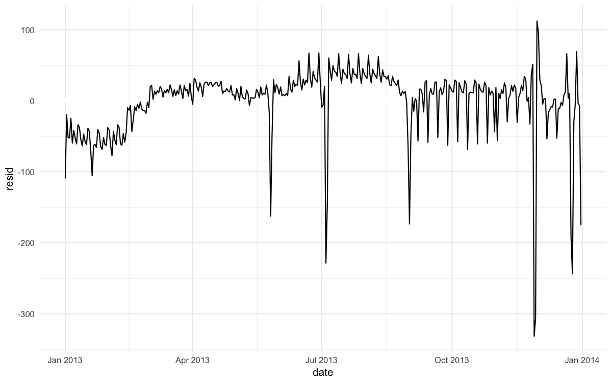
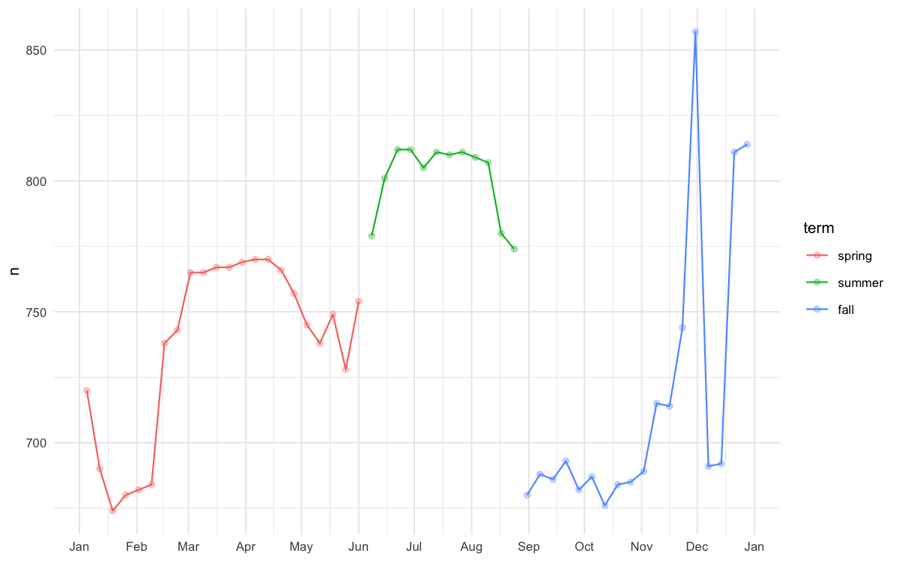

> 참고 자료: [modelr 공식 문서](https://modelr.tidyverse.org/) | [R for Data Science - Model](https://r4ds.had.co.nz/model-intro.html)

## 개요

**modeling**은 데이터에서 패턴을 발견하고 예측을 수행하는 핵심 도구입니다. 회귀분석의 기초 개념부터 예측, 잔차 분석, 변수 상호작용, 비선형 modeling까지 modelr 패키지를 활용하여 알아보겠습니다.

```r title="환경 설정"

```r
# 패키지 로드
library('tidyverse')  # 데이터 조작과 시각화
library('modelr')     # modeling 도구

# 플롯 최적화 설정
options(
  repr.plot.width = 8,
  repr.plot.height = 5,
  repr.plot.res = 150
)

# 테마 설정
theme_set(theme_minimal(base_size = 10))
```

## 회귀분석 기초

### 데이터 탐색과 시각화

```r
# sim1 데이터 시각화
ggplot(sim1, aes(x, y)) +
  geom_point()
```



### 회귀선 찾기 - 원초적 접근

**회귀분석의 핵심은 데이터를 가장 잘 설명하는 선을 찾는 것**입니다. 이를 이해하기 위해 무작위로 250개의 선을 그어봅니다.

```r
# 250개의 랜덤한 기울기와 절편 생성
models <- tibble(
  a1 = runif(250, -20, 40),  # 절편 (y-intercept)
  a2 = runif(250, -5, 5)     # 기울기 (slope)
)

# 모든 선을 한 번에 시각화
ggplot(sim1, aes(x, y)) +
  geom_abline(
    aes(intercept = a1, slope = a2),
    data = models, alpha = 1/4
  ) +
  geom_point()
```



### 최적 회귀선 찾기

#### 거리 기반 평가

```r
# 모델 함수 정의
model1 <- function(a, data){
  a[1] + data$x * a[2]  # y = a[1] + a[2] * x
}

# 거리 측정 함수 (RMSE)
measure_distance <- function(mod, data){
  diff <- data$y - model1(mod, data)
  sqrt(mean(diff^2))
}

# 예시: 특정 모델의 거리
measure_distance(c(7, 1.5), sim1)
# [1] 2.665212
```

#### 모든 모델 평가

```r
# 모든 모델에 대해 거리 계산
sim1_dist <- function(a1, a2){
  measure_distance(c(a1, a2), sim1)
}

models <- models %>%
  mutate(dist = purrr::map2_dbl(a1, a2, sim1_dist))

# 가장 좋은 10개 모델 시각화
ggplot(sim1, aes(x, y)) +
  geom_point(size = 2, color = "grey30") +
  geom_abline(
    aes(intercept = a1, slope = a2, color = -dist),
    data = filter(models, rank(dist) <= 10)
  )
```


### 격자 탐색 (Grid Search)

```r
# 체계적인 격자 탐색
grid <- expand.grid(
  a1 = seq(-5, 20, length = 25),
  a2 = seq(1, 3, length = 25)
) %>%
  mutate(dist = purrr::map2_dbl(a1, a2, sim1_dist))

# 최적 모델들 시각화
ggplot(grid, aes(a1, a2)) +
  geom_point(
    data = filter(grid, rank(dist) <= 10),
    size = 4, color = "red"
  ) +
  geom_point(aes(color = -dist))
```


### 수치적 최적화 (Newton-Raphson)

```r
# optim()을 사용한 최적화
best <- optim(c(0, 0), measure_distance, data = sim1)
best$par
# [1] 4.222248 2.051204

# 최적 회귀선 시각화
ggplot(sim1, aes(x, y)) +
  geom_point(size = 2, color = "grey30") +
  geom_abline(intercept = best$par[1], slope = best$par[2])
```


### lm()과의 비교

```r
# R의 내장 회귀분석
sim1_mod <- lm(y ~ x, data = sim1)
coef(sim1_mod)
# (Intercept)           x 
#   4.220822    2.051533
```

#### 핵심 개념
- **RMSE**: 모델의 적합도를 측정하는 지표
- **최적화**: 오차를 최소화하는 매개변수 찾기
- **lm()**: R의 최소제곱법 기반 회귀분석

## 예측과 모델 해석

### 예측값 생성

```r
# 고유한 x값에 대한 예측
grid <- sim1 %>%
  data_grid(x) %>%
  add_predictions(sim1_mod)

grid
#    x     pred
# 1  1 6.272355
# 2  2 8.323888
# 3  3 10.375421
# ...
```

### 예측선 시각화

```r
# 원데이터와 예측선 함께 표시
ggplot(sim1, aes(x)) +
  geom_point(aes(y = y)) +
  geom_line(
    aes(y = pred),
    data = grid,
    color = "red",
    size = 1
  )
```

## 잔차 분석

### 잔차 계산과 해석

```r
# 잔차 추가
sim1 <- sim1 %>%
  add_residuals(sim1_mod)

# 잔차 분포 확인
ggplot(sim1, aes(resid)) +
  geom_freqpoly(binwidth = 0.5)
```

### 잔차 패턴 분석

```r
# 잔차 vs 예측값 플롯
ggplot(sim1, aes(x, resid)) +
  geom_ref_line(h = 0) +
  geom_point()
```

#### 잔차 분석 체크포인트
- **무작위 분포**: 좋은 모델의 잔차는 패턴이 없어야 함
- **등분산성**: 잔차의 분산이 일정해야 함
- **정규성**: 잔차가 정규분포를 따라야 함

## 범주형 변수 modeling

### 범주형 예측변수

```r
# sim2 데이터 시각화
ggplot(sim2) +
  geom_point(aes(x, y))

# 범주형 회귀모델
mod2 <- lm(y ~ x, data = sim2)

# 예측값 생성
grid <- sim2 %>%
  data_grid(x) %>%
  add_predictions(mod2)

# 범주별 평균값이 예측값
ggplot(sim2, aes(x)) +
  geom_point(aes(y = y)) +
  geom_point(
    data = grid,
    aes(y = pred),
    color = "red",
    size = 4
  )
```

### model_matrix() - 내부 구조 이해

```r
# 더미 변수 확인
df <- tribble(
  ~ sex, ~ response,
  "male", 1,
  "female", 2,
  "male", 1
)

model_matrix(df, response ~ sex)
#   (Intercept) sexmale
# 1           1       1
# 2           1       0  
# 3           1       1
```

## 변수 간 상호작용

### 연속형 + 범주형 상호작용

```r
# sim3 데이터: 연속형 x1과 범주형 x2
ggplot(sim3, aes(x1, y)) +
  geom_point(aes(color = x2))

# 두 가지 모델 비교
mod1 <- lm(y ~ x1 + x2, data = sim3)      # 독립 효과
mod2 <- lm(y ~ x1 * x2, data = sim3)      # 상호작용 효과
```

### 모델 비교 시각화

```r
# 예측값 생성
grid <- sim3 %>%
  data_grid(x1, x2) %>%
  gather_predictions(mod1, mod2)

# 모델별 예측선 비교
ggplot(sim3, aes(x1, y, color = x2)) +
  geom_point() +
  geom_line(data = grid, aes(y = pred)) +
  facet_wrap(~ model)
```

### 잔차로 모델 성능 비교

```r
# 잔차 분석
sim3 <- sim3 %>%
  gather_residuals(mod1, mod2)

ggplot(sim3, aes(x1, resid, color = x2)) +
  geom_point() +
  facet_grid(model ~ x2)
```

#### 상호작용 해석
- **mod1 (+)**: 평행선 (같은 기울기, 다른 절편)
- **mod2 (*)**: 교차선 (다른 기울기, 다른 절편)

### 연속형 + 연속형 상호작용

```r
# sim4: 두 연속형 변수
mod1 <- lm(y ~ x1 + x2, data = sim4)
mod2 <- lm(y ~ x1 * x2, data = sim4)

# 격자 예측값 생성
grid <- sim4 %>%
  data_grid(
    x1 = seq_range(x1, 5),
    x2 = seq_range(x2, 5)
  ) %>%
  gather_predictions(mod1, mod2)

# 히트맵으로 시각화
ggplot(grid, aes(x1, x2)) +
  geom_tile(aes(fill = pred)) +
  facet_wrap(~ model)
```

## seq_range() - 유연한 시퀀스 생성

### 기본 사용법

```r
# 기본: 최소-최대 균등분할
seq_range(c(1, 2), 5)
# [1] 1.00 1.25 1.50 1.75 2.00

# pretty: 보기 좋은 숫자
seq_range(c(0.0123, 0.923423), n = 5, pretty = TRUE)
# [1] 0.0 0.2 0.4 0.6 0.8 1.0
```

### 고급 옵션

```r
# 극값 제거 (이상치 대응)
x1 <- rcauchy(100)  # 꼬리가 긴 분포
seq_range(x1, n = 5, trim = 0.10)  # 양쪽 10% 제거

# 범위 확장
x2 <- c(0, 1)
seq_range(x2, n = 5, expand = 0.10)  # 10% 확장
# [1] -0.05  0.225  0.50  0.775  1.05
```

## 비선형 modeling

### 다항식 회귀

```r
# 수식 변환 확인
df <- tribble(~y, ~x, 1,1, 2,2, 3,3)

# 잘못된 방법 (^는 상호작용 의미)
model_matrix(df, y ~ x^2 + x)
#   (Intercept) x
# 1           1 1
# 2           1 2  
# 3           1 3

# 올바른 방법 (I() 사용)
model_matrix(df, y ~ I(x^2) + x)
#   (Intercept) I(x^2) x
# 1           1      1 1
# 2           1      4 2
# 3           1      9 3
```

### poly() - 직교 다항식

```r
# 직교 다항식 사용
model_matrix(df, y ~ poly(x, 2))
#   (Intercept) poly(x,2)1 poly(x,2)2
# 1           1 -0.7071068  0.4082483
# 2           1  0.0000000 -0.8164966
# 3           1  0.7071068  0.4082483
```

### 스플라인 회귀

```r
library('splines')

# 자연 스플라인 (경계에서 선형)
model_matrix(df, y ~ ns(x, 2))
#   (Intercept) ns(x,2)1 ns(x,2)2
# 1           1 0.000000  0.000000
# 2           1 0.566263 -0.210842
# 3           1 0.344097  0.770602
```

### 비선형 함수 근사 예제

```r
# 사인 함수 + 노이즈 데이터
sim5 <- tibble(
  x = seq(0, 3.5 * pi, length = 50),
  y = 4 * sin(x) + rnorm(length(x))
)

# 다양한 차수의 스플라인 모델
mod1 <- lm(y ~ ns(x, 1), data = sim5)
mod2 <- lm(y ~ ns(x, 2), data = sim5)
mod3 <- lm(y ~ ns(x, 3), data = sim5)
mod4 <- lm(y ~ ns(x, 4), data = sim5)
mod5 <- lm(y ~ ns(x, 5), data = sim5)

# 예측 비교
grid <- sim5 %>%
  data_grid(x = seq_range(x, n = 50, expand = 0.1)) %>%
  gather_predictions(mod1, mod2, mod3, mod4, mod5, .pred = "y")

ggplot(sim5, aes(x, y)) +
  geom_point() +
  geom_line(data = grid, color = "red") +
  facet_wrap(~ model)
```

#### 비선형 modeling 주의사항
- **과적합**: 너무 복잡한 모델은 일반화 성능 저하
- **해석성**: 복잡할수록 해석 어려움
- **외삽**: 훈련 범위 밖 예측 위험

## 결측값 처리

### 자동 제거

```r
# 결측값 포함 데이터
df <- tribble(
  ~x, ~y,
  1, 2.2,
  2, NA,
  3, 3.5,
  4, 8.3,
  NA, 10
)

# lm()은 자동으로 결측값 제거
mod <- lm(y ~ x, data = df)
# 경고: 2 observations deleted due to missingness
```

### 명시적 처리

```r
# 결측값 제거 후 modeling
df_clean <- df %>%
  filter(!is.na(x), !is.na(y))

mod_clean <- lm(y ~ x, data = df_clean)
```

## 모델 성능 평가

### 교차 검증

```r
# k-fold 교차검증 (modelr 활용)
cv <- sim5 %>%
  crossv_kfold(k = 5)

# 모델별 성능 비교
models <- list(
  mod1 = ~ lm(y ~ ns(x, 1), data = .),
  mod2 = ~ lm(y ~ ns(x, 2), data = .),
  mod3 = ~ lm(y ~ ns(x, 3), data = .),
  mod4 = ~ lm(y ~ ns(x, 4), data = .),
  mod5 = ~ lm(y ~ ns(x, 5), data = .)
)

cv_results <- cv %>%
  crossing(model = names(models)) %>%
  mutate(
    mod = map2(model, train, ~ models[[.x]](.y)),
    rmse = map2_dbl(mod, test, rmse)
  )

# 성능 비교
cv_results %>%
  group_by(model) %>%
  summarise(mean_rmse = mean(rmse)) %>%
  arrange(mean_rmse)
```

## 실무 활용 팁

### modeling 워크플로우

1. **탐색적 분석**: 데이터 분포와 관계 파악
2. **기본 모델**: 단순한 선형 모델부터 시작
3. **복잡성 증가**: 상호작용, 비선형 항 추가
4. **모델 비교**: 교차검증으로 성능 평가
5. **최종 선택**: 성능과 해석성의 균형

### 모델 선택 기준

| 기준 | 설명 |
|------|------|
| **예측 성능** | RMSE, R², AIC/BIC |
| **해석 가능성** | 계수의 의미와 통계적 유의성 |
| **일반화 능력** | 새로운 데이터에 대한 성능 |
| **계산 효율성** | 훈련 시간과 메모리 사용량 |

### 진단 체크리스트

```r
# 모델 진단 함수
diagnose_model <- function(model, data) {
  # 잔차 정규성 검정
  shapiro_test <- shapiro.test(residuals(model))
  
  # R-squared
  r_squared <- summary(model)$r.squared
  
  # RMSE
  model_rmse <- rmse(model, data)
  
  list(
    normality_p = shapiro_test$p.value,
    r_squared = r_squared,
    rmse = model_rmse
  )
}

# 사용 예
diagnose_model(sim1_mod, sim1)
```

## 마무리

**modeling**은 데이터에서 인사이트를 추출하는 강력한 도구이지만, 올바른 이해와 적용이 필요합니다. 이번 포스팅에서 다룬 주요 내용을 정리하면:

- **회귀분석 기초**: 최적화 원리와 최소제곱법
- **예측과 잔차**: 모델 성능 평가와 진단
- **상호작용**: 변수 간 복합 효과 modeling
- **비선형 모델**: 다항식과 스플라인을 통한 곡선 적합
- **실무 워크플로우**: 체계적인 모델 개발과 검증

**실무에서는 단순한 모델부터 시작해서 점진적으로 복잡성을 늘려가는 것이 중요**합니다. 복잡한 모델이 항상 좋은 것은 아니며, 해석 가능성과 일반화 성능 사이의 균형을 맞춰야 합니다.

특히 **교차검증**을 통한 객관적 성능 평가와 **잔차 분석**을 통한 모델 가정 검증을 습관화하면, 신뢰할 수 있는 분석 결과를 얻을 수 있습니다!

다음 글에서는 고급 modeling 기법과 머신러닝 알고리즘에 대해 다뤄봅니다.

## 실전 예제: 다이아몬드와 항공편 분석

**실무 modeling**은 이론적 지식을 실제 데이터에 적용하여 의미 있는 인사이트를 추출하는 과정입니다. 단순한 패턴 찾기를 넘어서 도메인 지식과 통계적 기법을 결합하여 현실 세계의 복잡한 현상을 이해해야 합니다.

다음 예제들에서는 **다이아몬드 가격 예측**과 **항공편 운항 패턴 분석**이라는 두 가지 실전 사례를 통해 체계적인 modeling 워크플로우를 살펴봅니다.

## 환경 설정

```r
# 패키지 로드
library('tidyverse')      # 데이터 조작과 시각화
library('modelr')         # modeling 도구
library('nycflights13')   # 항공편 데이터
library('lubridate')      # 날짜 처리
library('splines')        # 스플라인 함수

# 플롯 최적화 설정
options(
  repr.plot.width = 8,
  repr.plot.height = 5,
  repr.plot.res = 150
)

# 테마 설정
theme_set(theme_minimal(base_size = 10))
```

## 예제 1: 다이아몬드 가격 예측

### 역설적 현상 발견

**"낮은 품질의 다이아몬드가 더 비싼 이유는 무엇인가?"**

```r
# 품질별 가격 분포 확인
ggplot(diamonds, aes(cut, price)) + geom_boxplot()
ggplot(diamonds, aes(color, price)) + geom_boxplot()  
ggplot(diamonds, aes(clarity, price)) + geom_boxplot()
```




#### 흥미로운 발견
품질이 떨어지는 다이아몬드(Fair cut, J color, I1 clarity)가 평균적으로 더 높은 가격을 보입니다. 이는 직관과 반대되는 현상입니다.

### 혼재변수(Confounding Variable) 발견

```r
# 캐럿과 가격의 관계 확인
ggplot(diamonds, aes(carat, price)) +
  geom_hex(bins = 50)
```



#### 핵심 인사이트
**캐럿(무게)이 숨겨진 혼재변수**입니다. 품질이 낮은 다이아몬드는 일반적으로 더 무겁고, 무게가 가격에 미치는 영향이 품질보다 크기 때문입니다.

### 데이터 전처리와 변환

```r
# 데이터 정제 및 로그 변환
diamonds2 <- diamonds %>%
  filter(carat <= 2.5) %>%    # 상위 99.7% 데이터만 사용
  mutate(
    lprice = log2(price),      # 가격 로그 변환
    lcarat = log2(carat)       # 캐럿 로그 변환
  )

# 로그 변환 후 관계 확인
ggplot(diamonds2, aes(lcarat, lprice)) +
  geom_hex(bins = 30)
```


#### 로그 변환의 효과
- **선형성 개선**: 복잡한 곡선 관계가 선형으로 변환
- **해석 용이성**: 로그 차이는 비율 변화를 의미
- **등분산성**: 잔차의 분산이 더 균등해짐

### 캐럿 효과 제거 modeling

```r
# 1단계: 캐럿만 사용한 기본 모델
mod_diamond <- lm(lprice ~ lcarat, data = diamonds2)

# 예측선 시각화
grid <- diamonds2 %>%
  data_grid(carat = seq_range(carat, 20)) %>%
  mutate(lcarat = log2(carat)) %>%
  add_predictions(mod_diamond, "lprice") %>%
  mutate(price = 2^lprice)

ggplot(diamonds2, aes(carat, price)) +
  geom_hex(bins = 50) +
  geom_line(data = grid, color = "red", size = 1)
```


### 잔차 분석을 통한 품질 효과 확인

```r
# 잔차 계산 및 시각화
diamonds2 <- diamonds2 %>%
  add_residuals(mod_diamond, "lresid")

# 캐럿 효과 제거 후 품질별 분석
ggplot(diamonds2, aes(cut, lresid)) + geom_boxplot()
ggplot(diamonds2, aes(color, lresid)) + geom_boxplot()
ggplot(diamonds2, aes(clarity, lresid)) + geom_boxplot()
```


#### 문제 해결
**캐럿 효과를 제거한 후에는 예상대로 품질이 좋을수록 높은 가격**을 보입니다. 초기 역설은 혼재변수 때문이었습니다.

### 통합 모델 구축

```r
# 모든 품질 변수를 포함한 종합 모델
mod_diamond2 <- lm(
  lprice ~ lcarat + color + cut + clarity,
  data = diamonds2
)

# 모델 예측값 생성 (대표값 사용)
grid <- diamonds2 %>%
  data_grid(cut, .model = mod_diamond2) %>%
  add_predictions(mod_diamond2)

ggplot(grid, aes(cut, pred)) +
  geom_point()
```


### 이상값 탐지 및 분석

```r
# 큰 잔차를 가진 다이아몬드 찾기
diamonds2 <- diamonds2 %>%
  add_residuals(mod_diamond2, "lresid2")

# 이상값 확인
diamonds2 %>%
  filter(abs(lresid2) > 1) %>%
  add_predictions(mod_diamond2) %>%
  mutate(pred = round(2^pred)) %>%
  select(price, pred, carat:table, x:z) %>%
  arrange(price)
```

#### 잔차 해석
- **잔차 -1**: 예측 가격의 절반 (2^(-1) = 0.5)
- **잔차 +1**: 예측 가격의 두 배 (2^1 = 2.0)
- **이상값**: 모델이 예측하지 못한 특수한 케이스들

## 예제 2: 항공편 운항 패턴 분석

### 시계열 데이터 생성

```r
# 일별 항공편 수 집계
daily <- flights %>%
  mutate(date = make_date(year, month, day)) %>%
  group_by(date) %>%
  summarise(n = n())

# 전체 시계열 시각화
ggplot(daily, aes(date, n)) +
  geom_line()
```



### 요일 효과 분석

```r
# 요일 변수 추가
daily <- daily %>%
  mutate(wday = wday(date, label = TRUE))

# 요일별 항공편 수 분포
ggplot(daily, aes(wday, n)) +
  geom_boxplot()
```



#### 비즈니스 인사이트
- **주말 효과**: 토요일과 일요일에 항공편 수 감소
- **업무일 패턴**: 월-금요일은 비교적 일정한 수준
- **토요일 최저**: 가족과의 시간을 선호하는 문화

### 요일 효과 제거 모델

```r
# 요일 기반 모델
mod <- lm(n ~ wday, data = daily)

# 예측값과 원데이터 비교
grid <- daily %>%
  data_grid(wday) %>%
  add_predictions(mod, "n")

ggplot(daily, aes(wday, n)) +
  geom_boxplot() +
  geom_point(data = grid, color = "red", size = 4)
```



### 잔차를 통한 숨겨진 패턴 발견

```r
# 잔차 계산 및 시계열 분석
daily <- daily %>%
  add_residuals(mod)

ggplot(daily, aes(date, resid)) +
  geom_ref_line(h = 0) +
  geom_line()
```



#### 새로운 패턴 발견
- **계절성**: 여름 증가, 겨울 감소
- **특별일 효과**: 휴일에 항공편 수 급감
- **장기 트렌드**: 연중 변화 패턴

### 요일별 세부 분석

```r
# 요일별 색깔 구분 시계열
ggplot(daily, aes(date, resid, color = wday)) +
  geom_ref_line(h = 0) +
  geom_line()
```


#### 토요일 특이점 발견
**토요일의 계절적 변화가 다른 요일과 다름**을 발견했습니다. 여름에는 예측보다 많고, 가을에는 적습니다.

### 특별한 날들 식별

```r
# 큰 음의 잔차를 가진 날들 (항공편 수 급감)
daily %>%
  filter(resid < -100)
#   date         n  wday     resid
# 1 2013-01-01  842   Tue  -109.4  # 신정
# 2 2013-07-04  737   Thu  -228.8  # 독립기념일  
# 3 2013-11-28  634   Thu  -331.8  # 추수감사절
# 4 2013-11-29  661   Fri  -306.5  # 추수감사절 다음날
# 5 2013-12-25  719   Wed  -243.7  # 크리스마스
```

### 장기 트렌드 시각화

```r
# 매끄러운 추세선 추가
daily %>%
  ggplot(aes(date, resid)) +
  geom_ref_line(h = 0) +
  geom_line(color = "grey50") +
  geom_smooth(se = FALSE, span = 0.20)
```


### 학기 효과 modeling

```r
# 학기 구분 함수 정의
term <- function(date){
  cut(date,
      breaks = ymd(20130101, 20130605, 20130825, 20140101),
      labels = c("spring", "summer", "fall")
  )
}

daily <- daily %>%
  mutate(term = term(date))

# 학기별 토요일 패턴 확인
daily %>%
  filter(wday == "Sat") %>%
  ggplot(aes(date, n, color = term)) +
  geom_point(alpha = 1/3) +
  geom_line() +
  scale_x_date(
    NULL,
    date_breaks = "1 month", 
    date_labels = "%b"
  )
```



### 학기-요일 상호작용 모델

```r
# 학기별 요일 효과 모델
ggplot(daily, aes(wday, n, color = term)) +
  geom_boxplot()
```


```r
# 상호작용 모델 구축
mod1 <- lm(n ~ wday, data = daily)              # 기본 모델
mod2 <- lm(n ~ wday * term, data = daily)       # 상호작용 모델

# 모델 비교
daily %>%
  gather_residuals(without_term = mod1, with_term = mod2) %>%
  ggplot(aes(date, resid, color = model)) +
  geom_line(alpha = 0.75)
```


### 강건한 회귀 모델

```r
# 이상값에 강건한 모델 (MASS::rlm)
mod3 <- MASS::rlm(n ~ wday * term, data = daily)

daily %>%
  add_residuals(mod3, "resid") %>%
  ggplot(aes(date, resid)) +
  geom_hline(yintercept = 0, size = 2, color = "white") +
  geom_line()
```


### 스플라인을 사용한 유연한 모델

```r
# 자연 스플라인을 사용한 연중 패턴 modeling
mod_spline <- MASS::rlm(n ~ wday * ns(date, 5), data = daily)

daily %>%
  data_grid(wday, date = seq_range(date, n = 13)) %>%
  add_predictions(mod_spline) %>%
  ggplot(aes(date, pred, color = wday)) +
  geom_line() +
  geom_point()
```


## modeling 전략과 실무 팁

### 반복적 modeling 워크플로우

1. **탐색적 분석**: 시각화를 통한 패턴 발견
2. **기본 모델**: 주요 효과부터 modeling
3. **잔차 분석**: 놓친 패턴 찾기
4. **모델 개선**: 새로운 변수나 상호작용 추가
5. **검증**: 도메인 지식과 일치 여부 확인

### 변수 변환 전략

| 상황 | 변환 방법 | 목적 |
|------|-----------|------|
| **치우친 분포** | 로그 변환 | 정규분포에 가깝게 |
| **곡선 관계** | 다항식, 스플라인 | 비선형 관계 포착 |
| **주기성** | 삼각함수 | 계절성, 주기 패턴 |
| **범주 통합** | 팩터 재코딩 | 의미 있는 그룹화 |

### 모델 해석 가이드

#### 로그 변환된 모델에서
- **계수 β**: log(y) 단위당 변화
- **exp(β)**: y의 배수 변화
- **100*(exp(β)-1)%**: 퍼센트 변화

#### 잔차 분석에서
- **패턴 존재**: 모델이 놓친 구조
- **이분산성**: 변수 변환 필요
- **이상값**: 특수 케이스나 오류

### 일반적인 함정들

1. **혼재변수 무시**: Simpson's Paradox
2. **과적합**: 너무 복잡한 모델
3. **외삽의 위험**: 훈련 범위 밖 예측
4. **인과관계 오해**: 상관관계 ≠ 인과관계

## 실무 활용 팁

### 변수 생성 함수화

```r
# 재사용 가능한 변수 생성 함수
compute_vars <- function(data){
  data %>%
    mutate(
      term = term(date),
      wday = wday(date, label = TRUE),
      month = month(date),
      is_holiday = date %in% holidays
    )
}
```

### 모델 비교 체크리스트

| 기준 | 측정 방법 | 목표 |
|------|-----------|------|
| **예측 성능** | RMSE, R² | 낮은 RMSE, 높은 R² |
| **복잡도** | 변수 수, AIC | 단순함과 성능의 균형 |
| **해석성** | 계수 유의성 | 의미 있는 관계 |
| **일반화** | 교차검증 | 새 데이터 성능 |

### 진단 함수 예제

```r
# 종합 모델 진단 함수
diagnose_model <- function(model, data) {
  residuals <- residuals(model)
  
  list(
    rmse = sqrt(mean(residuals^2)),
    r_squared = summary(model)$r.squared,
    shapiro_p = shapiro.test(residuals)$p.value,
    bp_test = car::ncvTest(model)$p  # 등분산 검정
  )
}
```

## 마무리

**실전 modeling**에서 가장 중요한 것은 **데이터와의 대화**입니다. 이번 포스팅에서 다룬 두 가지 사례를 통해 다음을 배울 수 있었습니다:

- **다이아몬드 분석**: 혼재변수의 중요성과 로그 변환의 효과
- **항공편 분석**: 시계열 패턴과 도메인 지식 결합의 필요성

### 핵심 교훈들

1. **직관과 다른 결과**: 항상 혼재변수 확인
2. **시각화 우선**: 패턴을 눈으로 먼저 확인
3. **잔차 분석**: 모델이 놓친 부분 탐색
4. **도메인 지식**: 통계와 실무 지식의 결합
5. **반복적 개선**: 한 번에 완벽한 모델은 없음

**실무에서는 완벽한 모델보다 이해하기 쉽고 실행 가능한 모델**이 더 가치 있습니다. 복잡성과 해석 가능성 사이의 균형을 찾아가며, 지속적으로 모델을 개선해 나가는 것이 성공적인 modeling의 핵심입니다!

다음 글에서는 머신러닝 기법과 모델 선택 전략에 대해 다뤄봅니다.