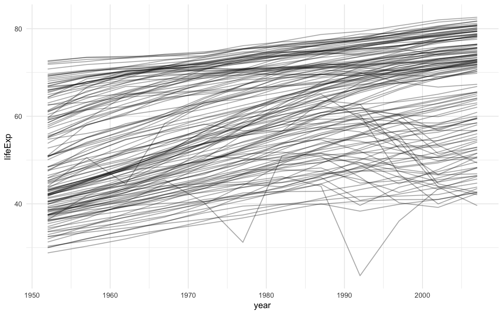

> 참고 자료:
> [purrr 공식 문서](https://purrr.tidyverse.org/) | [broom 공식 문서](https://broom.tidymodels.org/) | [R for Data Science - Many Models](https://r4ds.had.co.nz/many-models.html)

## 개요

복잡한 데이터 분석에서는 여러 그룹별로 모델을 적합하거나, 다양한 모델을 비교하거나, 복잡한 중첩 구조의 데이터를 다뤄야 할 때가 있습니다. purrr과 broom 패키지를 활용하여 중첩 데이터와 리스트-열을 효율적으로 다루는 방법을 알아보겠습니다.

```r title="환경 설정"

```r
# 패키지 로드
library('tidyverse')  # 데이터 조작과 시각화
library('modelr')     # 모델링 도구
library('broom')      # 모델을 tidy 데이터로 변환
library('gapminder')  # 예제 데이터셋

# 플롯 최적화 설정
options(
  repr.plot.width = 8,
  repr.plot.height = 5,
  repr.plot.res = 150
)

# 테마 설정
theme_set(theme_minimal(base_size = 10))
```

## 2. 많은 모델을 다루는 핵심 아이디어

### 3가지 핵심 개념

> 1) 간단한 모델을 여러 개 사용하여 복잡한 데이터셋을 잘 이해한다.
> 2) 리스트-열(List-column)을 사용하여 임의의 데이터 구조를 데이터프레임에 저장한다.
> 3) broom 패키지를 사용하여 모델을 타이디 데이터로 변환한다.

### gapminder 데이터 탐색

```r
# 데이터 구조 확인
gapminder %>% head()

# 전체 트렌드 시각화
gapminder %>%
  ggplot(aes(year, lifeExp, group = country)) +
  geom_line(alpha = 1/3) +
  labs(
    title = "전 세계 기대수명 변화 추이",
    x = "연도", y = "기대수명"
  )
```




전반적으로 기대수명이 꾸준히 증가하고 있지만, 이 패턴을 따르지 않는 국가들이 있습니다. 숨겨진 추세를 확인하기 위해 선형 추세 모델을 적합하여 전반적인 선형 추세를 제거합니다.

## 3. 중첩된 데이터(Nested Data)

### 데이터 중첩하기

**중첩(nesting)**은 그룹별로 데이터를 리스트 형태로 묶어 정리하는 방법입니다.

```r
# 국가와 대륙별로 데이터 중첩
by_country <- gapminder %>%
  group_by(country, continent) %>%
  nest()

by_country %>% head()
```

```r
# 특정 국가의 데이터 확인
by_country$data[[1]]  # 첫 번째 국가(Afghanistan)의 데이터
```

#### 중첩 데이터의 장점

- 관련 데이터 동기화: 모든 관련 객체가 함께 저장되므로 필터링이나 정렬할 때 자동 동기화
- 체계적 관리: 복잡한 분석을 체계적으로 관리 가능

## 4. 리스트-열(List-Column)

### 모델 적합하기

```r
# 각 국가별로 선형 모델 적합
country_model <- function(df) {
  lm(lifeExp ~ year, data = df)
}

# 모든 국가에 모델 적용
by_country <- by_country %>%
  mutate(model = map(data, country_model))

# 결과 확인
by_country %>% head()
```

### 리스트-열 활용의 이점

리스트-열을 사용하면 데이터프레임의 구조적 장점을 유지하면서 복잡한 객체들을 체계적으로 관리할 수 있습니다:

- 데이터와 모델의 연결: 각 행에 데이터와 해당 모델이 함께 저장
- 일관성 유지: 필터링이나 정렬 시 자동으로 동기화
- 확장성: 추가 분석 결과를 새로운 열로 쉽게 추가

## 5. 중첩 해제하기(Unnesting)

### 잔차 분석

```r
# 잔차 계산
by_country <- by_country %>%
  mutate(
    resids = map2(data, model, add_residuals)
  )

# 잔차 데이터 중첩 해제
resids <- by_country %>%
  unnest(resids)

# 잔차 시각화
resids %>%
  ggplot(aes(year, resid)) +
  geom_line(aes(group = country), alpha = 1/3) +
  geom_smooth(se = FALSE) +
  labs(
    title = "전 세계 기대수명 잔차 패턴",
    x = "연도", y = "잔차"
  )
```


### 대륙별 잔차 패턴

```r
# 대륙별로 면분할하여 패턴 확인
resids %>%
  ggplot(aes(year, resid, group = country)) +
  geom_line(alpha = 1/3) +
  facet_wrap(~continent) +
  labs(
    title = "대륙별 기대수명 잔차 패턴",
    x = "연도", y = "잔차"
  )
```


#### 분석 결과

아프리카 대륙의 플롯에서는 매우 큰 잔차값을 일부 볼 수 있으며, 이는 HIV/AIDS 전염병과 르완다 집단 학살의 영향을 보여줍니다.

## 6. 모델 성능 평가

### broom::glance() 활용

broom 패키지는 모델을 타이디 데이터로 전환하는 도구입니다.

```r
# 모델 성능 지표 추출
by_country %>%
  mutate(glance = map(model, broom::glance)) %>%
  unnest(glance, .drop = TRUE) %>%
  head()
```

### 모델 성능 시각화

```r
# R-squared 분포 확인
glance %>%
  ggplot(aes(continent, r.squared)) +
  geom_jitter(width = 0.5) +
  labs(
    title = "대륙별 모델 적합도 분포",
    x = "대륙", y = "R-squared"
  )
```


### 적합도가 낮은 모델 분석

```r
# R-squared가 0.25 미만인 국가들
bad_fit <- glance %>% 
  filter(r.squared < 0.25)

# 해당 국가들의 기대수명 추이 확인
gapminder %>%
  semi_join(bad_fit, by = "country") %>%
  ggplot(aes(year, lifeExp, color = country)) +
  geom_line() +
  labs(
    title = "선형 모델 적합도가 낮은 국가들",
    x = "연도", y = "기대수명"
  )
```


## 7. 리스트-열 생성 방법

### 리스트-열 생성의 4가지 방법

#### 1) 중첩을 사용하여 생성

```r
# 그룹별 중첩
gapminder %>%
  group_by(country, continent) %>%
  nest() %>%
  head(3)

# 특정 열 중첩
gapminder %>%
  nest(data = c(year, lifeExp, pop, gdpPercap)) %>%
  head(3)
```

#### 2) 벡터화 함수에서 생성

```r
# 문자열 분할 예제
df <- tribble(
  ~x1,
  "a,b,c",
  "d,e,f,g"
)

df %>%
  mutate(x2 = str_split(x1, ",")) %>%
  unnest(x2)
```

#### 3) 다중값 요약에서 생성

```r
# 분위수 계산 예제
probs <- c(0.01, 0.25, 0.5, 0.75, 0.99)

mtcars %>%
  group_by(cyl) %>%
  summarize(
    p = list(probs), 
    q = list(quantile(mpg, probs))
  ) %>%
  unnest(c(p, q))
```

#### 4) 명명된 리스트에서 생성

```r
# 리스트를 데이터프레임으로 변환
x <- list(
  a = 1:5,
  b = 3:4,
  c = 5:6
)

df <- enframe(x)
df
```

## 8. 리스트-열 단순화하기

### 단순화 전략

리스트-열을 일반 열로 변환하는 방법은 원하는 값의 개수에 따라 달라집니다:

#### 단일 값 → 원자 벡터

```r
# map_*() 함수 사용
df <- tribble(
  ~x,
  letters[1:5],
  1:3,
  runif(5)
)

df %>%
  mutate(
    type = map_chr(x, typeof),
    length = map_int(x, length)
  )
```

#### 다중 값 → unnest()

```r
# unnest()로 리스트-열을 일반 열로 변환
tibble(x = 1:2, y = list(1:4, 1)) %>% 
  unnest(y)
```

### 중첩된 리스트 처리

```r
# 중첩된 리스트에서 특정 요소 추출
df <- tribble(
  ~x,
  list(a = 1, b = 2),
  list(a = 2, c = 4)
)

df %>%
  mutate(
    a = map_dbl(x, "a"),
    b = map_dbl(x, "b", .null = NA_real_)
  )
```

## 9. broom으로 타이디 데이터 만들기

### broom의 3가지 핵심 함수

#### 1) glance() - 모델 전체 성능

```r
# 모델별 성능 지표 한 눈에
by_country %>%
  mutate(glance = map(model, broom::glance)) %>%
  unnest(glance) %>%
  arrange(r.squared) %>%
  head()
```

#### 2) tidy() - 계수 정보

```r
# 각 계수의 통계량
by_country %>%
  mutate(tidy = map(model, broom::tidy)) %>%
  unnest(tidy) %>%
  head()
```

#### 3) augment() - 관측값별 통계량

```r
# 잔차, 예측값 등 추가
by_country %>%
  mutate(augment = map2(model, data, broom::augment)) %>%
  unnest(augment) %>%
  head()
```

## 10. 실무 활용 워크플로우

### 체계적 분석 프로세스

```r
# 1단계: 데이터 중첩
nested_data <- raw_data %>%
  group_by(grouping_var) %>%
  nest()

# 2단계: 모델 적합
with_models <- nested_data %>%
  mutate(
    model = map(data, ~ model_function(.x)),
    predictions = map2(model, data, predict),
    residuals = map2(data, model, add_residuals)
  )

# 3단계: 모델 평가
model_summary <- with_models %>%
  mutate(
    glance = map(model, broom::glance),
    tidy = map(model, broom::tidy)
  )

# 4단계: 결과 정리 및 시각화
final_results <- model_summary %>%
  unnest(glance) %>%
  arrange(desc(r.squared))
```

### 성능 비교 시각화

```r
# 모델 성능 비교
model_comparison <- function(data) {
  data %>%
    unnest(glance) %>%
    ggplot(aes(r.squared)) +
    geom_histogram(bins = 30) +
    facet_wrap(~continent) +
    labs(
      title = "모델 성능 분포",
      x = "R-squared", y = "빈도"
    )
}
```

## 실무 활용 팁

### 모범 사례

1. 점진적 구축: 간단한 모델부터 시작해서 복잡도를 점차 늘려가기
2. 성능 모니터링: 정기적으로 모델 성능 지표 확인하기
3. 결과 검증: 이상치나 예외 케이스 별도 분석하기
4. 문서화: 각 단계의 목적과 결과를 명확히 기록하기

### 확장 가능한 구조

```r
# 여러 모델 비교를 위한 확장
model_comparison <- tribble(
  ~model_name, ~model_func,
  "linear", ~ lm(y ~ x, data = .x),
  "polynomial", ~ lm(y ~ poly(x, 2), data = .x),
  "smooth", ~ mgcv::gam(y ~ s(x), data = .x)
)

results <- nested_data %>%
  crossing(model_comparison) %>%
  mutate(
    fitted_model = map2(data, model_func, ~ .y(.x)),
    performance = map(fitted_model, broom::glance)
  )
```

### 주의사항

- 메모리 관리: 큰 데이터셋의 경우 메모리 사용량 주의
- 에러 처리: `safely()` 함수로 안전한 모델 적합
- 병렬 처리: `future_map()` 등으로 성능 최적화 고려

## 마무리

purrr과 broom을 활용한 중첩 데이터 처리는 복잡한 데이터 분석을 체계적으로 관리할 수 있게 해주는 도구입니다. 이번 포스팅에서 다룬 주요 내용을 정리하면:

- 중첩 데이터: 관련 데이터를 그룹별로 체계적 관리
- 리스트-열: 복잡한 객체를 데이터프레임에 저장
- 모델 관리: 여러 모델을 일관성 있게 처리
- broom 활용: 모델 결과를 타이디 데이터로 변환
- 워크플로우: 체계적인 분석 프로세스 구축

실무에서 유용한 활용 사례:

- A/B 테스트 결과 분석
- 시계열 데이터의 그룹별 모델링
- 머신러닝 파이프라인에서의 모델 비교
- 복잡한 중첩 구조 데이터 처리