## 개요

**시계열 데이터**는 시간의 흐름에 따라 기록된 데이터를 의미합니다. 시계열 분석은 데이터에 내재된 패턴을 파악하여 미래를 예측하는 데 중요한 역할을 합니다. 이 포스팅에서는 시계열 데이터의 핵심 구성 요소인 **불규칙(Irregular)**, **추세(Trend)**, **계절(Seasonal)** 성분에 대해 알아보고 R을 이용해 각 성분을 시각화하고 분석하는 기초적인 방법을 다룹니다.

```r title="환경 설정"
library('data.table')
library('tidyverse')
library('gridExtra') # 여러 그래프를 한 화면에 배열
library('lmtest')    # 더빈-왓슨 검정(dwtest)

options(
  repr.plot.width = 8,
  repr.plot.height = 5,
  repr.plot.res = 200
)

theme_set(theme_minimal(base_size = 12))
```

## 1. 불규칙 성분 (Irregular Component)

불규칙 성분은 예측할 수 없는 임의의 변동을 의미하며, 백색 잡음(White Noise)으로 가정하는 경우가 많습니다.

```r title="불규칙 성분 데이터 생성"
set.seed(1245)
n <- 100
# 평균 5000, 표준편차 20의 정규분포를 따르는 데이터 생성
z <- 5000 + 20 * rnorm(n)
head(z)
```

```text
[1] 5007.823 4995.394 5002.483 5013.122 5013.978 5001.319
```

`rnorm` 함수는 정규분포를 따르는 난수를 생성합니다. 아래는 평균 0, 표준편차 1인 기본 정규분포입니다.

```r
plot(rnorm(n), type = 'l', main = "표준 정규분포 난수")
abline(h = 0, lty = 2)
```

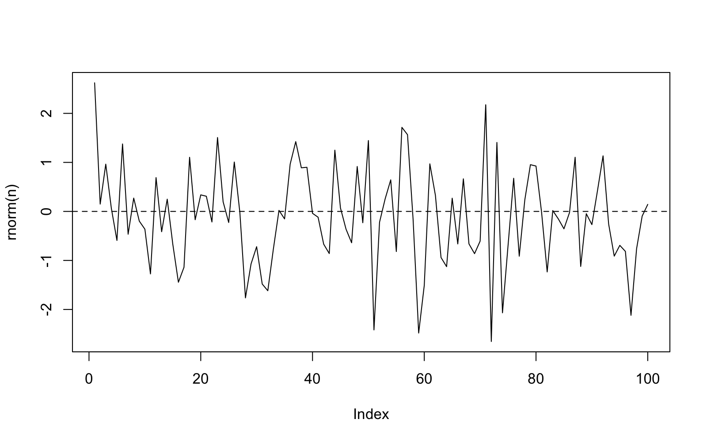

여기에 20을 곱하면 표준편차가 20으로 늘어나고, 5000을 더하면 평균이 5000으로 이동합니다.

```r
# 표준편차 조정
plot(20 * rnorm(n), type = 'l', main = "표준편차 20배 증가")
abline(h = 0, lty = 2)
```

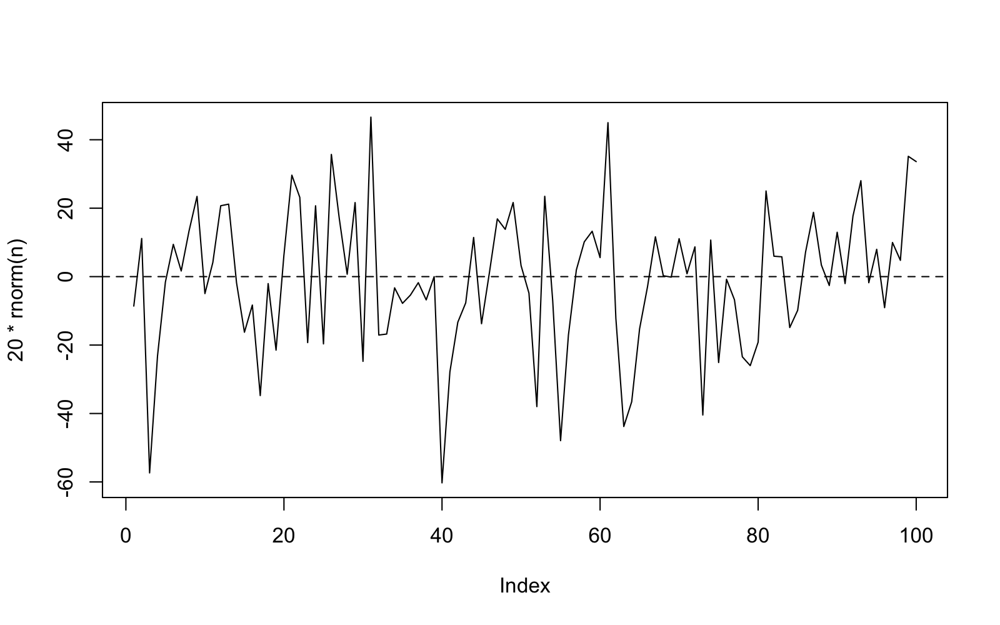

```r
# 평균 조정
plot(5000 + 20 * rnorm(n), type = 'l', main = "평균 5000으로 이동")
abline(h = 5000, lty = 2)
```

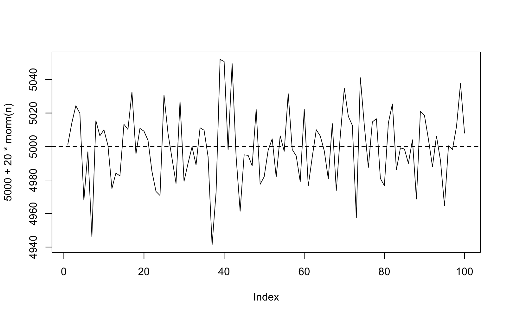

### 1.1 시계열 객체로 변환

`ts()` 함수는 일반 벡터를 시계열(Time Series) 객체로 변환합니다. 시계열 객체는 시간 정보를 내장하고 있어 분석에 유용합니다.

```r
z.ts <- ts(z,
           start = c(1980, 1), # 시작: 1980년 1월
           frequency = 12)     # 주기: 12 (월별 데이터)
```

`ts.plot()`은 시계열 객체를 시각화하는 데 특화된 함수입니다.
```r
ts.plot(z.ts, xlab = "date", ylab = "zt",
       main ="irregular elements")
abline(h = 5000)
```

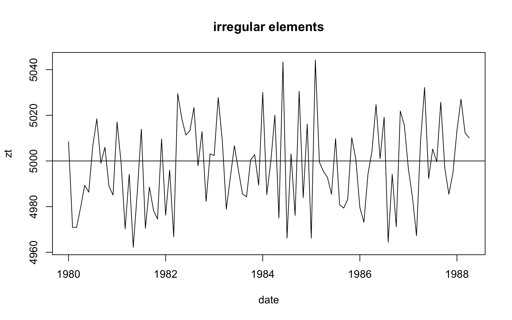

### 1.2 `ggplot2`를 이용한 시각화

`ggplot2`를 사용하면 더 세련된 시계열 그래프를 그릴 수 있습니다. `data.table`을 활용하여 시간 축을 생성합니다.

```r
tmp.data <- data.table(Time = seq.Date(as.Date("1980/1/1"),
                                       by = "month",
                                       length.out = 100),
                       z = z)

ggplot(tmp.data, aes(Time, z)) +
  geom_line(col = 'steelblue') +
  geom_hline(yintercept = 5000, col = 'grey80', lty = 2) +
  ggtitle("irregular elements") +
  scale_x_date(date_breaks = "10 year", date_labels = "%Y") +
  theme_bw() +
  theme(text = element_text(size = 16),
        axis.title = element_blank())
```

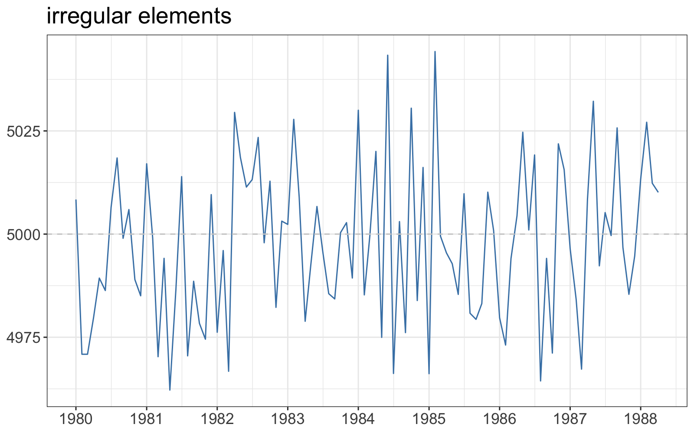

## 2. 추세 성분 (Trend Component)

추세는 데이터가 장기적으로 증가하거나 감소하는 경향을 의미합니다.

```r title="추세 데이터 생성"
set.seed(1234)
n <- 100
t <- 1:n
trend <- 0.5 * t      # 선형 추세
z <- trend + rnorm(n) # 추세 + 불규칙 성분
```

`ts.plot`으로 추세선과 노이즈가 더해진 시계열을 함께 그려 비교해봅니다.

```r
z.ts <- ts(z, start = c(1980, 1), frequency = 12)
trend.ts <- ts(trend, start = c(1980, 1), frequency = 12)

ts.plot(z.ts, trend.ts,
        col = c('blue', 'red'),
        lty = 1:2,
        xlab = "날짜",
        ylab = "값",
        main = "trend component")

legend("topleft",
       legend = c("series", "trend"),
       lty = 1:2,
       col = c("blue", "red"))
```

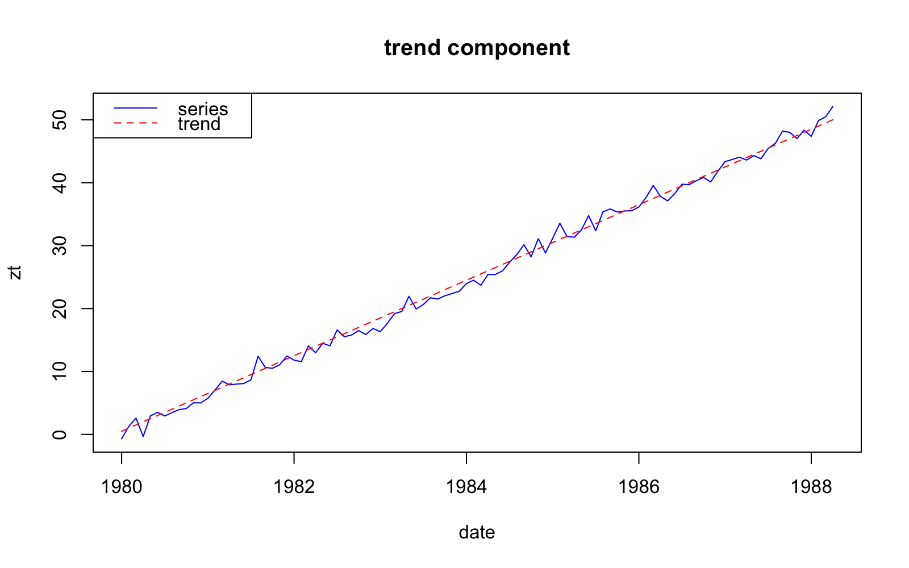

## 3. 계절 성분 (Seasonal Component)

계절 성분은 특정 기간(주기)마다 반복되는 패턴을 의미합니다. (예: 월별, 분기별)

```r title="계절성 데이터 생성"
n <- 120 # 10년치 월별 데이터
t <- 1:n
noise <- rnorm(n, 0, 1) # 불규칙 성분

# 주기적인 사인 함수 + 불규칙 성분
z <- 10 + 3 * sin((2 * pi * t) / 12) + 0.8 * noise
```

위 코드에서 `sin((2 * pi * t) / 12)`는 주기가 12인 사인파를 생성하여 계절성을 표현합니다. 여기에 불규칙 성분(`noise`)을 더해 실제 데이터와 유사한 패턴을 만듭니다.

```r
z.ts <- ts(z,
           start = c(1985, 1),
           frequency = 12)

plot(z.ts,
     xlab = "date",
     ylab = "zt",
     main = "seasonal component")
```

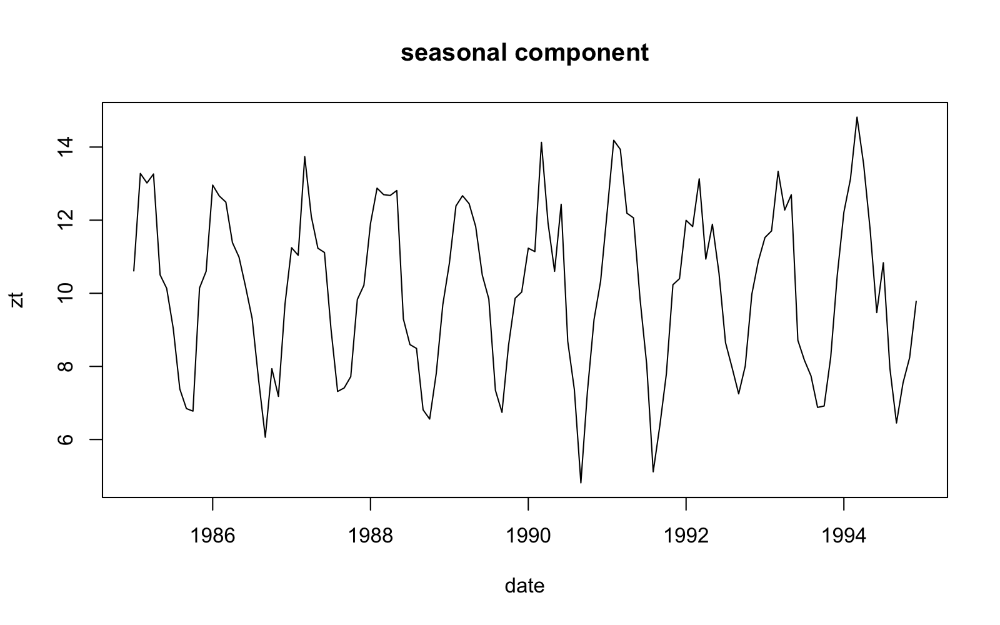

## 4. 주기 성분과 삼각함수

시계열의 주기적 패턴은 여러 개의 사인(sin)과 코사인(cos) 함수의 합으로 표현할 수 있습니다. 이를 **푸리에 분석(Fourier Analysis)**의 기본 아이디어라고 합니다.

### 4.1 다양한 주기와 진폭의 결합

주기가 다른 여러 삼각함수를 결합하면 복잡한 패턴을 만들 수 있습니다.

```r
x <- seq(0, 48, 0.01)

y1 <- sin(2*pi*x/12)
y2 <- sin(2*pi*x/6)
y3 <- sin(2*pi*x/3)

# 여러 주기 함수를 결합
y_combined <- y1 + y2 + y3

par(mfrow = c(4, 1), mar=c(3,3,2,1))
plot(x, y1, type = 'l', main="주기=12")
plot(x, y2, type = 'l', main="주기=6")
plot(x, y3, type = 'l', main="주기=3")
plot(x, y_combined, type = 'l', main="주기(12, 6, 3) 결합")
```

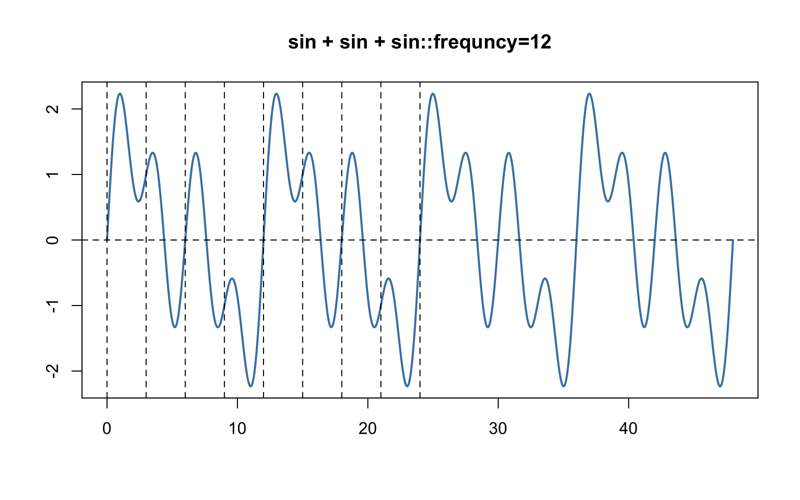


여기에 추세까지 더하면 더 복잡한 시계열 데이터가 만들어집니다.
```r
par(mfrow = c(1, 1))
# 추세(0.5*x)와 여러 주기 함수 결합
y_final <- x*0.5 + sin(2*pi*x/12) + sin(2*pi*x/6) +sin(2*pi*x/3) + cos(2*pi*x/12) + cos(2*pi*x/6) + cos(2*pi*x/3)

plot(x, y_final, type = 'l', col = 'steelblue', lwd = 2,
     xlab = "", ylab = "", main = "s+s+s+c+c+c frequency=12")
abline(a = 0, b = 0.5, lty = 2)
abline(v = seq(0, 24, by = 12), lty = 2)
```

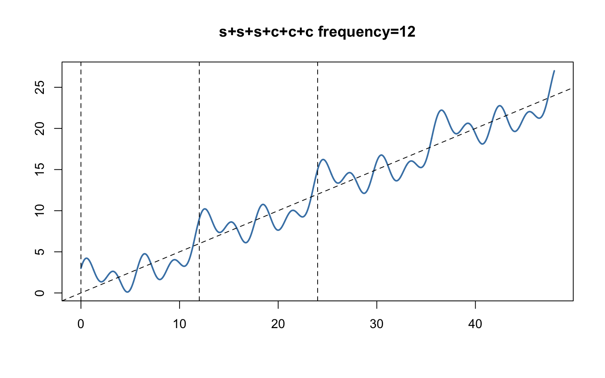

### 4.2 실제 데이터 분석 예시: 백화점 월별 매출액

이제 실제 데이터를 가지고 추세와 계절성을 분해해보겠습니다.

```r
z <- scan("depart.txt")

dep <- ts(z, frequency = 12, start = c(1984, 1))
plot(dep)
```

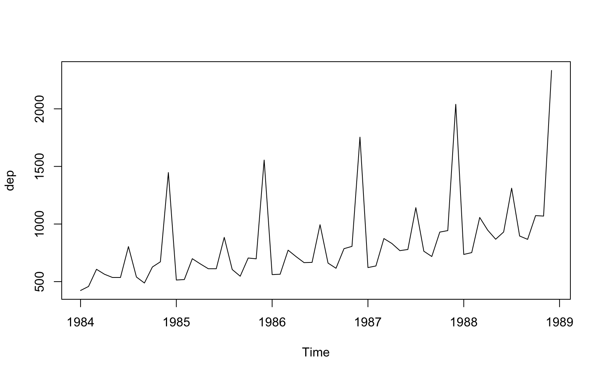

그래프를 보면 다음과 같은 특징이 보입니다.
- **증가하는 추세**: 시간이 지남에 따라 매출액이 꾸준히 증가합니다.
- **계절성**: 매년 특정 월(연말 등)에 매출이 급증하는 패턴이 반복됩니다.
- **이분산성**: 시간이 지날수록 변동의 폭(분산)이 커집니다.

분산이 일정하지 않은 이분산성 문제를 해결하기 위해 **로그 변환(Log Transformation)**을 적용합니다.

```r
tmp.data <- data.table(
    day = seq.Date(as.Date("1984-01-01"),
                   by = 'month', length.out = length(z)),
    z = z
    )

tmp.data[, lndep := log(z)]

p1 <- ggplot(tmp.data, aes(day, z)) + 
geom_line(col = 'skyblue') +
geom_point(col = 'steelblue') +
scale_x_date(date_breaks = "1 year", date_labels = "%Y-%m") +
labs(title = "monthly department store sales TimeSeries plot") +
theme_bw() +
theme(axis.title = element_blank())

p2 <- ggplot(tmp.data, aes(day, lndep)) + 
geom_line(col = 'skyblue') +
geom_point(col = 'steelblue') +
scale_x_date(date_breaks = "1 year", date_labels = "%Y-%m") +
labs(title = "monthly department store sales TimeSeries plot after log transformation") +
theme_bw() +
theme(axis.title = element_blank())

grid.arrange(p1, p2, nrow = 2)
```

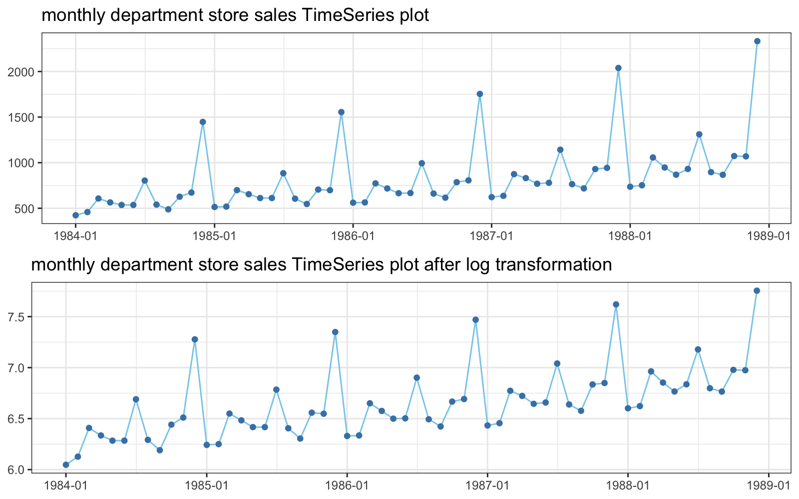

로그 변환 후 변동 폭이 시간에 따라 일정해진 것을 볼 수 있습니다. 이제 이 데이터를 사용하여 회귀분석을 진행합니다.

### 4.3 회귀분석을 이용한 패턴 분해

#### 방법 1: 월별 더미 변수(지시 함수) 사용

각 월(1월~12월)을 나타내는 더미 변수를 만들어 계절 효과를 모델링합니다.

```r title="데이터 준비"
tmp.data[, y := as.factor(as.integer(cycle(dep)))]
tmp.data[, trend := 1:length(z)]
```

```r title="회귀 모델 적합"
# lndep ~ 0(절편 없음) + trend + y
# 각 월(y1~y12)의 평균 효과를 직접 추정
reg <- lm(lndep ~ 0 + trend + y, data = tmp.data)
summary(reg)
```
```text
Call:
lm(formula = lndep ~ 0 + trend + y, data = tmp.data)

Residuals:
      Min        1Q    Median        3Q       Max 
-0.211753 -0.051833  0.003328  0.057396  0.138407 

Coefficients:
         Estimate Std. Error t value Pr(>|t|)    
trend   0.0106603  0.0001851  57.591  < 2e-16 ***
y1      6.0641904  0.0267882 226.376  < 2e-16 ***
y2      6.0807995  0.0268512 226.463  < 2e-16 ***
y3      6.3811183  0.0269188 237.049  < 2e-16 ***
y4      6.2953455  0.0269910 233.239  < 2e-16 ***
y5      6.2132392  0.0270678 229.544  < 2e-16 ***
y6      6.2197770  0.0271490 229.097  < 2e-16 ***
y7      6.5885065  0.0272346 241.916  < 2e-16 ***
y8      6.1842830  0.0273245 226.329  < 2e-16 ***
y9      6.1001148  0.0274186 222.480  < 2e-16 ***
y10     6.3334504  0.0275169 220.280  < 2e-16 ***
y11     5.5416882  0.0276193 200.646  < 2e-16 ***
y12     7.1104815  0.0277257 256.455  < 2e-16 ***
---
Signif. codes:  0 ‘***’ 0.001 ‘**’ 0.01 ‘*’ 0.05 ‘.’ 0.1 ‘ ’ 1

Residual standard error: 0.08472 on 107 degrees of freedom
Multiple R-squared:  0.9997,	Adjusted R-squared:  0.9996 
F-statistic: 2.628e+04 on 13 and 107 DF,  p-value: < 2.2e-16
```
- **해석**:
    - `trend` 계수는 매월 로그 매출액이 약 0.0106만큼 증가함을 의미합니다.
    - `y1` ~ `y12` 계수들은 추세가 보정된 각 월의 평균 로그 매출액을 의미합니다. 예를 들어 12월(`y12`)과 7월(`y7`)이 다른 달에 비해 높은 값을 가집니다.

적합된 모델과 실제 값을 비교해봅니다.
```r
tmp.data[, fitted_lndep := fitted(reg)]

ggplot(tmp.data, aes(day, lndep)) + 
  geom_line(aes(color = "실제 값"), lwd = 1) +
  geom_line(aes(y = fitted_lndep, color = "적합된 값"), lwd = 1) +
  scale_color_manual(values = c("실제 값" = "skyblue", "적합된 값" = "orange")) +
  labs(title = "실제 값과 회귀 모델 적합 값 비교", color = "범례") +
  theme_bw()
```

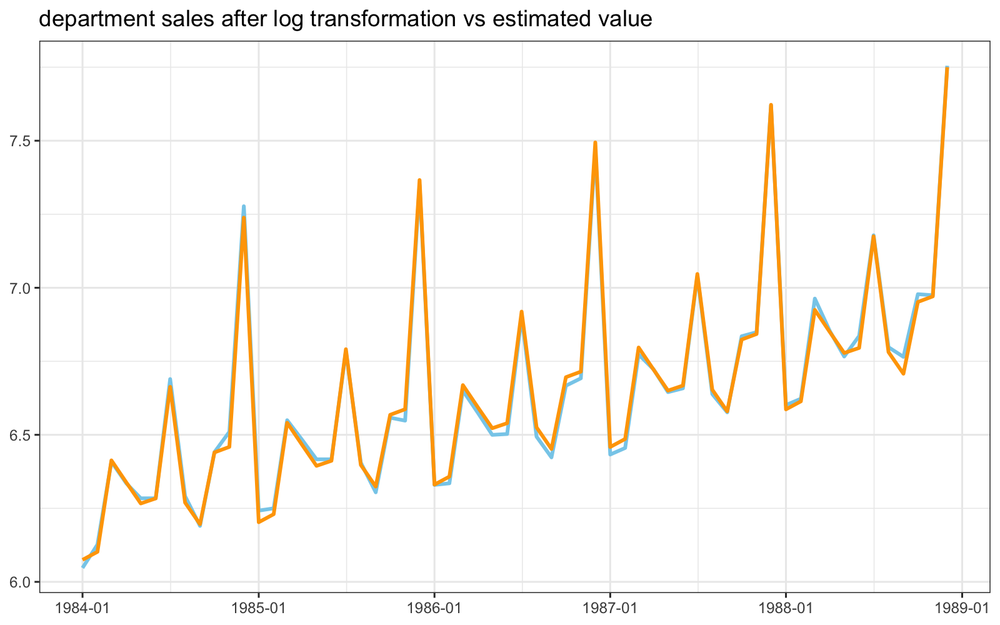

모델이 전반적인 추세와 계절성을 잘 포착하고 있음을 볼 수 있습니다.

**잔차 분석**

모델이 설명하지 못하는 부분(잔차)을 분석하여 추가적인 패턴이 있는지 확인합니다.
```r
tmp.data[, res := resid(reg)]

ggplot(tmp.data, aes(day, res)) + 
  geom_line(col = 'skyblue') +
  geom_point(col = 'steelblue') +
  geom_hline(yintercept = 0, col = 'grey', lty = 2) +
  labs(title = "잔차의 시계열 그림") +
  theme_bw()
```

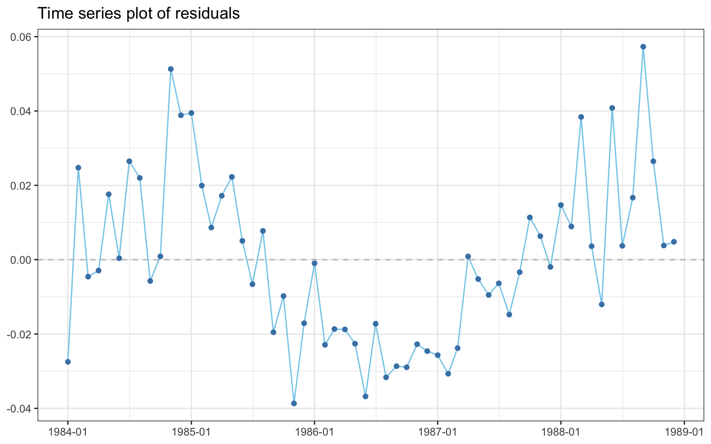

잔차가 0을 중심으로 무작위적으로 분포하지 않고, 이전 시점의 잔차가 다음 시점의 잔차에 영향을 주는 **자기상관(Autocorrelation)**이 의심됩니다. 더빈-왓슨 검정으로 이를 확인합니다.

```r
dwtest(reg)
```
```text
	Durbin-Watson test

data:  reg
DW = 0.543, p-value = 1.11e-15
alternative hypothesis: true autocorrelation is greater than 0
```
- **해석**: p-value가 매우 작으므로 "자기상관이 없다"는 귀무가설을 기각합니다. 즉, 잔차에 **양의 자기상관**이 존재합니다. 이는 시계열 모델이 모든 시간적 종속성을 포착하지 못했음을 의미하며, ARIMA 같은 더 복잡한 모델이 필요할 수 있음을 시사합니다.

#### 방법 2: 삼각함수 사용

계절성을 삼각함수들의 합으로 모델링합니다. 주기가 12, 6, 4, 3, 2.4인 sin, cos 함수들을 설명 변수로 사용합니다.

```r title="삼각함수 변수 생성"
tmp.data_sub <- tmp.data[, .(lndep, trend)]

# sin, cos 변수 추가
for (i in 1:5) {
  period <- 12 / i
  tmp.data_sub[, paste0("sin_", round(period, 1)) := sin(2 * pi * i / 12 * trend)]
  tmp.data_sub[, paste0("cos_", round(period, 1)) := cos(2 * pi * i / 12 * trend)]
}
```

```r title="삼각함수 회귀 모델 적합"
reg_2 <- lm(lndep ~ ., data = tmp.data_sub)
summary(reg_2)
```
- **결과**: `sin_2.4`를 제외한 대부분의 삼각함수 항이 유의하게 나타나, 매출액 데이터에 다양한 주기가 혼합되어 있음을 알 수 있습니다.

```r title="적합 값 및 잔차 시각화"
tmp.data_sub[, day := tmp.data$day]
tmp.data_sub[, fitted_lndep := fitted(reg_2)]
tmp.data_sub[, res := resid(reg_2)]

p1 <- ggplot(tmp.data_sub, aes(day, lndep)) + 
  geom_line(aes(color = "실제 값"), lwd = 1) +
  geom_line(aes(y = fitted_lndep, color = "적합된 값"), lwd = 1) +
  scale_color_manual(values = c("실제 값" = "skyblue", "적합된 값" = "orange")) +
  labs(title = "실제 값과 삼각함수 모델 적합 값 비교", color = "범례") +
  theme_bw()
  
p2 <- ggplot(tmp.data_sub, aes(day, res)) +
  geom_line(col = 'skyblue') +
  geom_hline(yintercept = 0, lty=2) +
  labs(title = "삼각함수 모델 잔차") +
  theme_bw()

grid.arrange(p1, p2, nrow=2)
```

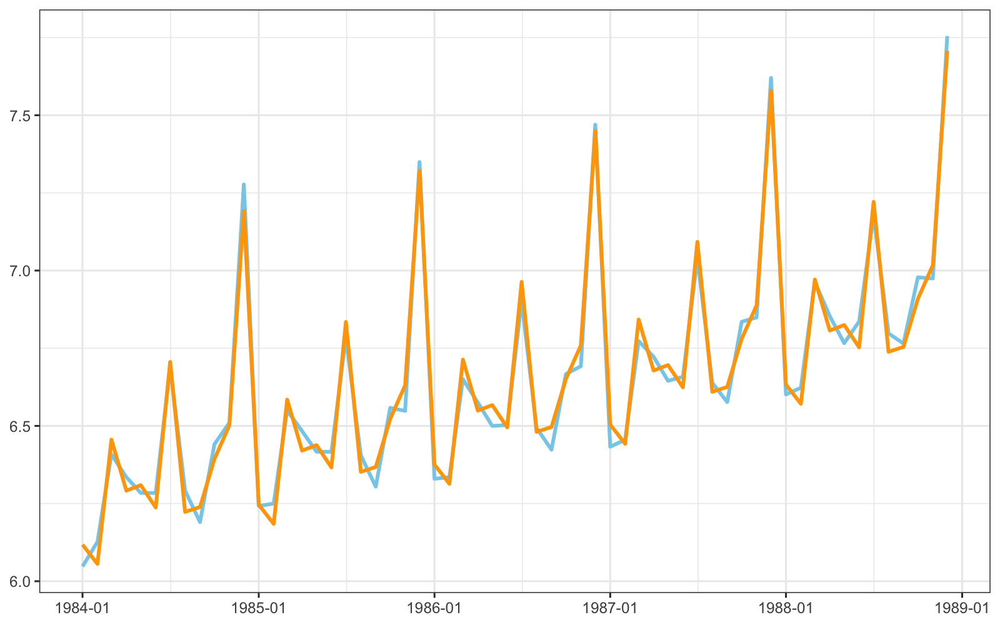
*(위 그래프가 적합 결과, 아래 그래프가 잔차)*

잔차 그림에서 여전히 패턴이 보입니다. 더빈-왓슨 검정을 해보면 음의 자기상관이 있는지 확인합니다.
```r
dwtest(reg_2, alternative="two.sided")
```
```text
	Durbin-Watson test

data:  reg_2
DW = 3.2459, p-value = 3.33e-09
alternative hypothesis: true autocorrelation is not 0
```
- **해석**: DW 통계량은 0~4의 값을 가지며 2에 가까울수록 자기상관이 없습니다. 0에 가까우면 양의 자기상관, 4에 가까우면 음의 자기상관을 의미합니다. 현재 DW 값은 3.24로 4에 가까우므로 음의 자기상관을 의심할 수 있고, 양측검정 p-value가 유의수준보다 매우 작으므로 "자기상관이 없다"는 귀무가설을 기각합니다.
